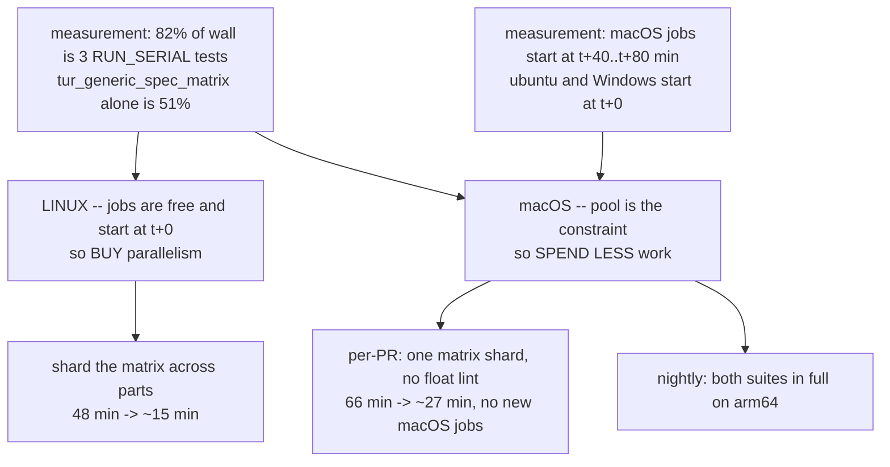

# CI auxiliary-suite latency -- shard on Linux, thin on macOS

> **Status: DONE -- archived 2026-10-04.** S1-S7 landed 2026-10-01 (#1019 and
> its predecessors) and the new shape has now been observed on `main`: macOS
> aux **66 min -> ~16-18 min** (better than the ~27 min projected), and the
> whole CI run **~2 h -> ~20-35 min** to green. Section 11 has the measured
> numbers that replace the projections in sections 5.1 and 6.3. The last
> follow-up (nightly rows not plotted) was filed and then fixed the same day:
> [`nightly-arm64-timings-not-on-ci-metrics`](nightly-arm64-timings-not-on-ci-metrics.md).
>
> What landed: `--shard i/N` on both scripts via `tests/shard_util.py` (S1); the
> matrix ctest timeout at 4500s (S2); `tests/ctest-parts.py` as the single source
> of the part patterns plus the `tur_ctest_partition` check (S3); `fconv` and
> `gsm1`/`gsm2` parts on Linux only (S4); `TUR_GSM_SHARD=1/4` inside the macOS
> `aux` part and `--suite-shard` in the collector (S5);
> `.github/workflows/nightly-arm64.yml` (S6); the stale comment numbers and a
> `timeout-minutes` on the `test` job (S7, 90 then tightened to 60 from the
> measurements). All four open questions are resolved -- see section 9.
>
> Written in response
> to "why do the macOS auxiliary suites take 56m currently?" against
> [#1010](https://github.com/turmeric-lang/turmeric/pull/1010), and then widened
> when the measurement showed the macOS runner POOL, not macOS CPU, is the
> binding constraint.
> **Type:** CI / test infrastructure
> **Touches:** [`.github/workflows/ci.yml`](../../.github/workflows/ci.yml)
> (the `test` job matrix and its three ctest steps),
> `tests/generic-spec-matrix.py`, `tests/check-emitted-float-conversions.py`,
> a new partition check in the spirit of `tests/run-shard-partition.sh`, and
> two `set_tests_properties` lines in `CMakeLists.txt`.
>
> **Decided by measurement, 2026-10-01 (section 3 is the reason):**
> 1. **The fix is asymmetric.** Linux gets more jobs; macOS gets less work.
>    Treating the two legs the same is what makes the obvious fix underperform.
> 2. **Do not split the two suites into one shared new part.** They serialize
>    against each other, so that shape saves ~16 min of ~66 and is not worth
>    the churn (section 5.1).
> 3. **Keep arm64 coverage of the generic-spec matrix on every PR**, as a
>    shard rather than as the full matrix. The bug class is ABI-sensitive and
>    dropping the leg outright is the one option that loses real signal
>    (section 6.2).

## 0. Summary

`Auxiliary suites (macos-latest)` took **56m48s** on #1010 and takes
**65m43s** on current `main`. It is one `ctest -j3` step, and 82% of its wall
clock is three `RUN_SERIAL` tests that `-j` cannot overlap. Two of those three
landed on 2026-09-30 and took the job from 18 min to 67 min in one merge.

But the job's duration is not the whole latency problem, and fixing only the
duration would disappoint. **macOS jobs for this repo wait 40-80 minutes to
start**, every run, while every ubuntu and Windows job starts immediately. So
the aux job's real contribution to time-to-green is ~64 min of queueing plus
~57 min of running, and adding macOS jobs -- the natural fix for a serial
bottleneck -- spends the scarce resource rather than the plentiful one.

Hence two different changes for the two legs:

Shared prerequisite for both: a `--shard i/N` flag on the two scripts, which
is the only new mechanism this plan needs (section 4).

## 1. Where the 56 minutes goes

The job is a single `ctest -j "$(getconf _NPROCESSORS_ONLN)"` step
(`ci.yml:307`). Modeling it as "serial barriers end to end, then everything
else across the available cores" predicts the measured wall clock to within
0.5%, which is what makes the rest of this plan actionable rather than
speculative:

| | macOS (3 cores) | ubuntu (4 cores) |
| --- | --- | --- |
| Sum of all 161 suite durations | 4236s | 3800s |
| **Serial barrier chain** | **2589s (43.2 min)** | 2418s |
| Parallelizable remainder | 1646s -> >=549s | 1381s -> >=345s |
| Predicted step | 3138s | 2763s |
| **Measured step** | **3154s** | 2903s |
| Serial share of wall | **82%** | 83% |

Source: the `timings-test-*-aux` artifacts of run `36928067264` (#1010), which
carry one row per ctest test.

The chain is three tests, all `RUN_SERIAL` in `CMakeLists.txt`:

| suite | macOS | share of step |
| --- | --- | --- |
| `tur_generic_spec_matrix` | 1622s | **51%** |
| `tur_emitted_float_conversions` | 613s | 19% |
| `turi_fixture_tests` | 346s | 11% |

`RUN_SERIAL` is correct on all three -- each fans out internally via
`ThreadPoolExecutor(max_workers=os.cpu_count())`, so co-scheduling them would
oversubscribe the box. The cost is structural: on ctest's scheduler a
`RUN_SERIAL` test is a full barrier, so 43 of the 53 minutes is a chain no `-j`
value can compress. The `ci.yml` matrix comment already documents this
mechanism for the `r7rs` case; this is the same mechanism, one layer down.

**This is not a macOS-specific slowdown.** ubuntu's aux step is 48m23s with the
same 83% serial shape, and total CPU differs by only 1.11x (3 cores vs 4).

### 1.1 Per-cell cost is not the problem

`tur_generic_spec_matrix` is 12 producers x 18 sinks x 19 types = 4104, minus
38 `EXCLUDE`d, = **4066 live cells**, at **1.51s of CPU per cell**. Each cell
spawns up to five processes: `tur check`, `tur run` (a full cc compile and
link), `tur --interpret`, `tur emit-c`, and a clang lint pass. 1.5s for all of
that is efficient. There is no per-cell waste to reclaim -- the suite is simply
4066 cells, and the only lever is how many run per job.

## 2. The regression point: #1007, merged as `8bb60d016`

Both expensive suites were registered on 2026-09-30 (`f460382db`,
`80b97b8d0`) and have no trend history before 2026-10-01. From
`origin/ci-metrics:suite-timings-2026.jsonl`, consecutive `main` pushes:

| sha | macOS aux wall | serial chain |
| --- | --- | --- |
| `e7a33b96e` (15:00Z, pre-#1007) | **18m12s** | 355s |
| `8bb60d016` (#1007 merge) | **67m28s** | 3080s |
| `7bae90d61` (latest main) | **65m43s** | 3038s |
| #1010 | 56m48s | 2589s |

#1010 is ~9 min faster than current `main`; it inherited the cost rather than
adding it. The `ci.yml` comment's "~13 min" budget for the aux part was
measured 09-28..09-30, in the window immediately before these landed, so that
comment is now stale and section 7 updates it.

## 3. The binding constraint is the macOS runner pool

This is the finding that shapes the plan, and it is invisible in job durations.

Every macOS job in a run is queued at t+0 and then waits. Two runs, same shape:

**Run `36922191619`** (`main`, 7bae90d61):

| job | queued | started | ran |
| --- | --- | --- | --- |
| tvm (macos) | +0m | **+40m** | 0m |
| JIT engine (macos) | +0m | **+40m** | 20m |
| Auxiliary suites (macos) | +0m | **+60m** | 66m |
| R7RS suites (macos) | +0m | **+67m** | 16m |
| Test (macos) | +0m | **+80m** | 18m |

**Run `36928067264`** (#1010):

| job | queued | started | ran |
| --- | --- | --- | --- |
| JIT engine (macos) | +0m | **+41m** | 23m |
| R7RS suites (macos) | +0m | **+52m** | 19m |
| tvm (macos) | +0m | **+58m** | 0m |
| Auxiliary suites (macos) | +0m | **+64m** | 57m |
| Test (macos) | +0m | **+75m** | 16m |

Each run has 23 jobs: 5 macOS, 5 ubuntu, 7 Windows, and 6 untagged. Every
non-macOS job started at t+0 (max wait 1 min), the sole exception being
`Publish suite timings`, which waits on the others by design. Effective macOS
concurrency reads as 2-3, on top of a ~40 min wait before the first macOS job
starts at all -- and that first wait cannot be a concurrency limit, since
nothing of ours was running. The repo is public, so this is pool scarcity, not
billing.

Two consequences:

- **macOS time-to-green is ~2 hours**, of which the aux job's 57 min is one
  part. Halving the job does not halve the latency.
- **Adding macOS jobs has a cost that the critical-path arithmetic hides.**
  Splitting one 57-min job into four 15-20 min jobs leaves total macOS
  occupancy unchanged (~115 runner-minutes in the `test` matrix on #1010's
  run, ~120 on `main`) while adding
  two more entries to a queue that already cannot start five promptly.

So on macOS the useful move is to **remove work**, not to redistribute it. On
Linux, where jobs start at t+0 and are free, redistributing is exactly right.

## 4. The shared mechanism: `--shard i/N`

Both legs need the same new flag, so it lands first and on its own (S1).

### 4.1 The slice, and why it is safe

`generic-spec-matrix.py:283` builds `cells` as a flat list before running
anything, so a round-robin slice by ordinal partitions it the same way
`TUR_TEST_SHARD` partitions the fixture corpus. Verified over the real 4066
live cells: for N = 2, 3 and 4 the slices are disjoint, their union is the
whole list, and sizes differ by at most 1.

| N | slice sizes | union | overlap | projected macOS per shard |
| --- | --- | --- | --- | --- |
| 2 | 2033, 2033 | 4066/4066 | 0 | 1025s (17.1 min) |
| 3 | 1356, 1355, 1355 | 4066/4066 | 0 | 683s (11.4 min) |
| 4 | 1017, 1017, 1016, 1016 | 4066/4066 | 0 | 512s (8.5 min) |

Balance holds per-dimension too: the innermost loop varies `TYPES`, and 19 is
prime, so no N in 2..4 divides it and no shard ends up correlated with a type.
That matters because per-cell cost varies by type -- a `struct` or `pairv` cell
costs more than an `int` one -- and a type-aligned shard would be the one way
this slice could come out unbalanced.

### 4.2 The ratchet is already safe; one guard is still needed

The obvious worry is the baseline ratchet, since
`--baseline tests/generic-spec-matrix.baseline` makes a FIXED cell fail the
run, and a shard sees only part of the matrix. It is fine as written: the
`fixed` detection loops over `results` -- the cells this invocation actually
ran -- and asks `key in known`, so a baseline row belonging to another shard is
never examined and never reported as fixed. The baseline file is also currently
empty.

What is **not** safe is `--write-baseline`: it writes `failing` from this
invocation only, so regenerating a baseline from a sharded run would silently
truncate it to that shard's cells. S1 makes `--write-baseline` with `--shard`
a hard error.

### 4.3 Spelling: a per-script variable, NOT `TUR_TEST_SHARD`

Reuse the `i/N` form and the 1-based reading that
`tools/ci/collect-suite-timings.py:parse_shard` already defines, but give each
script its **own** environment variable -- `TUR_GSM_SHARD` and
`TUR_FCONV_SHARD` -- rather than defaulting from `$TUR_TEST_SHARD`. Unset
means "run everything", so `CMakeLists.txt` needs no change and a local
`ctest` run still covers the whole matrix.

The reason not to reuse `TUR_TEST_SHARD` is the collector's coupling. It tags
rows from the job's *environment*, not per test -- its own docstring warns that
"anything else sharing the job's environment with `TUR_TEST_SHARD` still gets
it, and its rows are then replicas across shards." A dedicated part that runs
only the sharded test (S4) would be fine either way, but S5 deliberately runs a
matrix shard *inside* the 159-test `aux` part, and `TUR_TEST_SHARD` there would
mislabel all 159 other rows. One variable per script makes both call sites
correct without a rule to remember.

Where a part genuinely is one sharded test, S4 sets `TUR_TEST_SHARD` **as
well**, purely so the collector tags the row. That is the honest reading: the
job as a whole is that shard.

**The cost of the S5 shape, stated up front.** Because `aux` as a whole is not
sharded, the macOS `tur_generic_spec_matrix` row stays untagged while measuring
a quarter of the cells, so the trend series drops from ~2050s to ~512s with
nothing in the row explaining it. That is a real discontinuity in
`suite-timings-2026.jsonl`, and the options are to accept it with a note at the
changeover, or to pass `--shard` explicitly to the collector for that one part.
Resolved in section 9, question 4 -- it is a reporting choice, not a blocker,
but it should be made deliberately rather than discovered from a confusing
graph.

The rest of the metrics side needs no work: the collector already emits
`shard_index`/`shard_total` (null when unsharded) and `web/ci-metrics.js` keys
each slice as its own series. That was the blocker the matrix comment recorded
against sharding `fixtures`, and it is already cleared. The Windows legs'
`TUR_TEST_SHARD: ${{ matrix.shard }}` (`ci.yml:1139`, `ci.yml:1409`) is the
template for S4's matrix wiring.

## 5. Splitting out of `aux` (the Linux half)

### 5.1 The shapes, and the one to avoid

Projected from `main`'s measured numbers (`7bae90d61`), with the measured
249s of per-job overhead for `aux` and ~155s for a part that skips the
Emscripten setup:

| shape | macOS critical path |
| --- | --- |
| both suites into **one** new part | **~49 min** -- they serialize against each other |
| a part **each** | **~37 min** (the matrix part) |
| matrix sharded x2, float its own part | **~20 min** |

The first shape is the trap: it looks like the natural "pull the slow tests
out" change and it saves only ~16 min of ~66, because `RUN_SERIAL` makes the
two suites a chain inside their own part exactly as they were inside `aux`.

The third shape is where it stops paying: at two matrix shards the remaining
`aux` part (~19 min, now dominated by `turi_fixture_tests` plus the parallel
remainder) becomes the floor, so a third shard buys nothing.

### 5.2 The ctest patterns are exact complements

Verified against the real 161-name aux set:

- `-R '^tur_generic_spec_matrix$|^tur_emitted_float_conversions$'` selects
  exactly 2.
- The remainder is 159.
- Extending `aux` to
  `-E '^tur_tests$|r7rs|^tur_generic_spec_matrix$|^tur_emitted_float_conversions$'`
  excludes exactly those 2 and nothing else. No name in the aux set contains
  `r7rs`, so the existing unanchored alternative is safe to extend.

`tur_refine_wasm` stays in `aux`, so the `matrix.part == 'aux'` gate on the
Emscripten step (`ci.yml:168`) needs no change and the new parts do not pay
its 1m34s.

### 5.3 The partition invariant is unguarded, and a fourth part makes that worse

The `ci.yml` comment says "Verify after adding a suite: `ctest -N` totals must
satisfy all == fixtures + r7rs + aux." That verification is **prose, not a
test.** `tests/check-ctest-registration.sh` only checks that tests declared
under `src/CMakeLists.txt` appear in `ctest -N`; nothing checks that the parts
partition the registered set. A drift that drops a suite from every part would
pass -- `--no-tests=error` catches only a pattern that empties a part
completely, not one that loses a test from the middle.

`tests/run-shard-partition.sh` is this repo's precedent for guarding exactly
this shape, including the rule that membership answers come from the harness
rather than from a second copy of the enumeration. S3 follows it: single-source
the part patterns, then assert disjointness and completeness against
`ctest -N`. Adding a fourth part without this makes a silent drop more likely,
not less, which is why S3 is a prerequisite for S4 rather than a follow-up.

## 6. Thinning the macOS leg

### 6.1 The clang rationale no longer separates the legs

`generic-spec-matrix.py` sets `CC=clang` when `fconv_lint.find_clang()` finds
one, with a comment explaining that gcc 13 only warns on `-Wint-conversion` and
so missed real invalid-C cells. That comment is still true about gcc, but it no
longer distinguishes the two CI legs, because clang is present on both:

- No `UNAVAILABLE` / "no clang" line in the ubuntu job log. Both scripts print
  one and (for the float check) return 0 immediately when clang is missing.
- ubuntu burns *more* core-seconds than macOS on both suites --
  `tur_generic_spec_matrix` 6836 vs 6150, `tur_emitted_float_conversions`
  2644 vs 2064 -- which it could not do if it were skipping the lint leg.

So "macOS covers clang" is not a reason to keep either suite at full size
there.

### 6.2 But arm64 coverage of the matrix is load-bearing

`tur_emitted_float_conversions` is a pure clang-AST lint over emitted C. Across
two legs that is close to genuinely redundant, and the macOS copy is the
cheapest 11 minutes to give up.

`tur_generic_spec_matrix` is different: it compiles and *runs* 4066 programs,
and this is an ABI-sensitive bug class. #1010's own
`rc-of-byvalue-aggregate-payload` finding was a struct-padding read that a
member-wise copy does not preserve, and arm64 and x86-64 differ in aggregate
passing. Dropping the macOS leg of the matrix is the one option in this plan
that loses signal it cannot get back, so it is rejected.

### 6.3 The shape: a shard per PR, the full matrix nightly

Per-PR macOS runs `--shard 1/4` of the matrix (~8.5 min) and skips the float
lint. Nightly macOS runs both in full, alongside the existing crons
(`fuzz.yml` at 04:30, `tsan.yml` at 05:10).

A quarter-shard is an unbiased 25% sample of every producer x sink x type, and
representation regressions in this family hit whole rows or columns rather than
isolated cells -- #1010 classifies its own fixes by producer x sink class. So a
quarter-sample catches them on the PR, and the nightly closes the gap for
anything genuinely cell-local.

Both stay **inside the existing `aux` part** -- that is the point of the shape,
and it is why section 4.3 insists on a per-script variable. Projected from
`main`'s measured numbers:

| macOS `aux` component | now | after S5 |
| --- | --- | --- |
| `tur_generic_spec_matrix` (serial) | 2050s | 512s (shard 1/4) |
| `tur_emitted_float_conversions` (serial) | 688s | 0s (nightly only) |
| other serial (`turi_fixture_tests` et al.) | 302s | 302s |
| parallel remainder / 3 cores | 582s | 582s |
| per-job overhead (measured) | 249s | 249s |
| **step + job** | **3871s (65m)** | **1645s (27m)** |

So macOS aux goes 66 min -> **~27 min**, and `test`-matrix macOS occupancy
goes ~120 -> ~81 runner-minutes, with **no new macOS jobs** added to the
starved pool. That is less than the ~20 min a dedicated part would give, and
the difference is the deliberate trade: a fourth macOS job would shave another
7 minutes off one job while adding an entry to a queue that already makes the
first job wait 40 minutes (section 3).

## 7. Work items

- **S1 -- `--shard i/N` in both scripts.** Defaulting from `$TUR_GSM_SHARD` and
  `$TUR_FCONV_SHARD` respectively, **not** `$TUR_TEST_SHARD` (section 4.3);
  unset runs everything. Round-robin by ordinal over the already-flat cell
  list (`generic-spec-matrix.py:283`) and over `corpus_inputs()` in
  `check-emitted-float-conversions.py`. Make `--write-baseline` with `--shard`
  a hard error (section 4.2). Inert until S4/S5 use it, so it lands alone.
- **S2 -- raise the two ctest timeouts.** `tur_generic_spec_matrix` is at
  2050s against `TIMEOUT 3000` (68% of budget) and
  `tur_emitted_float_conversions` at 688s against 1500. Raise the first to
  4500 so an unsharded local or nightly run has headroom. Independent of
  everything else here; do it first.
- **S3 -- a ctest-partition check.** Single-source the part patterns and
  assert, against `ctest -N`, that they are disjoint and cover the registered
  set. Modeled on `tests/run-shard-partition.sh`, including taking membership
  from the harness rather than reimplementing it. Prerequisite for S4
  (section 5.3).
- **S4 -- Linux: split and shard.** `tur_emitted_float_conversions` into its
  own part; `tur_generic_spec_matrix` into two sharded parts; extend the `aux`
  `-E` per section 5.2. Each sharded job runs only the sharded test, per the
  collector trap in section 4.3.
- **S5 -- macOS: thin the per-PR leg.** One matrix shard, no float lint, both
  still inside the existing `aux` part so no macOS job is added
  (section 6.3). Settle question 4 before landing, since the trend
  discontinuity is easiest to annotate at the changeover.
- **S6 -- the nightly macOS leg.** Both suites in full on arm64, scheduled
  clear of the existing 04:30 and 05:10 crons.
- **S7 -- update the `ci.yml` matrix comment.** Its "~13 min" aux budget and
  its "~155 targets" are both pre-#1007 (section 2), and its manual
  "verify after adding a suite" instruction becomes a pointer to S3.

Order: S2, then S1 and S3 in either order, then S4, then S5 and S6, then S7.
S4 and S5 are the two that change check names and durations, so they are worth
landing on separate days to keep the timing trend readable.

**As implemented**, the order above was followed, with two deviations worth
knowing about:

- **S3 carries the macOS table rows that S5 uses.** The part table has to be
  complete for its own check to pass, so `tests/ctest-parts.py` landed with both
  legs described -- including the macOS `NIGHTLY_ONLY` row for the float lint --
  before `ci.yml` read any of it. The table is inert until a workflow asks it
  for a pattern, so no behaviour moved early; but between S3 and S6 that row
  names a nightly workflow that does not exist yet.
- **S4 and S5 are one commit.** Their `ci.yml` edits interleave in a single hunk
  of the job's `env` block, and the two halves are one coherent change to one
  job. That forgoes the separate-days advice above: landing them together means
  the trend sees the Linux split and the macOS thinning at the same point. The
  `--suite-shard` tag (question 4) is what keeps that readable anyway, since the
  macOS matrix row now says it measured a quarter rather than silently dropping
  4x -- so the reason for separate days is weaker than it was when the plan was
  written. Split the PR if the trend matters more than the round trip.

## 8. Also found, not caused by this

The `test` job has **no `timeout-minutes`**, so it inherits GitHub's 360-minute
default. That is why a 67-minute job passes quietly rather than being killed
with a diagnostic; the JIT job sets 60 and has a measured rationale for it
(`ci.yml:429-435`). Setting one here is in scope for S2 as a one-line change,
but it needs a number chosen against the post-S4/S5 durations, not today's --
so it is deliberately last, and noted rather than specified.

**Done in S7, at 90 minutes, and deliberately loose.** It went last as this
section asks, so it could be chosen against the post-S4/S5 shape (~27 min for
the slowest part plus a cold build) rather than against the 67-minute job.
Loose because a `timeout-minutes` kill is the one outcome with *no* diagnostics
-- it cancels the job and leaves the `if: always()` timing uploads pending, so a
run killed by it tells you less than the slow run it replaced. ctest's per-test
`TIMEOUT` properties are the tight bound and they name the offending suite; this
is only the outer fence. Tighten it once the real durations are in the trend.

## 9. Open questions -- all four resolved 2026-10-01

1. **Does the macOS queueing have a cause we control?** **No.** Checked before
   S5: `ci.yml` declares no top-level `concurrency` group (only
   `publish-timings` has one, by design), the repo's Actions permissions are
   `enabled: true` / `allowed_actions: all` with no runner-group restriction,
   and the repo is public, so standard-runner concurrency is the account's, not
   a repo setting. Nothing repo-side to raise. Decision 1 of the header block
   stands, and S5 is the right shape.
2. **Should the nightly macOS matrix rotate shards instead of running in
   full?** **Full run**, as the section argued. Rotating (`run_number % 4`)
   would make every PR-adjacent run cover a different quarter at 8.5 min, with
   no nightly leg at all -- simpler infrastructure, but it trades a reproducible
   nightly signal for a run-number-dependent one, which is a bad trade the first
   time a nightly goes red and cannot be re-run identically.
3. **Is `tur_emitted_float_conversions` worth keeping on macOS at all**, even
   nightly? **Yes, nightly.** Section 6.1's argument is that the legs are
   *near*-redundant, and near-redundant is not redundant: AppleClang and Linux
   clang are different front ends, and the two legs emit for different ABIs. A
   nightly run costs no PR latency, so it is the cheap way to find out whether
   the legs ever disagree -- and if they never do over a few months, dropping it
   then is a decision with evidence behind it. So S6 covers both suites, not
   only the matrix.
4. **How should the macOS matrix row be labeled once it measures a quarter of
   the cells?** **Option two: a per-suite shard in the collector.**
   `collect-suite-timings.py` grew `--suite-shard SUITE=i/N`, which tags one
   row and leaves the job's other 160 alone. The two rejected options were
   worse in kind, not just in degree: accepting the discontinuity leaves a
   series that drops ~2050s -> ~512s with nothing in the data explaining it,
   which is exactly the sort of graph that costs someone an afternoon in six
   months; and giving the macOS shard its own part pays the queue slot section 3
   spends the whole plan arguing against. The job-level `$TUR_TEST_SHARD` was
   never an option here -- it would label all 161 rows as replicas of a slice
   they never ran, which is the trap section 4.3 documents.

### 9.1 Follow-ups this implementation leaves open

Neither is a gap in S1-S7; both are things to do once the new shape has run.

- **Correct the projections to measurements.** **Done 2026-10-04** -- section
  11, and the `ci.yml` job comment now quotes measured numbers.
- **The nightly's timing rows are an artifact, not a trend series.**
  `nightly-arm64.yml` writes `timings.jsonl` and uploads it, but `ci.yml`'s
  `publish-timings` job aggregates one run of `ci.yml` and does not see another
  workflow's artifacts. Wiring the nightly into the `ci-metrics` branch is a
  separate change; until then the full-matrix arm64 durations are retrievable
  per run but not plotted. **Done 2026-10-04** -- `nightly-arm64.yml` now
  publishes them itself; see
  [`nightly-arm64-timings-not-on-ci-metrics`](nightly-arm64-timings-not-on-ci-metrics.md).

### 9.2 What else was worth moving -- measured, then done

Asked after S1-S7 landed: are there other suites to thin? Measured over
`origin/ci-metrics` (84,793 rows, 7 days, 100 runs, macOS medians), against the
post-S5 macOS `aux` of ~20.5 min modeled (767.5s serial chain + 1395.7s
parallel / 3 cores):

| candidate | kind | macOS | wall saved | verdict |
| --- | --- | --- | --- | --- |
| `turi_fixture_tests` | **RUN_SERIAL** | 283s | **283s** | sampled 1/4 + nightly |
| `tur_span_coverage` | parallel | 340s | 114s | left alone for now |
| `tur_shard_partition` | parallel | 261s | 87s | **Linux only** |
| `tur_examples_check` | parallel | 84s | 28s | not worth it |
| the three source fuzzers | parallel | 38-70s | 13-23s | not worth it |

The ranking is driven by `RUN_SERIAL`, not by duration: a parallel suite
contributes its duration divided by the core count, so only the serial barrier
is worth a full saving. Everything below the top three saves under 30s of wall
clock and is not worth the churn.

Two things came out of that measurement besides the relocations:

- **`lsp_saffron_diagnostics` and `lsp_r7rs_diagnostics` were not doing work.**
  Both sat at 60.1-60.8s with near-zero variance (Linux min 60.1, max 60.2), and
  60.10s of `real` against 0.24s of `user`. The cause was
  `SETTLE_SECONDS = 15`, an unconditional `time.sleep(15)` per LSP session, four
  sessions each -- about two minutes of sleeping in every job on both legs. Fixed
  by ordering rather than waiting (see `tests/lsp/jsonrpc_probe.py`): a
  `textDocument/documentSymbol` request flushes dirty documents *before* it is
  answered, so sending it ahead of `shutdown`/`exit` puts the publish in the
  stream by construction. Measured 60.10s -> 0.55s and 60.14s -> 2.15s with
  identical assertions. This was the cheapest item of the three and traded away
  no coverage at all.
- **`tur_shard_partition`'s "costs about a minute" comment is stale.** It is
  4.3 min median on macOS, up to 7 min.

`tur_span_coverage` is a defensible fourth (`tur audit-spans` asserts the
elaborated AST carries source spans -- a parser/elaborator property derived from
source text positions, independent of codegen, ABI and the C compiler), but it
buys only 114s and was left alone rather than spending the review.

## 10. Not in scope

- **Sharding the `fixtures` part.** Still a gating decision about the
  `Test (<os>)` check name and branch protection, exactly as the existing
  matrix comment says. Unchanged by this plan.
- **Reducing the matrix's cell count or per-cell work.** Section 1.1 measures
  1.5s of CPU per cell across five process spawns; there is no cheap win
  there, and shrinking the cross product is a coverage decision, not a CI one.
- **The JIT job's 60-minute budget and its macOS gating.** Separate concern,
  separate rationale already in the file.

## 11. Measured outcome (2026-10-04)

Measured over the 48 `main` runs on `origin/ci-metrics` since #1019 merged
(`8bf814ae`), passing rows only, plus the job timings of two full `ci.yml` runs
on `main` (`37175928345`, `37189530333`).

### 11.1 Per-suite, against the projections

| suite (leg) | before | projected | **measured median** (max) |
| --- | --- | --- | --- |
| `tur_generic_spec_matrix` macOS, shard 1/4 | 2050s | 512s | **458s** (882s) |
| `tur_generic_spec_matrix` Linux, shard 1/2 | ~1709s | ~855s | **812s** (953s) |
| `tur_generic_spec_matrix` Linux, shard 2/2 | ~1709s | ~855s | **863s** (1031s) |
| `tur_emitted_float_conversions` Linux | ~661s | unchanged | **651s** (754s) |
| `turi_fixture_tests` macOS, sampled 1/4 | 283s | ~71s | **67s** (157s) |
| `turi_fixture_tests` Linux | -- | unchanged | **197s** (212s) |
| `tur_shard_partition` Linux only | 261s (macOS) | -- | **189s** (286s) |
| `lsp_saffron_diagnostics` / `lsp_r7rs_diagnostics` | 60s / 60s | ~1s / ~2s | **1s / 5s** |

Linux "before" values are section 6.1's core-seconds over 4 cores, so they
are approximate. Every projection held or beat its number. The `--suite-shard` tags are in the
data as intended: the macOS matrix rows carry `shard_index=1, shard_total=4`,
so the series reads as a new slice rather than a 4x drop.

### 11.2 Job wall clock

| job | before (#1010 / `main`) | projected | **measured** |
| --- | --- | --- | --- |
| Auxiliary suites (macos) | 57m / 66m | ~27m | **15.9m, 17.5m** |
| Auxiliary suites (ubuntu) | 48m | ~15m | **16.4m, 16.7m** |
| Generic spec matrix 1/2 (ubuntu) | -- | -- | **11.6m, 15.7m** |
| Generic spec matrix 2/2 (ubuntu) | -- | -- | **15.6m, 15.8m** |
| Float conversions (ubuntu) | -- | -- | **6.8m, 11.5m** |
| whole `ci.yml` run to green | ~2h | -- | **~20m, ~32m** |

macOS aux beat its projection by ~10 min because the follow-ups in section 9.2
(LSP settle sleep, turi 1/4 sample, `tur_shard_partition` Linux-only) landed in
the same window and the projection predates them.

### 11.3 The queue went away too

The larger effect is section 3's: macOS jobs no longer wait 40-80 min to
start. In both sampled runs every macOS job started within ~15 min of the run,
most within 3 (offsets include the `Classify changed paths` gate). Whether
that is this plan's shorter macOS jobs freeing slots sooner, or the pool simply
being less contended this week, two runs cannot say -- section 9 question 1
found nothing repo-side to control. It is the number to re-check first if
macOS time-to-green regresses.

### 11.4 Nightly arm64

Three scheduled runs (2026-10-02..04), all green, 46-61 min each. Those three
were artifact-only; from the first nightly after the 2026-10-04 fix its rows
are published to ci-metrics (the report linked in the header).

### 11.5 The `test` job timeout

Tightened 90 -> 60 minutes, as section 8 said to once the trend had the
post-split numbers: the slowest part now measures ~18 min, so 60 is still >3x
headroom for a cold cache or a slow runner while catching a regression of the
#1007 kind (67 min) an hour sooner than the old 360-minute default would have.

