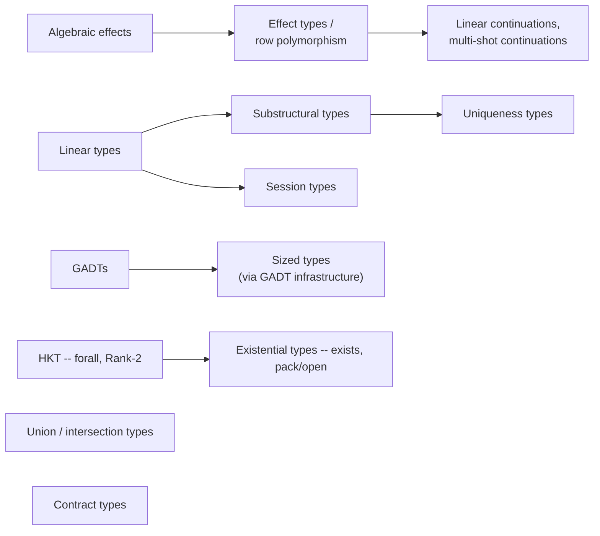

# Advanced Type System -- Design Rationale

Turmeric's type system evolved through a deliberate process of evaluating a
large set of candidate features against a set of fixed constraints. This guide
explains what those constraints are, why each shipped feature clears them, and
what happened to the two well-known features that were deferred for v1.0.0:
dependent types, which remain deferred, and refinement types, which shipped in
0.31.0 and graduated to always-on in 0.33.0 once it became clear the deferral
had rested on an assumption that did not hold.

## The constraints

Every advanced type system feature was measured against four tests:

1. **Aligns with Turmeric's goals** -- Lisp expressiveness, systems-level
   control, zero-cost abstractions.
2. **Fits the C99 target** -- no required garbage collector, manual or
   ownership-based memory, predictable performance, debuggable output.
3. **Composes with existing features** -- borrow checking, RC, typeclasses,
   algebraic effects. A feature that breaks the others is not worth having.
4. **Justifiable complexity** -- the elaborator and codegen changes must be
   proportionate to the user-facing benefit.

> **A note on flags.** All features described below are enabled by default
> in the compiler -- there is no opt-in flag to set. Historical `-X`
> experimental flags (e.g. `-Xlinear`, `-Xsessions`, `-Xeffect-types`) are
> still accepted on the command line for backward compatibility but emit a
> deprecation warning and have no effect.

---

## Ownership and linearity

### Why these features fit

Turmeric already had `ref<T>` (move-only, unique ownership). Linear, affine,
and relevant types are a natural extension of that discipline to the full
substructural lattice:

| Annotation | Can be dropped | Can be duplicated | Use case |
|---|---|---|---|
| `^unique` / `ref<T>` | Yes | No | Owned heap values, file handles |
| `^affine` | Yes | No | One-shot callbacks, handles you may discard |
| `^linear` / `lref<T>` | No | No | Resource handles that must be closed |
| `^relevant` | No | Yes | Values that must be observed (debug sinks) |

The codegen cost is zero: all four disciplines erase to the same C pointer
arithmetic that `ref<T>` already emits. The only new work is elaborator tracking
of usage counts, which is local (per function body) and decidable.

The key design decision was splitting `ref<T>` into two distinct types rather
than redefining it as linear:

- `ref<T>` maps to `CK_UNIQUE` (affine: at-most-one alias, droppable). This is
  the common case. Existing code continues to work.
- `lref<T>` maps to `CK_LINEAR` (linear: exactly-once, silent drop is an
  error). This is the opt-in form for resource handles where a forgotten `close`
  is a bug.

Wrapping `lref<T>` in `rc<T>` is a type error: shared ownership would violate
the exactly-once guarantee.

### Composability

Substructural types build on linear types, and session types in turn build on
linear types (session channels are linear). The three form a coherent
dependency chain rather than independent features.

Substructural types interact cleanly with typeclasses: a method declared with
`^linear` parameters requires all instances to match that discipline. The
elaborator enforces this at instance declaration time.

---

## Session types

Session types describe communication protocols in the type system: which party
sends what, in which order, and whether the channel branches.

```turmeric
;; A recursive protocol: receive an int, send one back, repeat.
(defalias EchoProto (Rec self (Recv int (Send int self))))

;; The channel's type carries the protocol state, so the order of `recv`
;; and `send` in the body is checked against it -- swapping them is a
;; TUR-E0212, not a runtime hang.
(defn echo-server [^linear ch : (Session EchoProto)] : nil
  (let [[n ch1] (recv ch)]
    (let [ch2 (send ch1 (* n 2))]
      (echo-server ch2))))
```
```sweet-exp
;; A recursive protocol: receive an int, send one back, repeat.
defalias EchoProto (Rec self (Recv int (Send int self)))

;; The channel's type carries the protocol state, so the order of `recv`
;; and `send` in the body is checked against it -- swapping them is a
;; TUR-E0212, not a runtime hang.
defn echo-server [^linear ch : (Session EchoProto)] : nil
  let [[n ch1] recv(ch)]
    let [ch2 send(ch1 {n * 2})]
      echo-server(ch2)
```

The protocol constructors are capitalised -- `Recv`, `Send`, `Close`, `Rec` --
and recursion is spelled with `Rec`/`self` rather than by naming the alias
inside itself. Lowercase `recv`/`send` are the *operations* you call on a
channel; in a type position they are read as type variables, which is why a
protocol written that way fails with `cannot compute dual of protocol`
(TUR-E0210) the moment a channel is allocated from it.

### Why these features fit

Session types are the natural consequence of having linear types and OS threads.
Once channels are linear (used exactly once before being passed on or closed),
the type system can track protocol state through the channel's type. The
elaborator adds duality checking -- client and server must be type duals --
which catches protocol mismatches at compile time rather than at runtime in a
hung coroutine.

The C99 story is straightforward: channels are bounded queues (or pipes) paired
with protocol tags. The runtime is a routed-queue implementation that does not
require a garbage collector. Session channels erase to a `struct` with a queue
pointer and a role field.

Multi-party sessions (the Honda-Yoshida-Carbone projection algorithm) extend
binary sessions to N-party protocols defined with `defprotocol`. Each
participant's view is derived by projection from the global type, guaranteeing
that the projected local types are consistent.

Timeouts are typed and protocol-aware: a `(Recv T (Timeout Q P))` encodes both
outcomes (message received or timeout) in the protocol type so neither branch
abandons a live linear channel.

---

## Effect types and row polymorphism

Turmeric's algebraic effects were untyped in their first iteration: any
function could perform any effect, and the type system did not track which
effects a computation used. Effect types make effect rows first-class.

```turmeric
;; Typed: this function may perform Io and nothing else.
(defn read-file [path : cstr] : cstr @ {Io}
  ...)

;; Effect-polymorphic: works with any effect set e that includes Ask.
(defn ask-and-add [x : int] : int @ {Ask | e}
  (+ x (perform (Ask))))
```
```sweet-exp
;; Typed: this function may perform Io and nothing else.
defn read-file [path :cstr] :cstr @ {Io}
  ...
;; Effect-polymorphic: works with any effect set e that includes Ask.
defn ask-and-add [x :int] :int @ {Ask | e}
  {x + perform(Ask())}
```

### Why these features fit

Row polymorphism is the correct model for effects because it is structural and
compositional. An effect row `{Io | e}` can be substituted into any context that
expects a superset of `Io`. This is exactly what the CPS transformation the
existing elaborator already performs wants: a function that performs `Write` is
safe in any context that handles `Write`, regardless of what else it handles.

Effect rows are compile-time only. They carry no runtime representation --
nothing is boxed, tagged, or heap-allocated because of an effect annotation.
This satisfies the zero-cost constraint.

The `forall [e]` quantifier (effect polymorphism) requires Rank-2 types. HKT
and HRT were prerequisites for this reason. The dependency is explicit and
documented.

Linear continuations (`^linear k`) and multi-shot continuations (`^multishot`)
extend effect handling to resource-safe and nondeterministic use cases
respectively. Both were built on the same CPS infrastructure -- they are not
separate features but modes of the existing continuation representation.

---

## Union and intersection types

```turmeric
;; Union: a value that may be int, cstr, or bool.
(defn print-any [x :(int | cstr | bool)] : unit
  (match x
    (i :int)  (println i)
    (s :cstr) (println s)
    (b :bool) (println (if b "true" "false"))))

;; Intersection: a value that is both Serializable and Printable.
(defn log-and-save [^Serializable ^Printable x : a] : unit ...)
```
```sweet-exp
;; Union: a value that may be int, cstr, or bool.
defn print-any [x : (int | cstr | bool)] :unit
  match x
    (i :int)
    println(i)
    (s :cstr)
    println(s)
    (b :bool)
    println $ if b "true" "false"
;; Intersection: a value that is both Serializable and Printable.
defn log-and-save [^Serializable ^Printable x :a] :unit
  ...
```

### Why these features fit

Union types and intersection types are the right tool for gradual typing: code at system boundaries -- FFI, plugin
APIs, configuration parsers -- benefits from the ability to say "this could be
any of these concrete types" without giving up type safety inside the boundary.

The codegen model reuses the existing tagged-union representation that ADTs
already emit. A union type `(A | B | C)` is a tagged union in C with one tag
per member. Subtyping (`A` is a subtype of `(A | B)`) is checked at use sites
and does not require runtime casts.

The `any` top type is the natural home for code
that genuinely wants dynamic dispatch -- dynamic configuration, debug printers,
and cross-FFI value shuttling -- without infecting typed code with `void*`.

Pattern matching on unions is exhaustive-checked: the elaborator requires a
`match` arm for every member of the union, mirroring the behaviour for ADTs.

---

## Sized types

Sized types (built on the GADT infrastructure) track container dimensions
as type-level compile-time integers.

> **Implementation status.** The example below is shipped behavior: a
> dimension mismatch whose sizes are statically known is caught at compile
> time (`TUR-E0260`). The `Size` GADT, `SizedVec`, sized
> buffers/matrices/bitvecs are all in place, and the size index is lifted to the type level -- it unifies
> across parameters, through `defstruct`/`defopaque` wrappers, and through
> polymorphic helpers. Sizes only known at run time fall back to runtime
> assertions. See the archived
> [sized-types-completion-plan.md](https://github.com/turmeric-lang/turmeric/blob/main/docs/archive/history/sized-types-completion-plan.md)
> (SZ6--SZ9) and
> [sized-types-cross-param-unification-plan.md](https://github.com/turmeric-lang/turmeric/blob/main/docs/archive/history/sized-types-cross-param-unification-plan.md).

```turmeric
;; Matrix multiplication: dimensions must be compatible.
(defn mat-mul [a :(Matrix m n float)
               b :(Matrix n p float)] :(Matrix m p float)
  ...)

;; Compile-time error if you pass incompatible shapes:
;; (mat-mul (Matrix 3 4) (Matrix 5 6))
;;   => expected n = 4, got n = 5
```
```sweet-exp
;; Matrix multiplication: dimensions must be compatible.
defn mat-mul [a : (Matrix m n float)
              b : (Matrix n p float)] : (Matrix m p float)
  ...
;; Compile-time error if you pass incompatible shapes:
;; (mat-mul (Matrix 3 4) (Matrix 5 6))
;;   => expected n = 4, got n = 5
```

### Why these features fit

Sized types are the systems programmer's version of lightweight dependent types.
Most code that researchers reach for dependent types to express -- length-indexed
vectors, matrix dimension checks, bit-vector widths for hardware description,
stack-allocated arrays with known sizes -- only needs compile-time integer
arithmetic on dimensions, not full Pi types with value-dependent types.

The codegen benefit is concrete: when the elaborator can prove that a buffer
size is statically known and fits on the stack, it emits `alloca` instead of
`malloc`. This is a zero-cost path for the common case in embedded and
performance-sensitive code.

Sized types also serve FFI: an `extern-c` declaration can annotate a C struct
with its Turmeric-side sized type, allowing the elaborator to verify layout
compatibility at import time.

The GADT infrastructure (G0--G4) was the natural home for sized types because
GADT pattern matching already refines index types in match arms. Adding
`StaticInt` as a kind-indexed type constructor over GADTs required no new
elaborator machinery beyond what G0--G4 already built.

---

## Contract types

Contract types attach runtime-checked predicates to types and
function boundaries.

```turmeric no-check
(defn vec-get [v :(vec a)
               i :#refine{ j :int | (and (>= j 0) (< j (vec/len v))) }] :a
  (vec/get-unsafe v i))

(defn sqrt [x :#refine{ y :double | (>= y 0) }] :double ...)
```
```sweet-exp
defn vec-get [v : (vec a)
              i : #refine{ j :int | (and (>= j 0) (< j (vec/len v))) }] :a
  vec/get-unsafe(v i)
defn sqrt [x : #refine{ y :double | (>= y 0) }] :double
  ...
```

### Why these features fit

The key insight is that "contract types" and "refinement types" are not the same
thing. Refinement types require predicate entailment -- the type checker must
prove at compile time that one predicate implies another. Contract types make a
simpler promise: check the predicate at runtime and fail fast if it is
violated.

Turmeric ships both, layered: the contract type is the annotation and the
runtime check, and refinement discharge is the pass that tries to prove each
one and drops the check where it succeeds. Reading them as two layers rather
than two competing features is what later made the proving half tractable
without an external solver -- see
["Refinement types: deferred, then built"](#refinement-types-deferred-then-built)
below.

This distinction maps cleanly onto Turmeric's build model:

- Debug builds (`just build`) always check contracts.
- Release builds (`just release`) strip them by default; pass `--keep-contracts`
  to retain them for safety-critical code.
- A custom failure handler (`set-contract-handler!`, `with-contract-handler`)
  lets embedders redirect failures instead of panicking.

Contracts do not require an SMT solver. They are predicates over values that
the elaborator emits as C conditionals. The runtime overhead is a branch plus
the predicate expression -- identical to the `assert!` macros that already
existed in `stdlib/contract.tur`, just integrated into the type annotation
syntax.

Contracts complement the existing `assert!`/`require!`/`ensure!` macros rather
than replacing them. The macros remain the imperative guard primitives for
ad-hoc checks inside function bodies; contract types are declarative annotations
at API boundaries.

---

## Existential types

Existential types hide a concrete type behind an opaque
boundary while still allowing operations on it through typeclass constraints.
They are the dual of higher-ranked `forall`: where `forall` lets the caller
pick the type, `exists` lets the callee pick the type and expose only what the
caller is allowed to do with it.

```turmeric
;; A boxed value paired with evidence that its type implements Show.
(defn box-it [x : a] :(exists [a] [(Show a)] a)
  (pack x (exists [a] [(Show a)] a)))

(defn print-it [e :(exists [a] [(Show a)] a)] : unit
  (open e [x] (println (show x))))
```
```sweet-exp
;; A boxed value paired with evidence that its type implements Show.
defn box-it [x :a] : (exists [a] [(Show a)] a)
  pack(x (exists [a] [(Show a)] a))
defn print-it [e : (exists [a] [(Show a)] a)] :unit
  open(e [x] println(show(x)))
```

### Why these features fit

Existentials are the missing half of Turmeric's quantifier story. HKT gave the
language `forall` and Rank-2 polymorphism; existentials complete the pair by
giving callees a way to return values whose concrete type is private.
Heterogeneous collections (`(vec (exists [a] [(Show a)] a))`), plugin APIs that
hand back opaque handles, and abstract data types whose representation is
sealed at the module boundary all fall out of the same construct.

The codegen story reuses infrastructure that already exists. A packed
existential is a `struct` holding the inner value (or a pointer to it) and one
vtable pointer per constraint -- the same dictionary-passing representation
that typeclasses already emit. `pack` is a record construction; `open` is a
scoped binding that brings the witness type and methods into scope. No new
runtime machinery, no boxing beyond what typeclass dispatch already requires.

Existentials compose cleanly with the rest of the system:

- **Typeclasses**: constraints on the existential are checked at the `pack`
  site against existing instance declarations. No new resolution rules.
- **RC and substructural types**: `(exists [a] [(Show a)] (rc a))` and
  `(exists [a] [(Show a)] (lref a))` are both well-formed. The discipline of
  the inner type is preserved through the existential boundary.
- **GADTs**: existential index variables in GADT constructors were the
  precursor; full first-class existentials generalise the same mechanism to
  arbitrary positions in a type.

The "existential GC" work (see `docs/archive/history/existential-gc-plan.md`)
addressed the one non-trivial interaction: ensuring that boxed values inside
existentials are visible to the runtime's tracing so that RC and arena
ownership rules continue to hold across the opaque boundary. With that piece
in place, existentials cost nothing beyond what users explicitly pack.

---

## Why dependent types were correctly deferred

Dependent types allow a type to be indexed by a runtime value:

```
Vec n a  -- a vector of length n, where n is a value
```

The critical piece of dependent types that Turmeric does not yet have is the
**Pi type**: `(Pi x a b x)` where the return type `b` can mention the argument
value `x`. Pi types require dependent unification in the elaborator -- the type
checker must unify types that contain arbitrary expressions, which is undecidable
in the general case and hard in the practical case.

Everything adjacent to Pi types that users actually reach for is already covered:

| "I want dependent types for..." | Turmeric answer |
|---|---|
| Length-indexed vectors | `SizedVec n a` via Sized Types |
| Matrix dimension checks | `Matrix m n a` via Sized Types |
| Compile-time naturals | `StaticInt` |
| Pattern-refined types | GADT pattern matching narrows index types |
| Equality proofs at compile time | GADT index witnesses |

The remaining gap -- functions whose return type is an expression over their
argument value -- does not have strong demand from Turmeric's target users
(systems programmers, embedded developers, application developers). The cases
that arise in practice are covered by GADTs plus Sized Types.

Introducing Pi types would require:

- A dependent unification engine in the elaborator (a significant research
  implementation problem, not just engineering).
- A proof-erasure pass so that proof terms do not appear in generated C.
- Interaction design between Pi types, GADTs, HKT, and effect rows -- all of
  which were designed without dependent types in scope.

The cost is Very High; the remaining demand is Low. Deferral is correct.

---

## Refinement types: deferred, then built

Refinement types attach compile-time-checked predicates to types, using the
same `#refine{...}` reader form contract types use:

```
#refine{ x : int | (>= x 0) }  -- an int proven non-negative
```

**They shipped in 0.31.0 and graduated to always-on in 0.33.0.** See
[refinement-types-guide.md](refinement-types-guide.md). This section is kept
because the reasoning that deferred them, and the one insight that later made
them shippable, are both worth having written down -- and because the other
deferred feature, dependent types, is still deferred on grounds that have not
changed.

### Why they were deferred

The key word is "proven". Unlike contract types, refinement types require the
type checker to establish predicate entailment: if `(>= x 0)` is in scope, can
it prove that `(>= (+ x 1) 0)` holds? The assumption at the time was that this
means an SMT solver -- Z3 or equivalent -- integrated into the elaborator, and
so a hard external dependency on the compiler's critical path.

| Phase | Status after v4 |
|---|---|
| Syntax (`#refine{ x : T \| p }`) | Done -- Contract Types use the same syntax |
| Subtyping (`T { p }` is a subtype of `T`) | Structural part done via union/intersection; entailment layer still needed |
| Runtime check insertion | Done -- Contract Types already do this |
| FFI boundary annotation | Done -- Contract Types CT4 covers this |
| Predicate propagation + SMT | The gap |

So the gap was well-defined and separable from the rest of the type system.
What made it look expensive was the solver.

### What changed: the runtime fallback makes a partial solver shippable

The deferral treated entailment as all-or-nothing -- either you have a complete
solver or you have nothing. That is true for a language where the refinement is
the *only* check. It is false here, and this is the whole insight:

**every refinement already has a runtime meaning.** The predicate is a contract
type first. So the static discharger is allowed to answer "I don't know" on any
obligation and remain sound -- that obligation simply falls back to the runtime
check it would have had anyway. Incompleteness costs performance, never
correctness.

That inverts the economics. A hand-rolled, incrementally-built solver is a real
feature rather than a broken one, because the failure mode of every gap in it
is a check you were already paying for. Turmeric's chain was built in stages --
normalization and syntactic entailment, congruence closure, Fourier-Motzkin
over exact rationals, Nelson-Oppen equality exchange, bounded cube expansion --
each stage useful on its own and each free to decline.

The consequence for the deferral argument: **there is no *external* SMT
dependency.** The solver itself is real and it ships -- the staged chain above
is `src/compiler/refine_solver*.c`, compiled into `tur`, and since 0.33.0 it
runs on every compile. What no shipped artifact links is a *third-party* prover:
there is no `libz3` to find at configure time, no solver subprocess, and
nothing on the compiler's critical path that a user has to install. A Z3 backend
existed for a while as a development-only oracle, cross-checking the in-house
chain's verdicts; once it had agreed on every VC a real program generated, it
was retired and deleted in 0.32.5. The risk that was correctly identified --
an external dependency, not entailment as such -- turned out to be avoidable
rather than merely worth postponing.

Contract types plus `assert!`/`require!`/`ensure!` still cover the practical
defensive-programming cases, and Sized Types plus GADTs still cover many
bounds-checking cases without any proving at all. Refinement types are the
layer that turns those runtime checks into compile-time ones where the
predicate can be discharged -- and leaves them alone where it cannot.

---

## How the features form a coherent whole

The shipped features are not independent additions. They form a dependency
graph:



Each feature in the graph uses the one above it. Dependent types would not slot
naturally into it -- they would require elaborator changes that cut across
multiple existing features, creating exactly the kind of cross-cutting
complexity that makes a type system hard to reason about.

Refinement types were expected to have the same problem and did not. They
attached as a layer *on top of* contract types rather than as a change running
through the graph, which is a direct consequence of the runtime fallback
described above: because a refinement is a contract type first, the static
discharger reads the existing annotations and either proves an obligation or
declines it. Nothing below it in the graph had to change to accommodate that.

The result is a type system that is powerful enough for systems programming
(linear resource management, session-typed protocols, stack-allocated sized
arrays), expressive enough for functional programming (effect rows, union types,
GADTs), and safe enough for API boundaries (contracts, and refinements proved
where they can be) -- without the research risk of dependent unification, and
without an *external* SMT dependency: the solver that discharges refinements is
in-house and compiled into `tur`, so there is no third-party prover to install
or link.

---

## See also

- [substructural-types-guide.md](substructural-types-guide.md) -- `^linear`, `^affine`, `^relevant`
- [uniqueness-types-guide.md](uniqueness-types-guide.md) -- `^unique` and `lref<T>`
- [session-types-guide.md](session-types-guide.md) -- Session types and protocol types
- [effects-system-guide.md](effects-system-guide.md) -- Algebraic effects
- [hkt-guide.md](hkt-guide.md) -- Higher-kinded types
- [existential-types-guide.md](existential-types-guide.md) -- Existential types and `pack`/`open`
- [gadts-guide.md](gadts-guide.md) -- GADTs
- [sized-types-guide.md](sized-types-guide.md) -- Sized types
- [contract-types-guide.md](contract-types-guide.md) -- Contract types
- [refinement-types-guide.md](refinement-types-guide.md) -- Refinement types: static discharge of `#refine{...}`
- [refinement-solver-internals-guide.md](refinement-solver-internals-guide.md) -- How the in-house solver chain works
- [union-intersection-types-guide.md](union-intersection-types-guide.md) -- Union and intersection types
- [effects-vs-monads.md](effects-vs-monads.md) -- Effect handlers vs. monad values
