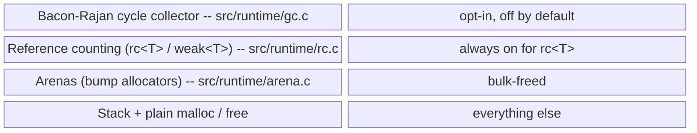

# Garbage Collection in Turmeric

Turmeric does **not** have a single, tracing, always-on garbage collector.
Memory management is layered: most values live on the stack or in an arena,
`rc<T>` values are reference-counted, and a Bacon-Rajan cycle collector sits
on top of RC to reclaim cycles when it is turned on. In v1 the cycle
collector defaults to `GC_DISABLED` — the RC layer alone is doing the work.

This guide explains what the runtime does, what the compiler emits, what the
interpreter deliberately does not free, and where the seams are.

---

## The layers, at a glance



Only values whose type is `rc<T>` participate in RC or GC. Everything else
is stack-allocated, arena-allocated, or manually freed at a well-defined
lifetime boundary.

---

## What GC is used for

The short answer: **cycles in `rc<T>` graphs.** The longer answer breaks
down by what each layer manages.

### Reference counting handles the common case

The RC layer (`src/runtime/rc.h`, `src/runtime/rc.c`) manages every value
whose type is `rc<T>`. That includes:

- Boxed closures with captured `rc<T>` children.
- Cons cells reachable through `rc<Cons>`.
- Boxed results and options — `rc<Result<T,E>>`, `rc<Option<T>>`.
- Existentials packed under `RCK_EXISTENTIAL` / `RCEXP_RC`.
- Any user `defstruct` used behind `rc<T>` — its walker is registered so
  fields that are themselves `rc<T>` get traced.

The compiler emits `rc_strong_increment` on clone and `rc_strong_decrement`
on drop, with **last-use elision** so a value that flows straight into a
consumer is passed without a bump. When the strong count hits zero, the
control block is freed via a deferred queue (`rc_free_queue.c`) that
flattens deep drop chains into an iterative loop — this keeps `rc<Cons>` of
a long list from blowing the C stack.

### The cycle collector handles the leftover

RC alone leaks cycles. That is what the GC layer is for. It is a
Bacon-Rajan trial-deletion collector:

1. When a strong decrement lands on a still-live block that could be part
   of a cycle, the block is added to a **suspect buffer** and colored
   PURPLE (`gc_possible_root`, called from `rc_strong_decrement` in `rc.c`).
2. A collection cycle runs `gc_mark_phase` (`gc.c`) over the suspects:
   colors reset to WHITE, blocks reachable from real roots (any block with
   `strong_count > 0` that is not a suspect) go BLACK, and reachability is
   propagated by each block's `walk_fn`.
3. `gc_trial_deletion_phase` (`gc.c`) frees anything still WHITE -- by
   definition, unreachable cyclic garbage.

The important part for users: **the collector only sees what the walker
sees.** `RCK_STRUCT` blocks provide a `walk_fn` registered at
`rc_cb_alloc_struct` time (`emit_expr.c:5594-5656`), and existentials with
`RCEXP_RC` payloads are visible through the same mechanism (EXG5). Blocks
allocated with `RCK_OPAQUE` (raw pointers, C handles) are invisible to the
walker — cycles that route through them will not be reclaimed.

### What triggers a collection

- `GC_DISABLED` (default in v1, `gc.c`) -- collection early-returns.
  RC still runs; cycles just accumulate.
- `GC_MANUAL` -- collection runs only when user code calls `(gc!)`.
- `GC_THRESHOLD` -- collection runs when the suspect buffer reaches
  `GC_SUSPECT_THRESHOLD` (128) entries.
- `GC_AUTO` (CG5) -- collection runs at **allocation checkpoints**, with no
  `(gc!)` call anywhere in the program. Two triggers: the candidate buffer
  reaching `GC_SUSPECT_THRESHOLD`, or `GC_AUTO_ALLOC_INTERVAL` allocations
  since the last collection. You get it by calling `(gc-auto!)`, and only by
  calling it -- automatic collection is opt-in in this language and is never
  the default, before or after v1. A program that never makes that call runs
  the pure-RC path with no collector overhead at all.

There is no background thread and no time-based sweep. Outside `GC_AUTO`, user
code drives collection.

Deliberately, the automatic trigger sits at allocation sites and **never** on
the refcount-decrement path: collecting out of `rc_strong_decrement` reenters
the collector while a caller is mid-mutation.

Runtime knobs surface as three compiler intrinsics wired in
`elab_memory.c`:

| Form           | Effect                          |
|----------------|---------------------------------|
| `(gc!)`        | Force one collection cycle now  |
| `(gc-enable!)` | Enable, defaulting the mode to `GC_MANUAL` |
| `(gc-disable!)`| Return to `GC_DISABLED`         |
| `(gc-auto!)`   | Enable in `GC_AUTO` -- collect automatically at allocation checkpoints |

### Seeing what the collector did

Four readers, all plain counts, plus a per-collection trace on stderr:

| Form | Returns |
|------|---------|
| `(gc-collections)` | collections run so far |
| `(gc-objects-freed)` | control blocks reclaimed |
| `(gc-live-blocks)` | rc blocks currently registered |
| `(gc-candidate-high-water)` | peak candidate-buffer occupancy |

```sh
TUR_GC_TRACE=1 ./my-program
[gc] #1 mode=3 candidates=128 freed=128 live=128->0
```

The high-water is the one to watch: `gc-live-blocks` is instantaneous and sits
near zero right after a collection, so it tells you little on its own. A
high-water that stays at `GC_SUSPECT_THRESHOLD` means the collector is keeping
up; one that climbs means it is not.

`(gc-enable!)` defaults to `GC_MANUAL`, not `GC_THRESHOLD` -- collection still
happens only when you ask for it with `(gc!)`. Call `gc_set_mode(GC_THRESHOLD)`
for the suspect-count trigger; an explicit mode set before `(gc-enable!)`
survives it.

> **What a collection actually reclaims.** `(gc!)` reclaims **live strong
> `rc<T>` cycles** as well as weak-zombie blocks. The collector runs real
> Bacon-Rajan trial deletion: a strong decrement that leaves the count > 0
> buffers a candidate root, and collection subtracts the internal (in-cycle)
> edges on a scratch counter to find blocks referenced only from within the
> candidate subgraph. Measured: 192 bytes per two-node cycle -> 0.
>
> One caveat: the collector only sees what the walker sees, so a cycle
> routed through an `RCK_OPAQUE` handle is not reclaimed. Collection is
> driven by user code -- `(gc!)`, or the suspect threshold under
> `(gc-enable!)` -- **unless** `(gc-auto!)` is in play, which collects at
> allocation checkpoints on its own (CG5). Breaking cycles with `weak<T>`,
> as in Rust, is valid and is the only option with the collector disabled
> (the default). See `docs/archive/gc-cycle-collection-plan.md` and
> `docs/archive/gc-cycle-collection-followup-plan.md`.

---

## What is *not* GC-managed

Most things. This is the part people miss.

**Stack values.** Primitives — `:int`, `:float`, `:bool`, `:cstr`
literals — live on the stack. No RC, no GC.

**Arena-allocated values.** The elaborator's scratch data, the
interpreter's value pool, and per-pass working memory all live in bump
arenas (`arena.c`) that are freed en masse at the end of their scope.
Individual values inside an arena are never freed one at a time.

**Region-allocated values.** The third reclamation mode, on by default since
2026-09-05 (see the
[regions plan](https://github.com/turmeric-lang/turmeric/blob/main/docs/archive/regions-plan.md)).
A `:heap` `defdata` node -- a list cell, a tree node, the per-link box of a
recursive sum -- has no unique owner by construction, so neither RC nor a
scope-exit drop can free it. A **region** does not ask who owns the node; it
asks *when the whole generation dies*. Two brackets declare that: `with-region`
(the lifetime only) and `bt-scope` (a trail level *and* the lifetime). Every
such node allocated while a bracket is open lands in an arena generation, and
when the bracket exits the generation is **rewound** in one O(slabs) step --
*provided* the compiler can prove the returned value does not transitively
reach anything allocated inside. That proof is two locks: a static walk over
the result type (scalars, `cstr`, non-heap ADTs of those, a `Vec` of scalars
pass; a node, a pointer, a closure, a recursive spine refuse) and a runtime
**escape note** that flags a generation whenever one of its words is seen
crossing out of it. A shape neither lock can clear **retires** the generation
instead of rewinding it -- byte-for-byte the pre-region behaviour, so a missed
shape costs a saving, never correctness. Retired and pooled generations are
freed at exit by `tur_region_shutdown`, registered ahead of every module
`defer` so a defer can still read a retired value. `TUR_REGIONS=0` turns the
whole mechanism off for bisection; `tests/run-regions-seam.sh` keeps that path
green.

The runtime note is wider than the result (region-lock-hardening, 2026-09-06),
because the result is not the only way out of a bracket. Three escapes the
result walk cannot see were each a segfault on the default build: a node
**stored** into an outer container (`vec-push!` from inside `with-region`), a
node hiding behind an **erased `:int`** inside an admitted record result
(`(HI n (build n 0))` where `build` returns `(:: (Link ..) :int)`), and a
`(Vec int)` result of erased nodes. So every primitive that writes a caller's
word into memory that can outlive a bracket says `TUR_REGION_NOTE(word)` --
`vec-push!`/`vec-set!`, `mutmap-set!`, the HAMT setters, `bt-set!`/`g-set!`,
the atomics, `gen-arr-push!`, `grid-set!`, `rcvec-push!`, `set!` on a global
or shared cell, `set-field!`/`set-deref!`, a closure-env fill, a heap-boxed
constructor field, an element box, an `rc/of` -- and an **erasing
ascription** (an ADT or type application that reaches a node, ascribed to
`:int`, `ptr<void>` or `Any`) notes the value at the point the static walk
loses it -- except one whose only use is `(= (:: node :int) 0)` or `not=`
against a literal `0`, the null test, which goes nowhere and is not noted
(stdlib-list-null-check-retires-regions). A by-value aggregate result
is noted by its words. A noted word that is region memory flags the generation
that OWNS it (not only the innermost), which then retires. The macro is
`((void)0)` under `TUR_REGIONS=0`. **A new store primitive must carry the
note**; the two fixtures `region-escape-via-store` and
`region-escape-via-erasure` read every stored value back after the pop.

An **inline-C body is opaque**, so a node handed to one may be retained past
the call with no store the compiler can hook. That is covered at the callee,
where every parameter is a plain C identifier: a parameter whose type can *be*
region memory is noted at body entry. The filter is narrow on purpose -- a
`:heap` node, or a by-value aggregate holding one, and never a scalar, a
`cstr`, a `ptr<void>`, an opaque newtype (`defopaque BtCell :ptr` is a C-made
handle) or a malloc-backed collection handle. So `(defn f [l : Link] ...)`
with a hand-written body retires the generation, while the far more common
scalar-parameter body notes nothing and keeps every rewind. No fixture in the
tree changed when this landed.

Two things sat outside the note, both closed and recorded in
`docs/archive/region-escape-through-unhooked-stores.md`: an `extern-c`
function, which has no emitted body to put the note in (unreachable -- the
extern-c boundary refuses a `:heap` node and any record holding one), and a
stdlib primitive that stores a word arriving as an *erased* `:int` rather than
a typed node (noted at the erasure, and by hand in each such primitive).
Prefer the typed style (`nxt : Link`, `(Vec Link)`, a `:copy` sum) over
erasing to `:int`: a typed value is refused by the result walk where it must
be, keeps its rewinds where it can, and never takes the erasure note.

The generation stack is **per-thread** (like the trail and the panic state);
ownership -- what `tur_region_free` refuses to `free()` -- is process-wide
through a registry, so a node that crosses threads is still safe to drop
anywhere. A pop whose inner brackets were skipped by a panic retires the
abandoned generations rather than jamming the stack. A panic out of a bracket
retires the bracket's own generation on the way out (never rewinds it: the
payload may point in), and every catch boundary (`catch-unwind`,
`catch-panic-of`) retires whatever a panic left open above the depth it was
entered at -- so even the outermost catch leaves the stack where it found it
(`region-catch-retires-stranded-generation`).

**Fuzzed, both ways.** `tests/regions-fuzz-src.py` generates programs that
let nodes out of a bracket through every route above (or not at all), reads
each value back after the pop on the default arm compiled with
`-fsanitize=address` (so the arena poison is live) and under `TUR_REGIONS=0`,
and checks both against a predicted stdout. It also predicts, per bracket,
whether the runtime must rewind or retire and compares that with the counts
`TUR_REGION_STATS=1` prints at shutdown -- so a lock that quietly refused
everything would fail the run as surely as one that let a node dangle.
The ctest smoke is `tur_regions_fuzz_src`; run the driver directly with a
larger `--n` and a fresh `--seed` for a session.

**Non-`rc` heap values.** A `defstruct` used by value or a raw `:ptr<T>`
returned from inline C is *not* on the RC path. If your inline-C code
`malloc`s, your inline-C code frees.

This includes **boxed sum-type payloads.** A `defdata` constructor with a
heap payload (`(Cons 1 rest)`, `(Full 7)`) emits a `ctor_*` `malloc`, but a
bare non-`rc<T>` box is never auto-freed on *any* path -- matching it and
consuming the payload does not drop the box. This is the memory model, not a
`match`-teardown bug: e.g. a plain `(defdata List (Nil) (Cons :int :List))`
built and matched leaks its `Cons` boxes by design. Opt a boxed value into
managed lifetime by wrapping it in `rc<T>`, or use the substructural
(`^linear`/`^unique`) path. The compiled program's *runtime* is not
leak-checked (only the `emit-c`/`build` codegen path is), so these leaks pass
the suite silently.

**Boxes without walkers.** `RCK_OPAQUE` blocks are RC-managed (they get
freed when the count hits zero) but the cycle collector cannot see through
them. Wrap C handles in `defopaque` and give them a proper drop, not a
walker, when they have no `rc<T>` children.

**A `Vec[rc<T>]` compiles and is refcount-correct** -- the Vec takes a strong
reference per slot and releases it on free/overwrite/removal -- but a cycle
routed through a Vec's element buffer is RC-balanced and **not** reclaimed,
because the Vec's buffer is an ordinary `malloc` block with no walker.

**A `Map[K rc<V>]` behaves the same way**: the map takes a strong reference on
insert (`tests/fixtures/map-holds-rc-values`) and a read hands the caller its
own, but HAMT nodes are plain `malloc` blocks with no walker, so a cycle routed
through a map entry is RC-balanced and unreclaimed. `weak<T>` is rejected as a
collection element everywhere (there is no count to take).

`tests/fixtures/gc-blind-spot-cycle-through-vec` measures exactly this. It
builds the same two-reference cycle twice, differing only in the back-edge:

| back-edge | result |
| --- | --- |
| `a --.peer--> b --.peer--> a` (rc fields) | freed, 0 live |
| `n --.kids--> Cell --.item--> n` (rc cells) | 0 live |
| `n --.kids--> Vec --slot--> n` | 0 freed, 50 live |

The middle row is the one that says what the gap is. A **user-defined container
of rc cells is traced today**, with no new machinery -- its links are ordinary
`rc` fields the walk glue already enumerates. So the blind spot is not
"collections" as a category and not a missing capability in the walker; it is
one specific thing, a flat `malloc`'d buffer with no `walk_fn`. **If you need a
collection of `rc<T>` the collector can trace, stdlib has two**, both opt-in:

- `stdlib/rcchain.tur` -- a chain of rc cells, pure Turmeric:

  ```turmeric
  (defstruct RcChain :move [A] [item : rc<A> next : rc<RcChain>])
  ```

  Nothing in the compiler or runtime knows about it -- both fields are ordinary
  `rc`, so the walk glue traces them like any other. Pinned by
  `tests/fixtures/rcchain-cycle-is-collected`. O(n) to index and one rc block
  per element.

- `stdlib/rcvec.tur` -- the **flat buffer, traced**. An `rc<RcVec>` handle's
  control block carries its own walk and drop hooks (`tur_rcvec_walk` /
  `tur_rcvec_drop`, emitted into every program's preamble), so the container
  itself is GC-visible and every slot -- an rc control-block pointer -- is
  reported as a child. O(1) indexing, one buffer, one retain per push
  (`rcvec-push!` borrows its element and the vector takes its own reference;
  `rcvec-get` mints the caller a new one). Pinned by
  `tests/fixtures/rcvec-cycle-is-collected` (the same 50-cycle shape the vec
  arm strands: reclaimed, 0 live) and `rcvec-holds-rc-values` (the counts).

A `Vec` of handles that cannot cycle is still the better default -- the plain
table above is the price only when the elements can form a cycle and the
collector is on.

Emitting a walk loop for the *plain* Vec's field would *not* fix this, and is
the trap worth naming: `gc_collect_white` frees the whole white set together and
never releases references out of it, which is sound only when every path into a
traced object is GC-visible. A plain `Vec` is shared by raw pointer with no
count of its own, so tracing through it would let the sweep free a block a live
`Vec` still points at -- a leak traded for a use-after-free. The container has
to become GC-visible first, which is exactly what `RcVec` is: the buffer's
owner is an rc block, so the collector always knows whether the buffer is still
held. The same argument applies unchanged to a HAMT node, which is why a cycle
through a `Map` entry remains unreclaimed. See
[docs/archive/history/collections-cannot-hold-rc-values.md](https://github.com/turmeric-lang/turmeric/blob/main/docs/archive/history/collections-cannot-hold-rc-values.md)
for the full design history.

A closure that *captures* an `rc<T>` releases it correctly; that is not a blind
spot.

---

## Ownership across the stdlib

Where does that leave the standard library? An audit of all ~138 stdlib
modules found that **stdlib builds no `rc<T>` cycles and uses `weak<T>`
nowhere -- because it barely reaches for shared ownership at all.** `rc<T>`
appears only in `stdlib/rc.tur` (the module that *defines* it) and the generated
`stdlib/docstrings.tur`; no other module constructs, stores, or imports one. The
library reaches its leak-free state by *sidestepping* shared mutable ownership,
via three strategies:

- **Persistent-immutable with structural sharing** -- `hamt`, `map`, `set`,
  `list`, `string`. Every update returns a new root; sharing is refcounted at the
  **C layer** (`tur_hamt_retain`, the string header's `rc` field), not via the
  Turmeric `rc<T>` type. An immutable DAG has no mutable back-edges, so no cycle
  can form.
- **By-value / single-owner mutable storage** -- `vec`, `mutmap`, `grid`, `ref`,
  `sized-*`. Each owns the one buffer it mutates; there are no shared handles and
  no back-pointers written into shared nodes.
- **Linear / affine opaque handles** -- `chan`, `future`, `taskgroup`, `mutex`,
  `reactor`, `net`, ... are `defopaque ... :linear` / `:affine`. Single ownership
  and exactly-once teardown are the deliberate alternative to refcounting.

**Relative to Rust, the stdlib is already at or beyond the ideal.** Rust's rule
is "use `Rc`/`Arc` only when ownership is genuinely shared, and break every cycle
with `Weak`." The stdlib clears that bar by rarely needing shared ownership in
the first place (Clojure/Haskell-style persistence plus linear types), so there
are no cycles to break and `weak<T>` is unused.

The one forward-looking caveat: a stored `rc<T>` field is what *would* enable a
cycle, and reclaiming one requires the collector to be enabled and the cycle to
be walker-visible (see the Known gaps below). To keep the property from
regressing silently, the
`tur_stdlib_no_rc_cycles` ctest guard (`tests/check-stdlib-no-rc-cycles.sh`)
fails if a stdlib type annotation introduces `rc<...>` without an explicit
`rc-cycle-ok` review marker.

The escape hatch for the day shared ownership *is* wanted lives in the
library: [`stdlib/weak.tur`](https://github.com/turmeric-lang/turmeric/blob/main/stdlib/weak.tur) provides `rc/downgrade`,
`weak/upgrade`, `weak/unwrap`, `weak/alive?`, and `weak/drop` -- Rust's
`Rc::downgrade` / `Weak::upgrade` pairing, wrapping the runtime's weak-ref
intrinsics. It is opt-in (`(load "stdlib/weak.tur")`) and stdlib itself uses
none of it. For when to reach for which ownership strategy in the first place,
see [ownership-guide.md](ownership-guide.md).

### The reviewed exceptions: `stdlib/rcchain.tur` and `stdlib/rcvec.tur`

`rcchain.tur` and `rcvec.tur` are the opt-in modules that *do* store `rc<T>`
-- both fields of an `RcChain` link are one (`[item : rc<A> next :
rc<RcChain>]`), and an `RcVec`'s buffer holds one per slot -- and both are
exempt from the guard as whole files, alongside `rc.tur` itself.

The exemption is the review, not a waiver of it. These containers can
absolutely form a cycle; the point is that theirs are **reclaimed**. A chain's
fields are plain `rc`, so the emitted walk glue reports both the element and
the spine as children; an rcvec's control block carries its own walk hook that
reports every slot. Either way the collector traces straight through -- no
`weak<T>` is needed to break anything, because nothing is stuck.
`tests/fixtures/rcchain-cycle-is-collected` and
`tests/fixtures/rcvec-cycle-is-collected` pin exactly that: fifty cycles
routed through each container, then `(gc!)`, then `gc-live-blocks` == 0.

That is these modules' entire reason to exist. A plain `(Vec rc<T>)` is
refcount-correct but *invisible* to the collector -- its elements sit in an
ordinary malloc'd buffer with no walk function, so a cycle through it is never
reclaimed (measured at 0 freed / 50 live in
`tests/fixtures/gc-blind-spot-cycle-through-vec`). The blind spot is the
unowned flat buffer specifically, not "collections". Reach for `RcVec` (O(1),
flat) or `RcChain` (no C hooks at all) when the elements can cycle and the
collector is on.

The exemption is file-level rather than per-line for a mechanical reason too: a
trailing `;; rc-cycle-ok:` marker does not survive `tur fmt`, which moves the
comment onto its own following line -- so a per-line marker would put this guard
in permanent conflict with the `fmt-bootstrap-stdlib` check in
`tests/run-fmt.sh`.

---

## The interpreter is different

The tree-walking interpreter (`turi_eval`, `src/turi/eval.c`) makes
deliberately different choices, and this trips people up.

**Closures are never freed *individually*.** Frames, bindings, and closures
are region-allocated from the env's value pool (`turi_val_alloc` in
`value.c`; `eval_frame_new`/`eval_frame_free` in `eval.c`), and the
per-object free is a deliberate no-op because a closure can capture a frame that
outlives its defining scope and the interpreter does not track which. The whole
pool is then reclaimed wholesale at `turi_env_free` (`env.c`) -- this is
region memory reclaimed at teardown, **not** memory abandoned to the OS. The
practical split: a short-lived process (fork-per-fixture, one-shot `tur build`)
reclaims everything at exit; a **long-lived env** is bounded by two mechanisms
that are on for the REPL. Incremental parse + elaboration is the default
for every env (`TUR_NO_INCREMENTAL_ELAB=1` opts out), so `eval_arenas` and
re-parse cost are linear instead of quadratic; the REPL additionally enables
scratch promotion, which deep-copies each eval boundary's escaping values into
a permanent pool and rewinds the scratch pool (measured over 1500
transient-heavy turns: ~1.1 GB retained -> ~2.2 MB). Embedders using the bare
create/eval/free pattern need neither and get the old behavior with
promotion off. See `docs/archive/turi-incremental-elaboration-design.md`
and `docs/archive/turi-interp-incremental-reclamation-plan.md`.

**Collections (Vec/Set/Map) backing buffers** are `calloc`/`malloc`'d outside
the value pool. They are tracked at creation and swept at teardown
(`docs/archive/history/interp-collections-never-freed.md`), and -- with scratch
promotion on, i.e. in the REPL -- **also reclaimed mid-run** (TR3): right
after each promotion rewind, a conservative mark over the live value graph
frees every tracked buffer nothing references any more (measured: 5000
dropped transient vecs -> 0 live tracked boxes, where teardown-only retained
all 5000). The sweep is leak-on-doubt: a live *non-empty* Set/Map's entries
are untyped carriers, so any cycle that reaches one frees nothing rather than
risk freeing a buffer a hidden reference still uses. TVar cells ride the same
tracking, which is also what keeps a TVar valid across rewinds. Explicit
`vec-free` / `set-free` / `map-free` remain available and remain the only
mid-run reclamation for envs without promotion.

**Consequence for `bash tests/run.sh`.** The compiler/codegen path is
leak-clean and runs with LeakSanitizer enabled. The interpreter harnesses
(`run-turi.sh`, `run-flags.sh`) default to `ASAN_OPTIONS=detect_leaks=0` -- not
because memory is abandoned, but because the interpreter deliberately does not
free incrementally, so LSan on the interp path is noise rather than signal. See
`docs/archive/history/asan-debug-leaks-plan.md`.

---

## Codegen surface (what you'll see in `emit-c` output)

Every `rc<T>` operation lowers to a call in the runtime preamble:

- `rc_cb_alloc_struct(size, type_id, drop_fn, walk_fn)` — box a struct
  payload with a walker for cycle visibility.
- `rc_cb_alloc_kinded(size, kind, sub_kind, ...)` — box existentials
  (`RCK_EXISTENTIAL`, `RCEXP_RC`) so the walker can see the witness.
- `rc_strong_increment(cb)` / `rc_strong_decrement(cb)` — clone / drop.
  The elaborator elides the pair when a value is used exactly once.
- `rc_weak_increment(cb)` / `rc_weak_decrement(cb)` — for `weak<T>`.
- `rc_upgrade(cb)` — weak → `option<rc<T>>`.

If you are looking at generated C and want to know whether a value is
GC-visible, look for `walk_fn` in the `rc_cb_alloc_*` call. If it is
`NULL` (or the block is `RCK_OPAQUE`), the collector cannot trace through
it.

---

## Reading list

If you want to touch this code:

1. `src/runtime/rc.h` -- control-block layout, kind tags (`RCK_*`,
   `RCEXP_*`). Start here; everything else assumes this vocabulary.
2. `src/runtime/rc.c` -- increment / decrement, the deferred free queue
   hookup, the `gc_on_strong_decrement` / `gc_possible_root` calls.
3. `src/runtime/gc.h` and `src/runtime/gc.c` -- modes, suspect buffer,
   `gc_mark_phase`, `gc_trial_deletion_phase`.
4. `src/compiler/emit_expr.c` -- where `rc_cb_alloc_*` calls are emitted;
   this is how types acquire walkers.
5. `src/turi/eval.c` -- the interpreter's opposing policy (region allocation +
   no-op per-object free, `eval_frame_new`/`eval_frame_free`) and why it is
   deliberate.

For historical context:

- `docs/archive/history/existential-gc-plan.md` — original EXG1 RC-for-existentials plan.
- `docs/archive/existential-gc-followup-plan.md` -- EXG4/5/6 (cross-scope
  ownership, cycle visibility, `:linear`).
- `docs/archive/history/end-to-end-monomorphization-plan.md` — the longer-term
  ABI direction; the current hybrid carrier/by-value boxing is the seam RC
  and GC sit on.

---

## Which copy of the collector runs

The collector exists in two copies: `src/runtime/{rc,gc,rc_free_queue}.c`
(linked as `libturt_runtime.a`), and a replica emitted into standalone C
output. Which one a program runs depends on the build path:

| build path | collector |
|---|---|
| `tur build` (executable) | **linked from `libturt_runtime.a`** -- the same code the interpreter runs |
| `tur build --shared` (.so) | the emitted replica, at **hidden visibility** -- a `.so` stays self-contained, and its collector is not exported, so a host that dlopens it cannot partially merge the two registries |
| bare `tur emit-c` | the emitted replica (its output must be standalone C) |
| no runtime archive locatable, or `--runtime=source` | the emitted replica |

`TUR_RCGC_FROM_ARCHIVE=0` forces the replica back; `=1` takes the archive even
for bare `emit-c`, for a caller who links `libturt_runtime.a` themselves.
`tools/gc-copy-diff.py` reports what still differs between the two.

### Two collectors in one process (a host that `dlopen`s a Turmeric `.so`)

Per the table above, a Turmeric host and a Turmeric `.so` each run their own
collector with their own registry. That is sound -- but it is worth being precise
about *why*, because the obvious reason is wrong and leaning on it will mislead
you.

**It is not because values stay on their own side of the boundary.** Nothing
enforces that. A module can export a `defn` returning `rc<T>` today, and it
builds and links cleanly:

```turmeric
(defmodule rcmod
  (export make-rc)
  (defn make-rc [x : int] : rc<int> (rc/of x)))
```
```sweet-exp
defmodule rcmod
  export(make-rc)
  defn make-rc [x : int] : rc<int> rc/of(x)
```

The manifest types that export as `:any`, so the boundary is untyped in both
directions and a host has no way to know it received something refcounted.

**It is because `gc_unregister_block` validates the back-reference before
mutating its array.** A block carries a `gc_index` into the registry that owns
it; a foreign block's index points into the *other* registry, so the
`gc_all_blocks[idx] != cb` identity check fails and the function bails instead of
corrupting anything. That guard is what does the work.

Two supporting properties, both live-checkable rather than asserted:

- The `.so`'s collector is not exported, so there is no interposition surface.
  On `tests/fixtures/build-shared-smoke`: **0** exported `gc_*`/`rc_*` dynamic
  symbols, 2 exported module symbols.
- The registries really are separate -- a host's `gc_stat_live_blocks()` stays at
  0 after the `.so` allocates an rc.

**Cross-boundary cycles are uncollectable by either collector.** `gc_mark_phase`
iterates one registry, and each holds only its own blocks, so a cycle with nodes
on both sides can never be fully traced. The result is a leak, not corruption --
the same class as the `Vec`/HAMT blind spot below. Enabling the collector on both
sides does not cover it.

**Sharp edge for inline-C against the runtime:** `gc_possible_root` exists only in
the archive. The replica inlines the same Bacon-Rajan edge into
`rc_strong_decrement` rather than factoring it out, so inline-C that calls
`gc_possible_root` by name compiles *and links* in a `--shared` build (a shared
object tolerates undefined symbols at link time) and fails only at `dlopen`:

```
dlopen: librc2.so: undefined symbol: gc_possible_root
```

Behaviourally the two are identical; only the symbol is missing. Verified above:
the symbol is present in `libturt_runtime.a` and absent from the `.so`.

## The dialect collector (`#lang r7rs`, `#lang saffron`)

Everything above is the Turmeric memory model: ownership, `rc<T>` counts and
the opt-in cycle collector. The two dynamic dialects do not fit it -- Scheme
data is shared, mutable and cyclic, and a Saffron `any` value is copied into
arguments, fields and results and handed to dynamic calls whose bodies no
analysis can see -- so a compiled single-unit program in either dialect swaps
its whole allocator for a conservative mark-sweep collector
(`src/runtime/r7gc.c`): every `malloc`/`free` in the unit, the region
fallbacks, and the runtime archive's allocation hook. It scans the stacks,
registers, thread-local state and data segment of every thread, and runs
threads in parallel. Details and limits: `docs/archive/r7rs-gc-plan.md` and
`docs/archive/r7rs-gc-threads-plan.md`.

| dialect | on since | opt out |
|---|---|---|
| `#lang r7rs` | 2026-09-25 | `TUR_R7RS_GC=0` / `--no-r7rs-gc` |
| `#lang saffron` | 2026-09-28 | `TUR_SAFFRON_GC=0` / `--no-saffron-gc` |

The static drops the compiler emits still run in a collected program; the
collector reclaims what they cannot prove. Because the collector's heap is
invisible to LeakSanitizer, `tests/run-leak-check.sh` builds a Saffron
fixture with the collector OFF -- it measures the ownership the compiler
emits -- and `tests/run-r7rs-gc.sh` checks what the collector reclaims (every
dialect fixture under frequent collections, plus bounded-memory loops).
`TUR_GC_STATS=1` prints what the collector did.

## Known gaps

- Cycle collection is off by default. When enabled it reclaims live strong
  `rc<T>` cycles as well as weak-zombies (see
  `docs/archive/history/gc-strong-cycles-not-collected.md`). Remaining gap: a
  cycle routed through an `RCK_OPAQUE` block is invisible to the walker.
  Automatic collection exists only as the opt-in `(gc-auto!)` mode; otherwise
  user code drives collection via `(gc!)` or the suspect threshold.
- A cycle routed through a `Vec[rc<T>]` element buffer or a `Map[K rc<V>]` entry
  is refcount-correct but not reclaimed: both are plain `malloc` blocks with no
  walker, and neither can simply be given one (each is shared by raw pointer, so
  the collector cannot know whether another holder exists). Measured by
  `tests/fixtures/gc-blind-spot-cycle-through-vec`; the fix -- an rc-managed,
  self-walking container -- is designed in
  `docs/archive/history/collections-cannot-hold-rc-values.md` item 3, and
  `stdlib/rcchain.tur` is a working instance of it.
- The walker relies on per-block metadata registered at allocation. Runtime
  type reflection is not available; a block with no `walk_fn` is opaque to
  the collector no matter what it actually points to.
- A **by-value recursive ADT** (`(defdata Lst [] (Cons [hd : int tl : Lst])
  (Nil))`) boxes each recursive link on the heap, and the spine is freed by
  the local that owns it at scope exit -- when the local is consumed inline,
  or lent to a callee the compiler can prove does not retain it (a
  non-pointer-scalar result, every match binder and field read of the
  parameter confined; `tests/fixtures/byval-recursive-adt-lent-to-callee`).
  A callee that **consumes** the value -- `(defn tail [xs : Lst] : Lst
  (match xs (Cons h t) t ...))` -- frees what it does not pass on: when its
  one use of the parameter is a `match` run once per call, each arm frees the
  box a returned or handed-on binder was copied out of, and the whole
  sub-spine of a binder it never used (`tests/fixtures/byval-recursive-adt-consumed-by-callee`).
  Both frees need the value to OWN its spine, which a whole-program
  provenance check establishes (`emit_core.c`): constructed, or moved from
  something that was. A copy out of a `^borrow` parameter, a global or a
  container element shares its boxes with its source and is never freed as
  if it owned them -- until 2026-09-28 the scope-exit drop did exactly that,
  a use-after-free. Its SOURCE is still freed: a `^borrow` callee that keeps
  its argument nowhere but its result (`(defn id-b [^borrow x : Lst] : Lst
  x)`) makes the result an alias the caller tracks, so `(let [w (id-b zs)]
  ...)` frees `zs` once `w` is dead. A FRESH spine handed straight to a
  non-retaining callee -- `(llen (build 3))` -- is freed right after the call
  (`tests/fixtures/byval-recursive-adt-lent-temporary-freed`). What still
  leaks is a consuming callee reached from a borrow and a container's
  elements; see `docs/reported/byvalue-recursive-shared-copies-leak.md`.
  One shape still leaks by design rather than by accident:
  - A **`:copy` recursive ADT** -- `Term`, `Subst`, `Stream` in
    `stdlib/logic.tur`, the `Regex` family -- is never freed per value. This
    is a contract, not a gap: drop glue makes a type move-only, and that move
    discipline is the single-owner guarantee a per-chain free depends on
    (measured: under `:copy`, `(let [t (Cons 3 (Nil)) a (Cons 1 t) b (Cons 2
    t)] ...)` emits two boxes carrying the SAME tail pointer, so a per-chain
    free would free it twice). The answer for `:copy` is the region bracket:
    inside `with-region` the whole spine is reclaimed on rewind (R4 of the
    regions plan routed exactly this allocation site there; the 3-cell repro
    wrapped in `(with-region (fn [] : int ...))` reports zero leaks). Build
    `:copy` recursive structures inside a region, or accept process-lifetime
    retention.
- A **by-value struct with an `rc` field** (`(defstruct S [r : rc<int> n :
  int])`) releases each rc field when a local of it leaves scope, so a copy
  that becomes an owner -- a let-local, a function's result -- takes its own
  count when it comes from a SHARED VIEW: a `^borrow`, a global, a container
  element, or a match binder of one. The clone is one `rc_strong_increment`
  per field (`tests/fixtures/byval-rc-struct-shared-copy`). An owning `ref`
  field has no count to take, so returning a struct that holds a borrowed
  one is `TUR-E0108`; build a new value instead,
  `(R (ref (deref (.p x))) (.n x))`.
- Interpreter memory is reclaimed at env teardown; a long-lived env is
  bounded incrementally only via incremental elaboration and scratch
  promotion (on for the REPL -- see "The interpreter is different" above).
  Embedders using the bare create/eval/free pattern grow until teardown. See
  `docs/archive/turi-interp-incremental-reclamation-plan.md`.
