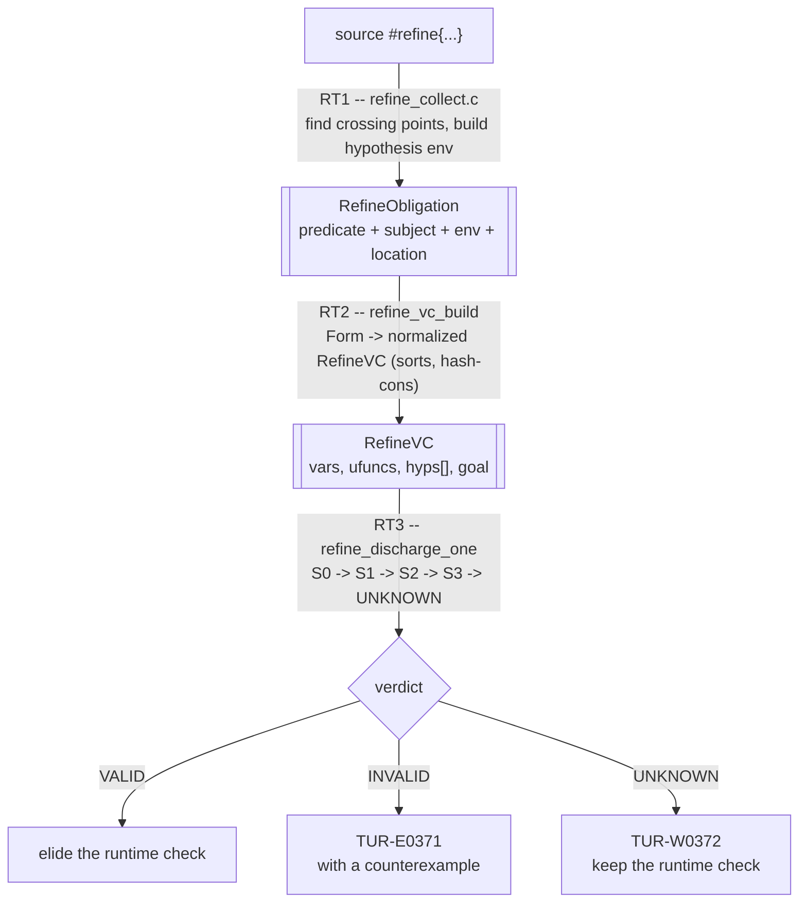

# The Refinement Solver (Internals)

> **Audience:** compiler developers and anyone who wants to know *how* the
> compiler proves a refinement predicate at compile time. For the user-facing
> feature -- how to write refinements and read their diagnostics -- see
> [refinement-types-guide.md](refinement-types-guide.md). For the always-on
> runtime half see [contract-types-guide.md](contract-types-guide.md). The
> design of record is
> [../archive/refinement-types-plan.md](https://github.com/turmeric-lang/turmeric/blob/main/docs/archive/refinement-types-plan.md).

A contract type `#refine{ x : T | p }` always has a runtime meaning: `p` is
checked when a value crosses into the type. On top of that, the compiler
always *tries to prove* `p` statically and elides the runtime check wherever
the proof succeeds. The prover is a small, staged,
in-house decision procedure that ships inside `tur` -- there is **no SMT
library dependency in any default or release build**, which is also why the
WASM playground gets static checking at zero download cost.

The one fact that shapes every design decision below:

> **Every obligation already has a sound runtime fallback.** So the static
> prover is allowed to give up on any obligation and stay correct -- the
> obligation just keeps the runtime check it would have had anyway. That is why
> a partial, hand-rolled solver is a real feature and not a broken one, and why
> turning `refined` on can never turn a correct program into a wrong one.

---

## Source map

Everything lives under `src/compiler/`, split by pipeline phase (RT1..RT7 are
the plan's phase names):

| File | Phase | Role |
|---|---|---|
| `refine_collect.{c,h}` | RT1 | Collect obligations at crossing points; encode `Form` -> normalized VC |
| `refine_vc.{c,h}` | RT2 | The normalized VC data structure, hash-consing, sorts, the backend seam |
| `refine_smtlib.{c,h}` | RT2 | Serialize a VC to SMT-LIB2 (`TUR_REFINE_DUMP=1` diagnostics) |
| `refine_solver.{c,h}` | RT3 | Shared machinery: NNF, DNF cube expansion, bounded model search |
| `refine_solver_s0.c` | RT3 | **S0** -- normalize + trivial/syntactic discharge |
| `refine_solver_euf.c` | RT3 | **S1** -- congruence closure (EUF) |
| `refine_solver_arith.c` | RT3 | **S2** -- linear arithmetic (Fourier-Motzkin) |
| `refine_solver_no.c` | RT3 | **S3** -- Nelson-Oppen combination of S1 + S2 |
| `refine_discharge.{c,h}` | RT3/RT6/RT7 | The backend chain, memoization, hint generation, diagnostics |

The elaborator wires it in from `elab_fns.c`, `elab_call.c`,
`elab_typeclasses.c`, and friends; the runtime-check codegen lives in
`emit_fns.c`. Diagnostic codes are registered in `diag.c` / `diag.h`.

---

## The pipeline



### RT1: where obligations come from

An obligation is created at each point a value crosses **into** a refined type.
`refine_collect.h` enumerates the crossing points collected today:

- a `defn` whose **return type** is a contract type (subject = the body form);
- a `defn` `:post` predicate (subject = the body, bound variable `result`);
- a **call-site argument** flowing into a contract-typed parameter (subject =
  the argument form; the callee's *other* parameter names are substituted by
  the actual arguments in their slots, so a predicate that mentions a sibling
  parameter is checked against real values).

Hypotheses -- the facts assumed true at the crossing -- come from:

- each parameter declared with a contract type (`v` renamed to the parameter
  name), and
- the function's `:pre` predicate.

Two obligation flags matter for how a failure is reported (`RefineObligation`
in `refine_collect.h:114`):

- **`runtime_guarded`** -- set for call-site crossings. The callee validates
  its own parameters on entry, so an argument we merely *cannot prove* is the
  normal state of a partially annotated program, not an error. Such an
  obligation reports only when it is *definitely* wrong (a closed goal that
  evaluates false, e.g. `(safe-div 10 0)`) or under `--strict-refine`. A
  function's **own** return refinement is a claim it makes about itself, so an
  open counterexample there is a `TUR-E0371` error. The distinction is *who
  owes the proof*.
- **`speculative` / `path_probe`** -- probes used by template inference (RT4)
  and path splitting; they are decided but report nothing and count nothing.
- **`quiet`** -- decided and counted like any obligation (stats, memo,
  refutation search), but reports nothing: the verdict is recorded
  (`refuted`, `refuted_closed`, `unknown_reason`) and the caller words the
  headline and attaches the shared notes with `refine_emit_obligation_notes`.
  Loop invariants use it, because "the body does not preserve `(>= acc 0)`" is
  not a sentence the generic "refinement on X" reporter can build.

### Loop invariants

`elab_while` parses `:invariant p`, validates it (pure `bool`), injects the two
runtime checks (entry; last statement of the body) and records a
`LoopInvSite` (`elab_internal.h`): the source forms, the two check slots, and
the **sort of every local in scope** -- a name the environment does not
declare defaults to Int, which for a float local would let S2's integer
tightening prove a falsehood. The enclosing `defn` decides its sites once its
body is elaborated (`li_analyze_loops`, `elab_fns.c`), BEFORE its return
obligations, and a proof overwrites the matching check slot with nil.

| # | obligation | environment | goal |
|---|---|---|---|
| 1 | initiation | the entry walk's facts | each conjunct of `p` |
| 2 | preservation | entry facts not naming an assigned variable, `p`, `c`, the path's branch tests | each conjunct of `p` under the path's substitution |
| 3 | use | -- | `p AND (not c)` after the loop, once 1 and 2 are proved |

Three pieces, each deliberately small:

- **The entry walk (`li_walk`)** descends the function body to a point and
  collects what holds there: `if` conditions, `let` equations, a plain
  `(set! x v)`'s `x = v`, a proved loop's post-fact, a loop's `p` and `c` inside
  its body. It is *position-aware*: a statement before the point drops the
  facts naming what it assigns or borrows; an enclosing loop counts as having
  run any number of times; a lambda body starts empty; a special form whose
  binders it cannot read forfeits every fact naming a symbol it holds. Unlike
  the crossing walk's WF3 whole-body filter, an assignment AFTER the point does
  not stale a fact at it -- which is what lets a crossing inside a loop body
  keep `p` and `c` when the loop assigns the very names they mention.
  Call-site crossings use this walk (under the gate) whenever their path
  crosses or steps over an annotated loop.
- **The body composer (`li_compose`)** turns the body into one sequential
  substitution per path (`if`/`when` split the path set, at most 16). It is
  applied to the goal as a FORM, not handed to the encoder as `RefineSubst`:
  the encoder leaves a substituted name FREE when its image does not encode,
  and a free `acc` in `p'` is the pre-body `acc` -- which would prove `p'` from
  `p`, the one answer preservation must never give by accident.
- **The post-loop step (`li_prove_paths_ext`)** extends `rt_prove_paths`' `do`
  case. Havoc is done by renaming the PAST: every hypothesis already in the
  environment is rewritten so an assigned `x` reads `x~liN`, then `p` and
  `(not c)` are assumed of the current `x`. Renaming the future instead gave a
  second loop a renamed copy of its own form whose invariant still spoke of
  `x`, and two proved loops in a row judged the final value by the first one's
  post-fact -- a live wrong proof during development. The same function reads a
  multi-binding / multi-body `let` as the nested single-binding lets it means.

**Declines, and the channel each one closes.** A loop is declined (both checks
kept) rather than modelled when a variable it depends on can change with no
`set!` in the loop: borrowed anywhere in the function (`&`, `&mut` -- an alias
taken before the loop reaches a writing callee inside it), or assigned where
code does not run in place (a lambda, which lives in a shared cell; an
effect-handler clause, which runs during a `perform`; a `defer`; any special
form `li_head_runs_in_place` does not allow-list). The invariant and condition
may not read a field, a deref or a mutable global -- those are unresolvable
heads the encoder treats as congruent abstract measures, and a call between
two occurrences could change them. Early exits, place writes, nested
assigning loops and shadowing body `let`s decline as listed in the user guide.
Every one of those shapes was a live miscompile at some point during
development, and `tests/fixtures/errors/loop-invariant-unseen-writes` and
`loop-invariant-declines` pin them.

**Sabotage.** `errors/loop-invariant-post-havoc` is the check that the havoc
is load-bearing: skip the environment rename in `li_prove_paths_ext` and its
`stale` function proves `(= r 0)` of a loop counter, its return check is
elided, and the fixture fails for want of its diagnostic.

---

## RT2: the normalized verification condition

`refine_vc.h` defines the backend-independent structure every stage consumes. A
`RefineVC` is a set of sorted **variables**, a set of **uninterpreted function
symbols**, a list of **hypotheses**, and a single **goal**:

```c
typedef struct RefineVC {
    VCVar     *vars;    uint32_t n_vars,   cap_vars;   // sorted variables
    VCUFunc   *ufuncs;  uint32_t n_ufuncs, cap_ufuncs; // measures, nonlinear terms
    VCTerm   **hyps;    uint32_t n_hyps,   cap_hyps;    // assumed true
    VCTerm    *goal;                                    // to prove
    bool       has_real;       // any real -> QF_UFLRA rather than QF_UFLIA
    bool       has_nonlinear;  // a nonlinear subterm was abstracted
    ...
} RefineVC;               // refine_vc.h:92
```

### Sorts and operators

Three sorts (`VS_INT`, `VS_REAL`, `VS_BOOL`) and a compact operator set. The
term builder **normalizes as it interns**, so later stages have fewer cases to
handle (`refine_vc.h:44`):

```
  (> a b)     ==>  (< b a)
  (>= a b)    ==>  (<= b a)
  (not= a b)  ==>  (not (= a b))
```

No `VC_GT` / `VC_GE` term ever exists -- every backend handles three relations
(`VC_EQ`, `VC_LT`, `VC_LE`) instead of six.

### Hash-consing

Every term interns through an open-addressing hash table (`RefineVC.htab`), and
constant subterms are folded at construction time: `vc_mk(VC_ADD, [1, 2])`
returns the interned `3`. Structurally equal terms share one `VCTerm*`, so
**`a == b` (pointer equality) is structural equality** (`refine_vc.h:70`). S0's
syntactic checks and S1's congruence closure both lean on this directly.

### Uninterpreted functions, measures, and purity

Two kinds of subterm cannot be reasoned about arithmetically, so RT2 abstracts
them to **uninterpreted function applications** (`VCUFunc`):

1. **Named measures** -- a call to a user function like `size-of` or `len`. The
   solver never unfolds the body; it reasons about the symbol congruentially
   (`f(a) == f(a)`).
2. **Nonlinear terms** -- a `var*var` or `var/var` product the linear theory
   cannot see inside. Abstracting it sets `has_nonlinear` and drives the
   `TUR-W0373` warning.

`(as T e)` is a **builtin conversion, not a measure**, and the encoder
handles it before the measure path, by what the conversion does to the value:
`(as float e)` / `(as f64 e)` is `e` itself (the VC's reals are exact, so an
int converted to float denotes the same number, and keeping `e`'s Int sort
lets S2 keep its integrality); `(as int e)` / `i64` / `isize` is `e` on an int
operand and an opaque Int-sorted truncation term on a real one; `f32` (rounds)
and the narrower or unsigned ints (`i8`..`i32`, `u8`..`u64`, `usize`, which
wrap) are opaque terms at the target's sort, congruent across occurrences; a
target outside that set is not encoded (the obligation keeps its runtime
check). Until 2026-09-29 it fell through to
the measure encoder, which declared `as` as an abstract measure at the
position-default sort -- Int -- and the type name as a variable; `(as float
v)` over a float was then integer-tightened (`t <= 2.75` to `t <= 2`) and a
satisfiable cube was refuted (fixtures `errors/refine-cast-in-predicate-refuted`, now refuted at compile time with a witness, and `refine-cast-in-predicate` for the opaque truncation).

Treating two occurrences of a call as *the same value* is only valid when the
callee is **pure**, and purity is **earned, not declared**
(`refine_collect.h:53`, fixture `refine-measure-euf`): the compiler walks the
callee's body against a default-deny whitelist (literals, immutable reads,
`if`/`let`/`do`, arithmetic builtins, calls to functions already known pure). A
non-empty `#fx{...}` row is a *veto* only. Anything unrecognized stays impure,
so a missed case costs one runtime check, never a wrong proof. An impure call
gets a **fresh** symbol per occurrence (`RefineVC.fresh_ctr`), which is why
`(- (tick) (tick))` cannot be folded to `t - t` and mis-proved `>= 0`.

### Identity: fingerprint + structural equality (RT7)

`refine_vc_fingerprint` hashes the *meaning* of a VC under a canonical
alpha-renaming (variables and symbols numbered by first occurrence), so
`x > 0 |- x+1 > 0` and `n > 0 |- n+1 > 0` land on the same memo key. A hash is
never trusted alone: a hit is confirmed with `refine_vc_equal`
(`refine_vc.h:142`).

---

## What the assertions look like

To prove `hyps |= goal`, the solver **refutes** `hyps AND (not goal)`. If that
formula is unsatisfiable, the goal is entailed. This is the shape every stage
runs over.

### As SMT-LIB2

`refine_smtlib.c` serializes the VC in exactly this refutation form. The dump
below (from `TUR_REFINE_DUMP=1`) is the obligation for the return value of
`double-pos`, `x > 0 |- 2x > 0`:

```smt
(set-logic QF_UFLIA)
(declare-const x Int)
(assert (< 0 x))            ; the hypothesis  x > 0, normalized
(assert (not (< 0 (* x 2)))) ; the negated goal
(check-sat)                 ; unsat  => goal is valid
```

The logic is `QF_UFLIA` (or `QF_UFLRA` when `has_real`) -- quantifier-free,
uninterpreted functions, linear integer/real arithmetic. Measures and
abstracted nonlinear products appear as plain `declare-fun` applications with no
special-casing, because RT2 already turned them into uninterpreted symbols.

### As cubes (what the in-house stages consume)

`refine_solver.c` puts the refutation formula into **negation normal form**
(De Morgan pushes negations to the leaves) and expands it to a small **DNF**: a
set of **cubes**, each a conjunction of literals. The goal is valid **iff every
cube is unsatisfiable** (`refine_solver.h:16`):

```c
typedef struct VCCube  { VCTerm **lits; uint32_t n; } VCCube;
typedef struct VCCubeSet {
    VCCube  *cubes; uint32_t n;
    bool     overflow;  // a cap was hit -> caller must answer RT_UNKNOWN
    bool     trivial;   // refutation folded to `false` outright -> valid
} VCCubeSet;
```

Two subtleties in the expansion (`refine_solver.c`):

- **A disequality is a disjunction.** `a != b` over a total order is
  `a < b OR b < a`. NNF rewrites a *negated* arithmetic equality into that
  disjunction (keeping the original literal alongside, so EUF still sees the
  disequality). Without it, an equality *goal* that needs any arithmetic --
  the most natural postcondition, `(= r <expr>)` -- would be unprovable, because
  a single linear constraint cannot encode `!=`.
- **Every step is capped.** Cube count (`REFINE_MAX_CUBES = 64`), literals per
  cube (`REFINE_MAX_CUBE_LITS = 64`), expansion depth, LA variables/constraints,
  EUF terms -- each cap, when hit, yields `RT_UNKNOWN` and the runtime check
  survives. This is the "naive S4" the plan sanctions: explicit annotations keep
  the propositional structure tiny, so small-DNF suffices and there is **no
  DPLL(T) engine** (`refine_solver.h:26`).

### A worked mixed example

The canonical assertion that needs both theories (fixture `refine-measure-euf`,
`refine_solver_no.c:4`):

```
hyps:  size-of(v) = n,   0 <= i,   i < n
goal:  i < size-of(v)
```

Linear arithmetic alone cannot see that `size-of(v)` and `n` denote the same
value; congruence closure alone cannot do the `i < n` ordering step. The
Nelson-Oppen combination (S3) exchanges the entailed equality `size-of(v) = n`
and closes it.

---

## RT3: the staged solver

`refine_discharge.c` owns an ordered array of backends and stops at the first
non-`UNKNOWN` verdict (`refine_discharge.c:56`):

```c
static const RefineBackend CHAIN[] = {
    refine_s0_decide,   // trivial / syntactic
    refine_s1_decide,   // congruence closure (EUF)
    refine_s2_decide,   // linear arithmetic
    refine_s3_decide,   // Nelson-Oppen combination
};
```

Backends run in **ascending cost**. Adding a stage only ever moves obligations
*left* in the chain; it never changes an answer, because every stage preserves
the soundness invariant. Each backend implements the `RefineBackend` seam and
returns one of three verdicts.

### The soundness invariant (one-directional, absolute)

```c
typedef enum RefineVerdict {
    RT_UNKNOWN = 0,  // the always-safe answer (zero value on purpose)
    RT_VALID,
    RT_INVALID,
} RefineVerdict;                                  // refine_vc.h:169
```

> A backend **may never** return `RT_VALID` for an obligation that is not
> genuinely entailed. `RT_UNKNOWN` is always permitted and always sound -- it
> falls back to the runtime check. `RT_INVALID` requires a real counterexample
> (see below), never a guess.

`RT_UNKNOWN` being the zero value means a zero-initialized decision is safe by
construction.

### S0 -- trivial / syntactic (`refine_solver_s0.c`)

No real reasoning. Reflexivity, constant folding (already done at intern time),
syntactic entailment (a goal that *is* one of the hypotheses -- pointer
equality thanks to hash-consing), and per-cube literal-level refutation:
a `false` literal, complementary literals `L` and `(not L)`, or an ordering
literal over identical terms (`x < x`). Discharges a surprising fraction of
demo-grade obligations -- `0 <= 3`, `b != 0` after a literal guard.

### S1 -- congruence closure / EUF (`refine_solver_euf.c`)

Union-find + congruence closure decides quantifier-free equality with
uninterpreted functions -- the theory where measures and abstracted products
live. Every non-leaf term is an application of its operator, so congruence
covers `(+ a b)` and `(len v)` uniformly. Three sources of contradiction:

1. a disequality `a != b` whose sides became congruent;
2. two distinct literals in one class (`3` and `5` can never be equal);
3. a positive atom and a negated atom that are congruent.

The second source compares literals by **value**, not by term identity: an
Int literal and a Real literal for one number (`3` and `3.0`) are two
hash-consed terms, and until 2026-09-29 a class holding both was called a
conflict. That refuted a satisfiable cube and proved whatever goal sat under
it -- reachable from source wherever a real-sorted term is equated with an
int-sorted one (`(= x (to-f n))` with `x = 3.0`, `n = 3`, `to-f` a
float-returning measure: S3's exchange merges the two classes). The mixed
compare is conservative, `(double)i == r` reads as "same value", so a rounding
coincidence past 2^53 costs a proof, never a wrong one (fixture
`refine-int-real-literal-not-contradictory`, corpus
`qf_uflira_int_real_literal_{sat,unsat}`).

Terms are interned through a hash index keyed on the hash-cons id, and the
closure is a signature-table fixpoint: each round buckets every application by
(operator, symbol, argument roots), so congruent terms meet in one bucket
rather than being found by an all-pairs compare -- `O(n * arity)` per round.
Literal conflicts are one pass over a root map. `REFINE_MAX_EUF_TERMS` bounds
the rest. (Until 2026-09-28 all three were `O(n^2)` scans; see
[solver-hot-structures-linear-scans](https://github.com/turmeric-lang/turmeric/blob/main/docs/archive/solver-hot-structures-linear-scans.md).) Textbook treatment: Harrison; Bradley &
Manna (see References).

**The state is incremental across cubes.** S1 and S3 hold ONE `EufState` and
bracket each cube with `euf_mark` / `euf_undo_to` rather than building a fresh
one per cube out of the arena, which is what they did before 2026-08-26. Every
`parent[]` write is trailed, path compression included, so the merge history a
proof-producing congruence closure would need stays recoverable. Each cube still
starts from the empty partition, so verdicts are identical to the rebuild path
by construction -- the change deletes per-cube allocation churn, not answers.
The trail is `src/compiler/trail_c.h`; `TUR_REFINE_EUF=rebuild` restores the old
path for replay (see Debugging).

Note the congruence *fixpoint* above is unaffected: it is still the naive
all-pairs sweep, which is the algorithm rather than the state discipline.
`LaState` is still rebuilt per cube -- making it incremental is the plan's SX4,
which is parked on the cap evidence.

### S2 -- linear arithmetic (`refine_solver_arith.c`)

**Fourier-Motzkin elimination over exact rationals** (`int64` num/den, every
step overflow-checked). This is a strict superset of difference logic, so index
and bounds reasoning -- `0 <= i`, `i < len`, `i + 1 <= n` -- is covered, and it
decides conjunctions of linear constraints outright.

- **Integers:** rational unsatisfiability implies integer unsatisfiability, so
  every refutation is sound for `int`. On top of that, constraints whose
  variables are all int-sorted get the Omega test's two exact steps
  (`docs/archive/solver-integer-tail-plan.md`, landed 2026-09-05):
  *normalization* -- clear denominators, divide by the gcd of the
  coefficients, round the bound to the integer hull (`e < 0` becomes
  `e <= -1`, which is what lets `x > 0 |= 2x > 0` go through, and
  `2q >= -1` becomes `q >= 0`) -- and *equality elimination* -- the gcd
  divisibility test on every equation (`2v = 2x + 1` has no integer solution:
  parity), then substitution through any unit-coefficient variable so the test
  re-runs on what the substitution produced. Equalities are kept as equalities
  in the constraint set for this reason; the two-inequality split happens
  inside `la_unsat`, only for an all-integer equation with no unit coefficient
  (`2x + 3y = 1`), which is the part of the Omega equality phase still open.
  Every step is an equivalence over the integers, so the set keeps exactly its
  integer models. Full integer completeness on the inequality side
  (branch-and-bound / dark shadow) is deliberately not attempted.
- **Purification:** any term the linear encoder cannot see inside -- a `VC_VAR`,
  a measure, an already-abstracted nonlinear product -- becomes an opaque LA
  variable. This is the Nelson-Oppen purification step, and it is what lets S3
  exchange equalities with EUF over exactly these shared terms.
- Weakness is combinatorial blow-up, absorbed by `REFINE_MAX_LA_CONSTR` -> a cap
  hit degrades to a runtime check. If the cap ever bites real code, an
  incremental simplex (Dutertre--de Moura) slots in behind the same `la_*`
  interface.

### S3 -- Nelson-Oppen combination (`refine_solver_no.c`)

Neither theory alone decides a mixed cube. S3 runs both S1 and S2 over the same
cube and has them **exchange the equalities each entails over their shared
terms** (the purified opaque terms, which EUF also holds as nodes), iterating to
a fixpoint (`NO_MAX_ROUNDS = 4`, `NO_MAX_SHARED = 16`). EUF and LRA are both
convex, so this deterministic exchange is complete for them. Integers are
non-convex, which in general forces case-splitting on disjunctions of
equalities; S3 does **not** do that -- it reaches a fixpoint and, if neither
theory reports unsat, answers `RT_UNKNOWN`. Sound, incomplete on exactly the
integer tail the plan reserves for a future S2c.

### Counterexamples (`refine_model_search`, `refine_solver.c:298`)

Failing to *prove* proves nothing, so after the chain comes back `UNKNOWN` a
separate **bounded model search** tries to *refute* the goal. It picks a small
candidate value set -- the integer literals mentioned in the VC, their
immediate neighbours, and a handful of small integers around zero -- enumerates
assignments over an odometer, and **evaluates `hyps AND (not goal)` exactly**. A
satisfying assignment is a genuine counterexample, which is the only thing in
the whole solver allowed to answer `RT_INVALID`, and it does so *with a model*.

Scope is deliberately tiny: at most `MODEL_MAX_VARS = 8` variables and -- the
cap that actually binds -- at most `MODEL_MAX_EVALS = 131072` full evaluations
(the product of the per-variable candidate counts), and it **declines any VC
carrying uninterpreted symbols** -- a measure has no fixed interpretation to
evaluate, so guessing one would be dishonest. The important zero-variable case
is a call site with literal arguments (`(safe-div 10 0)`): the goal is closed,
one evaluation decides it.

Every sort has a candidate set (since 2026-09-29; before that only Int
variables were searched, so a plainly false float refinement, or one with a
bool parameter in its predicate, never got a witness). Ints take the literals
in the VC, their neighbours and a few small values; bools take `false` and
`true`; reals take the numeric literals with a half-unit either side and a few
small values, and are **evaluated in `double`** -- which is not an
approximation of the runtime check but exactly it, so a real witness is a
value the program would reject (fixture
`errors/refine-real-and-bool-counterexample`). An assignment that cannot be
evaluated (overflow, a zero divisor) is skipped rather than ending the search.

The search also **declines a VC whose encoder dropped a hypothesis**
(`RefineVC.hyps_dropped`: a `:pre` outside the predicate fragment, or a
call-site argument it could not encode). Dropping is sound for a proof and
unsound for a refutation -- the dropped fact may exclude the witness -- and a
`:pre` written with a `let` used to produce a `TUR-E0371` hard error, with a
witness, on a correct function (fixture
`refine-dropped-hypothesis-keeps-check`). `TUR_REFINE_STATS=1` prints
`refine: hypothesis not encoded (<reason>)` for each drop.

---

## Memoization and hints

### Within-unit memo (RT7)

`refine_discharge.c` keeps a per-process, open-addressed memo keyed on
`refine_vc_fingerprint`, confirmed with `refine_vc_equal` on a hit. It holds
only decided, non-speculative results. This matters because RT6 hint generation
issues *many* speculative queries; memoizing keeps that affordable.

### Hint generation (RT6)

"Cannot be proved" is only half an answer. The other half -- *which extra fact
would have discharged it* -- is a **second query through the same seam**: add a
candidate hypothesis and re-run the whole chain (`run_chain`,
`refine_discharge.c:139`). A candidate that works was *checked*, not guessed, so
the `help:` line is never a heuristic. Two families are tried:

- comparisons against the integer literals the code already mentions, and
- relations between two variables (this is what produces an index bound like
  `(< i n)`).

A candidate that *contradicts* what is already known is rejected explicitly --
otherwise a contradictory hypothesis would discharge the goal by ex falso and
the compiler would suggest constraining a variable to be both `< 0` and `> 0`.
When nothing consistent helps, no `help:` line is printed.

Example failure with all three parts (claim, witness, remedy):

```
error[TUR-E0371]: refinement on the return value of 'wrong' cannot be proved statically
note: the predicate (> r 0) does not hold for every input here
note: counterexample: x = -2
help: (> x 0) would discharge it -- e.g. declare x : #refine{ v : int | (> v 0) }
```

---

## Integration with the rest of the compiler

- **Elaboration.** The elaborator owns scope, so it supplies the
  `RefineFnResolver` callback (`refine_collect.h:78`) that lets the encoder look
  up a called function's return refinement and purity. A `NULL` resolver
  disables result propagation and purity discrimination -- every call falls back
  to the safe fresh-per-occurrence encoding. Obligations are created from
  `elab_fns.c` (returns / `:post` / loop invariants) and `elab_call.c`
  (arguments).
- **Effect system.** Purity for congruence is decided against the effect
  whitelist described above; the `#fx{...}` row is a veto. See the
  [effects-system-guide.md](effects-system-guide.md) for the effect rows
  themselves.
- **Typeclasses.** A refinement on a class method's signature is checked against
  each instance: an instance may not *strengthen* a method's precondition
  (`TUR-E0374`) and gets a leniency note where relevant (`TUR-W0377`). See
  fixtures `refine-typeclass-*` and `refine-class-*`, and the archived notes
  `docs/archive/class-param-refinement-not-demanded-of-callers.md`.
- **Codegen.** When an obligation is proven `RT_VALID`, `emit_fns.c` elides the
  runtime contract check it would otherwise inject; on `UNKNOWN`/`INVALID` the
  check is emitted exactly as the always-on contract path (see
  [contract-types-guide.md](contract-types-guide.md)) would.
- **No gate.** Static discharge is unconditional: every compile that sees a
  `#refine{...}` runs the pipeline described here. There is no `EXPERIMENTS[]`
  row and no global to read. The old opt-in spellings survived as compatibility
  shims for one minor line and were **retired in 0.38.0**, so
  `--enable=refined`, `:experiments [:refined]`, and the user experiments file
  are once more `TUR-E0310` (`refined` is out of `GRADUATED[]` in
  `src/runtime/experiments.c`), and `#lang turmeric refined` is once more
  `TUR-E0330` (out of `GRADUATED_LAYERS[]` in
  `src/compiler/lang_layers.c`). Passing any of them changes nothing about
  what the solver does.
- **`--strict-refine`.** A diagnostic-strictness knob (not an experiment) that
  turns every `UNKNOWN`/open-`INVALID` obligation into a hard error, for builds
  that must discharge every refinement statically.

---

## Diagnostics

Registered in `diag.c` / `diag.h` (the `RT3` block, `diag.c:241`):

| Code | Kind | Meaning |
|---|---|---|
| `TUR-E0370` | error | refinement predicate is ill-typed (code allocated) |
| `TUR-E0371` | error | predicate genuinely does not hold (own claim falsifiable, or argument definitely wrong at its call site) |
| `TUR-W0372` | warn | nothing decided it; the runtime check is kept |
| `TUR-W0373` | warn | a nonlinear subterm was abstracted; arithmetic reasoning is incomplete for it |
| `TUR-E0374` | error | a typeclass instance's refinement is stronger than the method's |
| `TUR-E0375` | error | an effectful predicate where a pure one is required |
| `TUR-E0376` | error | refinement over a type parameter (a refinement alias with type parameters is rejected at `elab_types.c` with a plain diagnostic) |
| `TUR-W0377` | warn | instance-leniency note (paired with the class-method checks) |
| `TUR-E0378` | error | refinement appears inside a function type |
| `TUR-I0379` | internal | **RETIRED in 0.32.5**, never emitted: reported a Z3-oracle mismatch back when a dev build could link one. Code reserved, not reused |
| `TUR-W0063` | warn | a lingering enable of a GRADUATED experiment; accepted, no effect. Not `refined` any more -- its shim was retired in 0.38.0 |
| `TUR-W0064` | warn | a lingering GRADUATED `#lang` layer token; accepted, no effect. `GRADUATED_LAYERS[]` is empty since 0.38.0 |
| `TUR-E0310` / `TUR-E0330` | error | a lingering `--enable=refined` / `#lang turmeric refined` from 0.38.0 on; delete them |

`TUR-E0371` and `TUR-W0372` both leave the program safe -- the runtime check
survives either way. `tur explain TUR-W0372` prints the long form of any code.

---

## Caps reference

The solver is bounded in two places, and only the first tier used to be written
down. Every cap in both tiers degrades to `RT_UNKNOWN` -> runtime check: they
cost **completeness, never soundness**, because a capped obligation keeps the
check it would otherwise have elided.

### Tier 1 -- solver caps (`refine_solver.h`)

| Cap | Value | Guards |
|---|---|---|
| `REFINE_MAX_CUBES` | 64 | DNF cube count |
| `REFINE_MAX_CUBE_LITS` | 64 | literals per cube |
| `REFINE_MAX_EXPAND_DEPTH` | 256 | DNF product recursion backstop |
| `REFINE_MAX_LA_VARS` | 32 | linear-arithmetic variables |
| `REFINE_MAX_LA_CONSTR` | 512 | linear-arithmetic constraints |
| `REFINE_MAX_EUF_TERMS` | 512 | congruence-closure terms |
| `NO_MAX_SHARED` | 16 | terms in the S3 equality exchange |
| `NO_MAX_ROUNDS` | 4 | S3 exchange rounds before giving up |
| `MODEL_MAX_VARS` | 8 | counterexample-search variables (array backstop) |
| `MODEL_MAX_EVALS` | 131072 | counterexample-search evaluations, `n_cand ** n_vars` |
| `MODEL_MAX_CANDS` | 16 | counterexample candidate values |

The two `MODEL_*` caps are the ones most likely to surprise, because they do
not cost a proof -- they cost a **refutation**. The proving stages only ever
answer Valid or Unknown, so a counterexample can come from nowhere but the
bounded search, and `refine_model_search` returns `NULL` outright for a VC it
declines. Until 2026-09-05 the width cap was **3**, and a four-parameter
function with a plainly false return refinement therefore stayed `unknown`
(silent, runtime check kept) where the same function with three parameters
reported `TUR-E0371` with a witness -- an ordinary shape none of the three
swept populations contained, which is why the sweep read clean. The cap that
binds is now the evaluation budget, which is what the odometer actually pays:
a five-variable VC over five candidates (3125 evaluations) is cheaper than a
three-variable one over sixteen (4096). See
`docs/archive/solver-integer-tail-plan.md`.

Both are instrumented under `TUR_REFINE_STATS=1`:

```
refine:   model vars      peak      9 / 8      ** HIT
refine:   model vars run  1 (of 1 over the cap)
refine:   model evals out 1 (budget 131072 evaluations)
```

`model vars` counts every decline at the width cap. `model vars run` counts
the subset a higher cap would actually help; since every sort has a candidate
set (2026-09-29) that is every decline, and the two rows read the same. `model evals out` counts declines on the
budget; every one of those would run at a bigger budget, so it needs no
`would run` twin. The cost is exponential either way (`n_cand ** n_vars`, and
`n_cand` is up to 16), which is why the distinction matters rather than being
pedantry.

### Tier 2 -- collection caps (upstream of the solver)

These bound what reaches the solver rather than what it does, and they live in
the elaborator and the encoder. **The tightest cap in the whole refinement path
is here, not in tier 1.**

| Cap | Value | Where | Bounds |
|---|---|---|---|
| `RT_CS_PATH_MAX_HYPS` | 8 | `refine_solver.h` | path conditions recovered per call-site crossing |
| `RT_CS_PATH_MAX_DEPTH` | 24 | `elab_fns.c` | how deep the walk looks for them |
| `ENC_MAX_MEASURES` | 32 | `refine_collect.c` | names in the per-VC sort table |
| `ENC_MAX_SUBST` | 8 | `refine_collect.c` | substitutions while encoding a predicate |
| `ENC_MAX_DEPTH` | 64 | `refine_collect.c` | predicate nesting |
| `ENC_MAX_PROPAGATE` | 4 | `refine_collect.c` | return-refinement propagation depth |
| `VCID_MAX_SYMS` | 256 | `refine_vc.c` | symbols in the RT7 memo fingerprint |
| `RT_PURE_MAX_DEPTH` | 64 | `elab_fns.c` | purity walk |
| `RT_SET_SCAN_MAX_DEPTH` | 24 | `elab_fns.c` | set-membership scan |

They are sound in the same one direction, and the encoder says so where it
drops a hypothesis it cannot encode: *"fewer hypotheses can only make the goal
HARDER to prove, never easier"*. The two whose overflow could plausibly go the
other way are handled explicitly rather than by luck:

- **`VCID_MAX_SYMS`** overflow makes the fingerprint **0, which is never a memo
  key**, so the VC is re-decided rather than matched against a truncated
  identity. A memo collision here would be a genuine wrong answer.
- **`ENC_MAX_MEASURES`** overflow leaves the name out of the sort table and
  falls back to the callee's own declared sort -- still exactly one sort per
  name, which is the invariant that keeps a symbol from being Int in a
  hypothesis and Bool in the goal.

### What is counted

Every tier-1 cap except `MODEL_MAX_CANDS` is counted under
`TUR_REFINE_STATS=1`, plus `RT_CS_PATH_MAX_HYPS` from tier 2 -- see "Reading
the cap lines" below. `MODEL_MAX_CANDS` bounds a candidate *value* set rather
than a structural quantity and nothing has asked for it; the rest of tier 2 is
uninstrumented too, and if one is ever suspected it needs a counter first.

**A population that cannot reach a cap is not evidence the cap never bites.**
Two rows in `benchmarks/cap-sweep-results.md` read `n/a` for the SMT-LIB corpus
for exactly this reason -- it never elaborates (so no `path_hyps`) and its
harness never runs the model search (so no `model_vars`). The subtler case is
the fuzzer population, which *does* report `model_vars` and reports it at 0%
headroom: `tests/refine-fuzz-src.py` generates at most two parameters, so a
generated VC structurally cannot exceed three variables. That peak is the
generator's ceiling, not a finding. The sweep file says so in place.

### The limits that are not numbers

Raising a cap cannot reach any of these. They are what the solver is, not how
much of it there is, and on today's evidence they bound its usefulness far more
than any number above.

- **Fragment: quantifier-free `QF_UFLIA` / `QF_UFLRA`.** A quantifier is
  refused outright, not approximated.
- **Nonlinear arithmetic is abstracted, not decided.** `x * y` becomes an
  uninterpreted term (`TUR-W0373` says so), so S2 can reason about its
  occurrences but never about its value. The one exception is a sign law: a
  square `(* a a)` carries the hypothesis `(<= 0 (* a a))` (still abstracted,
  still warned). Division and remainder by an integer *literal* are not
  nonlinear and are no longer opaque either: the encoder asserts
  `a = k*q + r` plus the truncating sign/bound clause for `q = (/ a k)`,
  `r = (mod a k)` (`vc_add_divmod_axioms`, shared by the encoder and the
  SMT-LIB reader), so S2 reasons about them through the axioms while still
  treating the terms as shared variables. The VC's `VC_DIV`/`VC_MOD` are C's
  truncating pair throughout -- folding, model evaluation, axioms -- while
  SMT-LIB's `div`/`mod` are Euclidean (`0 <= mod < |n|`), so the SMT-LIB seam
  translates at both ends: `tur smt` builds the Euclidean value out of the
  truncating pair plus an `ite` (`tr_euclid_divmod`), and the serializer
  spells the truncating value in Euclidean terms
  (`(ite (>= a 0) (div a k) (- (div (- a) k)))`). A non-literal divisor or a
  zero divisor is outside `tur smt`'s fragment and refused whole.
- **Integers are non-convex and S3 does not case-split.** Deciding a mixed
  integer cube in general needs splitting on disjunctions of equalities; S3
  reaches a fixpoint and answers `RT_UNKNOWN` instead. S2's own integer
  layer now closes the equation-side part of this (gcd test, unit-coefficient
  substitution -- see S2 above); what remains is the inequality-side hull
  (branch-and-bound / dark shadow) and equations with no unit coefficient.
  See `docs/archive/solver-integer-tail-plan.md` for what is left and what
  would trigger it; `TUR_REFINE_STATS=1` prints the two triggers (`eq no-unit
  split`, `LA int feasible`) as obligation counts, and as of 2026-09-05 no
  swept population has an unknown obligation Z3 can prove.
- **No DPLL(T).** Boolean structure is naive DNF: no clause learning, no theory
  propagation, no conflict-driven search. The cube caps exist because of this,
  not the other way round.
- **The congruence fixpoint re-hashes every term per round** rather than
  keeping Nieuwenhuis-Oliveras use-lists, so a merge costs a full round rather
  than touching only the affected parents. Each round is linear since
  2026-09-28 (it was an all-pairs sweep), which is the right tradeoff at the
  sizes measured (peak 25 terms of 512).

**`path hyps` reads differently from the others.** Its peak *saturates*: the
walk stops collecting once the array is full, so the peak reads 8 whatever the
real demand was. Read `hits` for whether it bit; the peak is a headroom reading
only while hits is 0. Counting past the cap would mean restructuring a
recursive walk with early returns, which risks changing *which* guards get
collected -- a verdict change bought for a measurement, which is the wrong
trade.

---

## Debugging

```sh
# Per-unit stats: how many obligations were proven / refuted / unknown, then
# one line per cap with the run's high-water mark against the limit.
TUR_REFINE_STATS=1 tur build main.tur
# refine: 3 obligation(s): 2 proven, 0 refuted, 1 unknown (7 backend call(s))
# refine: caps (none hit)
# refine:   cubes           peak      4 / 64
# refine:   cube literals   peak      7 / 64
# refine:   path hyps       peak      4 / 8
# refine:   model vars      peak      2 / 8
# ...

# Dump each VC as SMT-LIB2 (the refutation form shown earlier).
TUR_REFINE_DUMP=1 tur emit-c main.tur

# Suppress static discharge entirely: every obligation declines, so nothing is
# elided and every refinement keeps its runtime check.
TUR_REFINE_NO_DISCHARGE=1 tur build main.tur

# Replay S1/S3 against the pre-2026-08-26 rebuild-per-cube EUF state instead of
# the incremental mark/undo default. Verdicts are identical by construction, so
# any output difference between the two is a bug in the incremental path -- this
# is the seam to bisect one with.
TUR_REFINE_EUF=rebuild tur build main.tur
```

### Reading the cap lines

Every cap in the table above degrades to `RT_UNKNOWN` when it bites, which is
sound but **silent**: from the outside, an obligation the solver capped out on
and one that was simply never in its competence produce the identical
"unknown" tally. The cap lines separate the two. A cap that fired is marked
`** HIT`, and the summary line says whether anything fired at all.

The `peak` is recorded on **every** query, not only on the ones that overflow,
so a cap that never fires still reports how much headroom was left --
`cubes peak 3 / 64` and `cubes peak 61 / 64` are the same zero-hit summary and
completely different signals about whether the next slightly wider function
falls off the cliff.

Two counters have no peak of their own: `FM blow-ups` counts the times
Fourier-Motzkin elimination backed off before growing past
`REFINE_MAX_LA_CONSTR` (distinct from the constraint adder hitting the same
limit -- different causes, different fixes), and `NO rounds out` counts the
times the Nelson-Oppen exchange was still learning equalities when its round
budget ran out.

A hit is not an error. It is lost completeness, and only lost completeness that
costs a real proof is worth acting on -- a cap that fires on an obligation
which had to answer `UNKNOWN` anyway cost nothing.

To sweep this across the corpus, the in-tree refinement fixtures and the
fuzzer's own generated VCs in one go, run
[`benchmarks/run-cap-sweep.sh`](../../benchmarks/run-cap-sweep.sh); it writes a
per-population table to `benchmarks/cap-sweep-results.md`. The corpus harness
emits its own machine-readable per-benchmark line under `TUR_CORPUS_CAPS=1`
(aggregation lives in the sweep script because each benchmark is decided in a
forked child). The current numbers, and what they say about which solver
extensions are worth building, are in
[../archive/solver-extension-plan.md](https://github.com/turmeric-lang/turmeric/blob/main/docs/archive/solver-extension-plan.md)
under SX0(b).

### Asking the solver directly -- `tur smt` and `--dump-refine=json`

Both of these exist so the solver can be interrogated from *outside* a compile.

```sh
# Run an SMT-LIB2 script through the standard S0-S3 chain.
tur smt query.smt2
# unsat
# (stderr) tur smt: decided by S2 (arithmetic)

# One JSON record per refinement obligation in a unit.
tur check --dump-refine=json main.tur
```

`tur smt` accepts the **corpus subset** of SMT-LIB2 over `QF_UFLIA` /
`QF_UFLRA`. A script using anything outside that fragment is refused **whole**,
never partially parsed -- a partly-read assertion set has weaker hypotheses
than the script wrote, so answering `unsat` from it would be a claim about work
that was not done. `unknown` is a first-class answer, and parity with a
production SMT solver is a non-goal.

Its exit codes mirror the answer so a shell harness can branch on `$?` without
parsing stdout. They are deliberately **not** the 0-is-success convention --
`unsat` is an answer, not a success, and `sat` is not a failure:

| code | meaning |
|---:|---|
| 0 | `unsat` -- the assertion set is contradictory (proved) |
| 1 | `sat` -- a model was found |
| 2 | `unknown` -- no stage decided it |
| 3 | error -- unreadable, or outside the accepted fragment |

When a script asks more than once, the exit code is the **last** answer.

#### The assertion stack -- `push` / `pop`, and `--interactive`

A script runs as a **session**: `(push)` and `(pop)` scope the assertions, and
each `(check-sat)` is answered where it appears, so one script can ask several
questions.

```sh
$ cat scoped.smt2
(set-logic QF_LIA)
(declare-fun x () Int)
(assert (> x 10))
(check-sat)          ; sat
(push 1)
(assert (< x 5))
(check-sat)          ; unsat -- contradicts x > 10
(pop 1)
(check-sat)          ; sat again; the contradiction was scoped

$ tur smt --interactive     # the same commands, read from stdin
```

`(push n)` / `(pop n)` take an optional level count defaulting to 1, and an
unmatched `pop` or a malformed level is a refusal (exit 3), never a guess.
`(get-model)` reprints the witness from the last `sat`. `(exit)` ends the
session.

Two limits, both deliberate:

- **Only hypotheses are scoped.** A `declare-fun` inside a scope survives the
  `pop`. That is a divergence from SMT-LIB, and a sound one in this direction:
  a declared symbol appearing in no assertion is an unconstrained variable, and
  an unconstrained variable cannot make an assertion set *less* satisfiable, so
  it can never turn a `sat` into an `unsat`. The reason not to scope them is
  concrete: hypotheses are hash-consed terms holding variable *indices*, and
  truncating `n_vars` would leave interned terms pointing at slots a later
  declaration could reuse with a different sort.
- **The assertion set is incremental; the solver state is not.** A `pop`
  restores exactly the hypotheses in scope at the matching `push`, with nothing
  re-read or re-translated. But each `check-sat` runs the chain from the current
  assertion set, which rebuilds the DNF cubes -- adding one hypothesis changes
  the cube set wholesale, so there is no solver-side mark to undo between two
  checks. `euf_mark` / `euf_undo_to` bracket cubes *within* a single check
  (see S1 above); they are not what `push` and `pop` map onto.

A script that contains no `(check-sat)` at all is still decided once at the end,
which is what the corpus benchmarks rely on.

#### From the browser -- `turi_smt_check`

The solver is already in the WASM module (`compiler/refine_*.c` are
`TUR_CORE_SOURCES`), so the playground has been shipping S0-S3 all along.
`turi_smt_check` is the door onto it:

```js
const json = Module.ccall('turi_smt_check', 'string', ['string'], [script]);
// {"schema":1,"results":[{"answer":"unsat","decided_by":"S2 (arithmetic)"}]}
```

Same reader, same chain, same bounded model search and same push/pop semantics
as `tur smt` -- two doors onto one solver should not disagree. One `results`
entry per `(check-sat)` in script order; a `sat` entry carries its `model`
inline (the witness belongs with the answer, so nothing has to ask twice). A
script outside the fragment returns an `error` key and an **empty** `results`
array -- refused whole, never partially parsed. `schema` is 1, the stable shape
since SX9, matching `--dump-refine=json`.

The result is malloc'd; free it from JS with `Module._free`. Nothing reachable
from this entry point touches elaboration or discharge, so no answer it gives
can elide a runtime check.

The JSON dump carries, per obligation: source location, the predicate as
written, the verdict, which stage decided it, whether the RT7 memo answered it,
the counterexample when there was one, which caps bit **for that obligation**,
and `vc_smtlib` -- the VC in the refutation form the stages actually decide.

Caps come in **two** fields, and the distinction is load-bearing:

| field | window |
|---|---|
| `caps_hit` | the obligation's own chain run |
| `caps_hit_probe` | the RT4 path-splitting probes run for this site *before* the obligation existed |

Path splitting tries each path silently first. Those probes are separate
obligations, discharged earlier, so their cap hits fall outside `caps_hit`'s
window -- and until 2026-08-26 they were counted globally and attributed to
nobody, which showed up as a per-compile summary reporting `** HIT` while every
obligation's `caps_hit` read empty. Sum the two fields for "all solver work
this site paid for"; read them apart when it matters whether a cap bit on one
path or on the whole body. They are not merged at the source because summing is
one addition and separating after the fact is impossible.

That last field is the point. It is replayable:

```sh
tur check --dump-refine=json main.tur   | python3 -c 'import json,sys; print(json.load(sys.stdin)["obligations"][0]["vc_smtlib"], end="")'   > vc.smt2
tur smt vc.smt2        # same verdict, same deciding stage
```

`unsat` on the recorded VC is the same answer as `proven` on the obligation --
the VC is the refutation form, so refuting it *is* the proof. Because the
writer and reader are now the same file
([`refine_smtlib.c`](../../src/compiler/refine_smtlib.c)), this closes a loop
in both directions: an external harness can differentially test any solver
against `tur` without `tur` ever linking one.

The dumped VC is legal SMT-LIB 2.6 for an external solver, not only for
`tur smt`'s reader: an integral Real literal is written `3.0`, never `3`
(`%.17g` alone drops the point, and in a mixed `QF_UFLIRA` VC the replay then
read an Int numeral -- a different literal from the one the encoder built), a
name that is not a simple symbol is quoted (`|tickm#0|`),
a reserved or builtin name is renamed (`|match~rw|` -- SMT-LIB makes `|match|`
the same symbol as `match`, so quoting alone is refused), an uninterpreted
function's parameter sorts are read off a real application (an abstracted
`if`/`match` takes a Bool among its Int arguments), and a VC mixing Int and
Real declares `QF_UFLIRA`. `benchmarks/run-unknown-oracle.py` replays every
`unknown` obligation through Z3 and fails on a VC it cannot parse, which is
what keeps this true.

The JSON schema is **stable** since SX9 and says so in every record
(`"schema": 1`; schema 0 was the same shape while it was flagged unstable).
Branch on it: an additive change keeps the number, a key removed or retyped
bumps it.

`TUR_REFINE_NO_DISCHARGE` is a **test seam, not a feature gate** -- env-only,
with no `--enable`, no `EXPERIMENTS[]` row and no CLI flag. It exists because
the source-level fuzzer needs a reference build in which every refinement keeps
its runtime check, which is the ground truth for "does this program actually
violate its own refinement". That is what the `refined` experiment gate
supplied until refinement types graduated in v0.33.0, and no shipping flag
reconstructs it: `--no-contracts` emits *no* checks, `--keep-contracts` emits
checks *minus* whatever discharge elided, and the elided set is precisely what
the fuzzer's miscompile property is about. It is implemented as one early
return in `refine_collect_obligation` -- the single chokepoint every obligation
flows through -- so nothing is collected, nothing is decided, and no refinement
diagnostic fires. Reach for it when you want to know whether a behavior you are
looking at came from discharge or was there anyway.

### The Z3 oracle -- RETIRED in 0.32.5

There used to be a dev-only Z3 backend (`refine_libz3.c`, behind a
`TUR_REFINE_Z3_ORACLE` CMake option) that ran after the in-house chain and
flagged any stage claiming `VALID` where Z3 said `INVALID`. It is **gone** --
file, option, `find_package` block, and the VC-level differential fuzzer that
depended on it. There is no way to link a solver into `tur` today, and nothing
to enable.

It was scaffolding with a defined end: a bootstrap while the in-house stages
were thin, and an oracle while their trustworthiness was still being
established. Both jobs finished (see `docs/archive/refinement-types-plan.md`,
"Z3 retirement criteria"), and keeping a second solver around past that point
buys nothing while implying the shipped compiler has a solver dependency it
never had.

**What replaced it, and why the replacement is better:**

- `tests/corpus/smtlib/` + the `tur_refine_corpus` ctest target -- 125
  benchmarks whose `sat`/`unsat` labels are **data in the repo**, replayed
  against the in-house chain with no solver linked. A live oracle only worked
  on a machine that had Z3 installed; this runs in every build, including CI
  and WASM, which are exactly the ones that never had one.
- `tests/refine-fuzz-src.py` -- a **source-level** differential fuzzer that
  compiles generated programs twice (`TUR_REFINE_NO_DISCHARGE=1` as the
  reference leg, then a normal build) and compares what happens. It needs no
  oracle at all, and it covers the part that actually broke: both known
  soundness bugs lived in the source-to-VC encoder, *above* where the deleted
  VC-level fuzzer started, which is why ~17,300 generated VCs across six seeds
  stayed clean through both of them.

To debug a specific VC against an external solver by hand, dump it with
`TUR_REFINE_DUMP=1` and feed the SMT-LIB2 to whatever solver you like.

---

## Tests

Fixtures live in `tests/fixtures/refine-*` and `tests/fixtures/refined-*`
(plus `gadt-refine-*` for GADT interaction) -- ~45 directories exercising the
whole pipeline. Representative cases:

| Fixture | Exercises |
|---|---|
| `refine-proved` | S0/S2 -- `x > 0 |= 2x > 0`, check elided |
| `refine-measure-euf` | S1+S3 -- measure-as-uninterpreted, Nelson-Oppen |
| `refine-call-site` | argument crossings, sibling-parameter substitution |
| `refine-result-propagation` | using a callee's return refinement as a fact |
| `refine-disjunctive-goal` | DNF cube expansion on a disjunctive postcondition |
| `refine-equality-goal` | the disequality-as-disjunction NNF rewrite |
| `refine-cube-expansion-bounded` | cap-hit degrades to a kept runtime check |
| `refine-nonlinear-warn` | `TUR-W0373` on an abstracted product |
| `refine-match-impure-arm` | fresh-per-occurrence encoding for impure calls |
| `refine-runtime-check-still-fires` | an undischarged obligation keeps its runtime contract |
| `refine-graduated-enable-noop`, `refine-graduated-lang-layer-noop` | the `TUR-W0063` / `TUR-W0064` compatibility shims |
| `refined-bounded-idx`, `refined-nonempty` | index/non-empty bounds end to end |

Beyond the fixtures, `tests/refine-fuzz-src.py` fuzzes at the source level:
it generates whole programs and compares gate-off against gate-on behavior, so
its oracle is the runtime contract layer rather than a second solver. It
targets the soundness invariant -- the failure it hunts for is a program the
gate-off build catches and the gate-on build lets through.

(A second, VC-level fuzzer cross-checked the chain against Z3 until 0.32.5. It
went with the oracle; see "The Z3 oracle -- RETIRED in 0.32.5" above for why
that costs less coverage than it sounds like.)

Run the suite with the mandatory 12-minute timeout:

```sh
bash tests/run.sh 2>&1 | grep -E '^(FAIL|summary)'
```

---

## References

**In-tree**

- [refinement-types-guide.md](refinement-types-guide.md) -- user-facing feature guide.
- [contract-types-guide.md](contract-types-guide.md) -- the always-on runtime half.
- [../archive/refinement-types-plan.md](https://github.com/turmeric-lang/turmeric/blob/main/docs/archive/refinement-types-plan.md) -- design of record; the RT1..RT7 and S0..S4 phase names used throughout this doc.
- [experimental-flags-guide.md](experimental-flags-guide.md), [effects-system-guide.md](effects-system-guide.md), [compiler-internals.md](compiler-internals.md).
- Archived decisions: `docs/archive/impure-refinement-predicates-accepted.md`, `docs/archive/class-param-refinement-not-demanded-of-callers.md`, `docs/archive/crossing-shadowed-binder-false-proof.md`.
- Source: `src/compiler/refine_*.{c,h}`, `src/runtime/experiments.c`, `src/compiler/diag.{c,h}`.

**External (the textbook procedures the stages implement)**

- J. Harrison, *Handbook of Practical Logic and Automated Reasoning*, Cambridge University Press, 2009 -- congruence closure, DNF/NNF, Nelson-Oppen.
- A. Bradley & Z. Manna, *The Calculus of Computation*, Springer, 2007 -- EUF, linear arithmetic, theory combination.
- G. Nelson & D. Oppen, "Simplification by Cooperating Decision Procedures", *ACM TOPLAS* 1(2), 1979 -- the combination method S3 implements.
- Fourier--Motzkin elimination (S2); B. Dutertre & L. de Moura, "A Fast Linear-Arithmetic Solver for DPLL(T)", *CAV* 2006 -- the simplex that would replace S2 if the cap ever bites.
- The SMT-LIB2 standard and the `QF_UFLIA` / `QF_UFLRA` logics (smt-lib.org).
