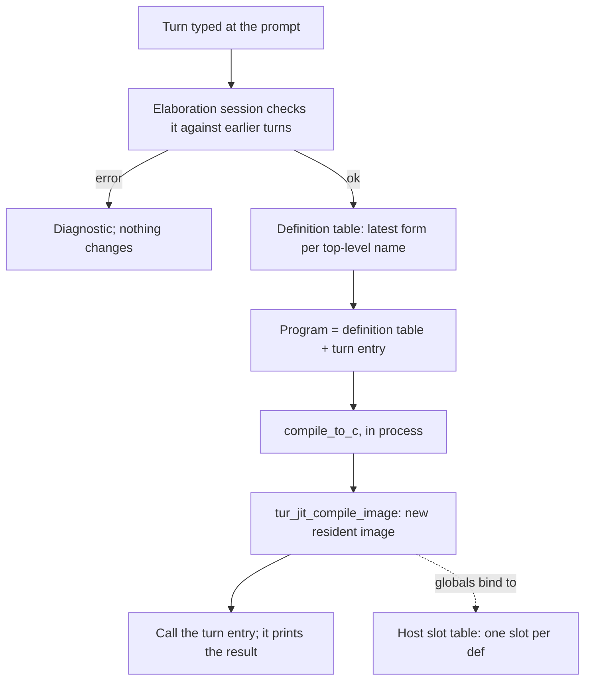

# Plan: Compiled evaluation at the `tur repl` prompt

> **Status:** C0 landed 2026-09-30. **C1 landed 2026-10-02** behind
> `--enable=repl-jit-inline-c`, and went **beta on 2026-10-04** (advisory
> `expires_at` 0.65.0) once its value boundary closed and its surface was
> frozen as the "Supported subset" under C1. C2 was investigated 2026-10-02 and
> again 2026-10-04 (findings under C2) and is not started. **Rewritten 2026-09-29.** The 2026-06-28 draft (in
> git history) proposed compiling each prompt form with a `cc` subprocess into
> a `.so` and `dlopen`ing it. It predates the in-process MIR JIT (graduated
> 0.34.0). The JIT and the spice REPL now provide most of the machinery the
> draft planned to build, and the draft had design flaws this version fixes
> (see "Why not the 2026-06-28 draft"). The file name is historical: nothing
> here is ahead-of-time compiled any more.
> **Last Updated:** 2026-10-04
> **Track:** post-v1. C0 (a bug fix) and C1 (an experiment) have landed.
> **Type:** REPL / interpreter (`src/turi/`) / JIT (`src/jit_engine.c`) /
> emitter (REPL-mode globals).
> **Requires:** a `TUR_JIT` build. Since 2026-10-02 that is the default on
> 64-bit x86-64 and arm64: MIR is vendored under `external/mir/`, so a default
> configure no longer reaches the network, and the release binaries carry the
> engine. That resolves Open question 1.
> **See also:** [jit-guide](../guides/jit-guide.md),
> [spice-repl-plan](../archive/spice-repl-plan.md),
> [jit-engine-plan](../archive/jit-engine-plan.md) (J2 image mode),
> [jit-ffi-c2mir-plan](../archive/jit-ffi-c2mir-plan.md),
> [cc-path-preamble-split-plan](cc-path-preamble-split-plan.md).

## Goal

Let a user type any Turmeric at `tur repl` and have it run the way `tur build`
would run it: inline-C, native layout, compiled semantics. The REPL must keep
its workflow while doing so: state carries from turn to turn, and anything can
be redefined.

The gap is concrete today. The interpreter runs an inline-C body only if it
recognises the pattern (`try_exec_simple_inline_c`, `src/turi/eval.c:5899`),
and refuses the rest. Piped into `tur repl` on `main` (`c6ba4162`):

````text
(defn seven [] : int
  ```c
  return 7;
  ```)
(seven)
(defn c-mix [a : int b : int] : int
  ```c
  int64_t t = a;
  return t * 31 + b;
  ```)
(c-mix 3 4)
````

```text
=> #<fn seven>
=> 7
=> #<fn c-mix>
error: eval: inline-C not supported in interpreter mode (function uses a native C implementation; run it with `tur build`/`tur run` instead of `--interpret`)
```

The same `c-mix` in a file prints `97` under `tur jit`. Until C0 landed, adding
a `for` loop to the body made things worse: the REPL could not even read the
form. Since C1, `tur repl --enable=repl-jit-inline-c` prints `97` too.

## What already exists

| Piece | Where | What this plan uses it for |
| --- | --- | --- |
| Incremental elaboration session (TR2.2b) | `TuriEnv.elab_session`, `src/turi/env.h:261`; on by default (`incremental_elab`, `:230`) | Checks each turn against earlier turns without re-elaborating them. Applies the REPL's redefinition rules (`elab_prior_turn_global`, `src/compiler/elab_core.c:2505`) and gives the turn's result type |
| JIT image mode (J2) | `tur_jit_compile_image` / `tur_jit_image_sym` / `tur_jit_image_free`, `src/jit_engine.h:74-103` | Compiles emitted C in process, links it against `tur`, runs `__tur_static_init`, and finds functions by C name, static ones included |
| Split runtime | `jit_try_split_preamble`, `src/main.c:4494` | Every image links against the one runtime inside `tur` instead of carrying its own copy of the preamble's state |
| Repeated in-process compile | `repl_jit_build`, `src/main.c:5155`; `compile_to_c` at `:5234` | Precedent for running the front end and emitter inside the REPL process on every `(reload)`, saving and restoring `g_interpret_mode` / `g_emit_for_link` around it |
| Old images stay resident | retired list, `src/turi/ffi_thunk.c:494-507` | The lifetime rule: never free an image something may still point into |
| Exports manifest and scalar marshaling | `g_manifest_sink` (`src/main.c:5232`), `tur_ffi_install_spice_bindings`, `src/turi/ffi_thunk.c` | Binding a compiled function as an interpreter native: C name, signature, and int/float/cstr/bool/nil marshaling |
| C1's mid-turn compile (2026-10-02) | `repl_inline_c_jit_build` (`src/main.c`), `src/turi/inline_c_jit.c`, `repl_jit_compile_image(..., prune, ...)` | Compiling inside a turn without disturbing it: diagnostic-registry save/replace, emission-flag save/restore, `jit_prune` on an image TU, quiet c2mir warnings |
| Lean resident images (2026-10-02) | `tur_jit_compile_image` releases the C front end once an image is initialized | An image costs ~1.6 MB resident instead of ~28-62 MB, which is what makes "keep every image" thinkable (C2, point 5) |
| Vendored MIR, `TUR_JIT` on by default (2026-10-02) | `external/mir/`, `cmake/mir.cmake`, `CMakeLists.txt` | Every default build and release binary carries the engine |

## Why not the 2026-06-28 draft

- **Latency.** It assumed under 60ms per form from `clang -O0` on a ~50-line
  file. The emitted C for a one-line program is 9,545 lines, and `cc -O0 -g0
  -c` on that alone takes ~525ms (gcc 13) or ~150-290ms (clang 18). The draft
  also recompiled the whole growing session on every form.
- **`tur build --shared` refuses a single file** ("requires a directory
  argument (single-file builds emit static symbols)"). The symbol S2 would
  have `dlsym`'d does not exist.
- **Unloading the previous library is unsafe.** Closures, function pointers,
  string literals and instance dictionaries that point into it outlive it,
  and the OS does not track heap pointers. The spice reload already learned
  this and keeps old images.
- **Every `.so` carried its own runtime state** (allocator, regions, interned
  symbols, thread-locals). A value made by one generation would be consumed
  by another generation's runtime.
- **An append-only session cannot redefine.** A second `(def x ...)` or
  `(defn f ...)` in one file is an "already defined" error. (Until
  2026-09-30 the `defn` case got past the front end and failed in the C
  compiler instead:
  [duplicate-defn-in-one-file-reaches-the-c-compiler](../archive/duplicate-defn-in-one-file-reaches-the-c-compiler.md).)
  The draft's registry also looked a `def` up *before* initializing it, so a
  re-`def` would have kept the stale value. The interpreter re-initializes.
- **A `void *` registry** cannot hold floats or by-value aggregates. Storing
  into it is also an escape store, which CLAUDE.md's "Region Store Hooks"
  rule requires to be noted.
- Smaller:
  - `TUR_M7_HKT=0` has been retired.
  - `(module ...)` and `instance` are really `defmodule` and `definstance`.
  - There is no `TUR_DEBUG` variable.
  - `src/runtime/globals.c` holds CLI configuration, not runtime code.
  - The value converters in `ffi_thunk.c` handle scalars only.
  - The inline-C example used a syntax that does not exist.

What survives from the draft: the goal, a host-owned table that keeps `def`
state across compiles (fixed below), and `:reset` as the clean slate.

## Measurements (2026-09-29)

Release `-DTUR_JIT=ON`, x86-64 Linux, 4 cores, `main` at `c6ba4162`.
Timings are best of 3, end to end. `compile_ms` comes from `tur jit
--timing-json` and covers c2mir plus link, on the split runtime.

| Program | Emitted C | `tur emit-c` | `tur jit` compile_ms | `tur jit` wall |
| --- | --- | --- | --- | --- |
| one `defn` + `main` | 9,545 lines | ~23ms | ~110ms | ~135ms |
| 200 small `defn`s | 11,762 lines | ~37ms | ~115-125ms | ~140-160ms |
| 800 small `defn`s | 18,362 lines | ~100ms | ~170-180ms | ~195-210ms |

For comparison, `tur build` of the one-line program takes ~210ms.

In process, a compiled turn pays roughly the `emit-c` column plus the
`compile_ms` column. That is ~130ms for a small session, growing slowly with
the number of definitions. C2 is designed around that budget, and C4 lists
the ways to reduce it.

## Design

### C0 -- the prompt must accept a multi-line inline-C form (LANDED 2026-09-30)

This was a bug fix:
[repl-continuation-counter-misreads-reader-syntax](../archive/repl-continuation-counter-misreads-reader-syntax.md).
A `for (...;...;...)` inside a fence kept the `..` prompt open forever, and a
`')'` char literal made the REPL evaluate the form halfway through the fence.
The REPL now asks `reader_open_depth` (`src/compiler/reader.c`) whether the
input is complete, and keeps a blank line typed inside a fence or string.
C1 and C2 could not be tested at an interactive prompt without it.

### C1 -- JIT the inline-C `defn`s the interpreter cannot run (LANDED 2026-10-02, BETA 2026-10-04)

The smallest change that closes the gap. The interpreter stays the evaluator,
and only the inline-C bodies it refuses get compiled. Experiment
`repl-jit-inline-c` (a prototype from 0.59.0, beta since 2026-10-04, advisory
`expires_at` 0.65.0); it applies wherever turi
runs, so `tur repl` and `tur --interpret` alike. With it on, the `c-mix`
example above prints `97` at the prompt and under `--interpret`. Try Turmeric
has no JIT and is unchanged.

**As built.** `src/turi/inline_c_jit.{h,c}` is the MIR-free half, in
`tur_core`. The compile is a hook that `tur` registers from `main.c` on a
`TUR_HAVE_JIT` build (`repl_inline_c_jit_build`), so a build without an engine
has no hook and keeps today's error.

- **Trigger.** `eval_apply_driven` (`src/turi/eval.c`), straight after
  `try_exec_simple_inline_c` declines -- the point where the body would
  otherwise reach "inline-C not supported". It applies to user code only
  (`!is_from_stdlib`). The stdlib's inline-C is answered by native overrides
  first, or by interpreter intercepts that run on the error path itself: the
  session channel templates, and `gc_force`. Compiling those would bypass the
  intercepts.
- **Cache.** One entry per `FnDef`, holding either the compiled shim or the
  refusal message. A redefinition elaborates a new `FnDef`, so it misses the
  cache and compiles afresh. The old entry and the old image stay, under the
  same retired-image rule as the spice reload. A refusal is cached too, so a
  body c2mir rejects costs one compile, not one per call.
- **Signature first.** Before compiling, every parameter and the result must be
  a scalar the emitter's `NAME__ffi` shim marshals: int-class, float, cstr,
  bool, or a unit result. Anything else is refused with the type named (`takes
  a parameter of type Pt`).
- **Source.** The defn's own text, sliced from the file it was read from by the
  span elaboration records on the binding (`Binding.defn_claim`, set for every
  top-level `defn`). That covers the prompt, `--interpret`, and defns brought
  in with `(load ...)`. A reader whose text the plain reader cannot read back
  (neoteric, sweet) falls back to printing the session's Form. A defn written
  by a macro has neither, and is refused.
- **Program.** `(defmodule __repl-jit (export NAME) <defn>)`. That is narrower
  than the plan above proposed. No type definitions ride along, because the
  signature check admits only scalars, so a signature can never name one.
- **Compile.** `compile_to_c` on a scratch file under `$TMPDIR` named after the
  defn, with the emission flags `repl_jit_build` saves. The manifest supplies
  the C name, and `g_emit_ffi_export_shims` supplies the shim. The compile runs
  mid-evaluation, so the host puts back everything `compile_to_c` resets that
  the turn still uses: the diagnostic file registry (the turn's source is file
  id 0) and the had-error flag. c2mir's warnings are suppressed for these
  compiles (`tur_jit_set_quiet_warnings`); its errors still print. The TU is
  pruned like `tur jit`'s (`jit_prune`), with one non-static caller appended
  to keep `__tur_static_init` alive.
- **Call.** Through `NAME__ffi`, which casts each slot to the real C parameter
  type. The result is tagged by the declared type, so a cstr comes back as a
  cstr and a bool as a bool. The spice export shim, by contrast, returns every
  int-class result as an int.

**Refusals.** Each is an error value, and the session carries on:

- A body that calls another Turmeric definition. Only the defn is compiled, so
  MIR's link fails (`import of undefined item helper`).
- A non-scalar signature.
- A variadic defn.
- A defn written by a macro.
- An inline-C block that is not a defn's whole body, such as one inside a `let`
  or a Turmeric body. Those stay "inline-C not supported".

**Found on the way, fixed.** The pattern executor's `simple-return` matcher
answered with the *first* `return` in a body, even one behind a loop or an
`if`. So `all-even` printed `false` for `(all-even 4 8)` under `--interpret`,
rc=0 and no warning, and C1 never saw the body. It now declines a body with a
loop or more than one `return`:
[turi-inline-c-simple-return-takes-first-return](../archive/turi-inline-c-simple-return-takes-first-return.md).

**What an image costs, and what changed for it.** Measured on the C1 path,
Release, x86-64 Linux, 4 cores. The baseline is the image path as it was
(unpruned TU, C front end kept until the image is freed):

| | first compile | resident after 51 compiles |
| --- | --- | --- |
| as it was | ~235 ms | 3.2 GB (~62 MB per image) |
| + `jit_prune` on the C1 TU | ~130 ms | 1.4 GB (~28 MB per image) |
| + C front end released once the image is initialized | ~135 ms | 116 MB (~1.6 MB per image) |

The C front end -- parsed system headers and runtime declarations -- was most
of an image, and nothing reads it after the module is linked: generation works
from MIR's own IR. So `tur_jit_compile_image` now calls `c2mir_finish` as soon
as the image is initialized, for every image, including the spice REPL's and
the dynamic FFI's thunks. `TUR_JIT_KEEP_C2MIR=1` restores the old lifetime.
120 consecutive compiles in one Release session returned 120 correct results.
In a 51-compile session the compile share averages ~155 ms; the interpreter's
own share of that session is ~700 ms in total.

**The value boundary (found 2026-10-04, fixed).** The signature check above is
not a safety boundary on its own. A `ptr<void>`, `:int` or un-annotated
parameter is one machine word, and an interpreter value reaches compiled code
through it as a bare address: a vec the interpreter's natives built, an
existential the interpreter packed, a cons list, a Result. Compiled code then
reads it with the compiled layout, and frees, reallocs or keeps memory the
interpreter allocated from its own arenas. Measured over the fixture corpus
(below): **26 fixtures that failed with a clean "inline-C not supported" error
without the flag crashed the process with it** (SIGABRT from `free` on arena
memory, or SIGSEGV), and 14 more passed only because the interpreter happened
to lay a value out the way compiled code reads it (cons cells, Result) -- luck,
not a contract.

Two call-time checks now close what the runtime can see
(`src/turi/inline_c_jit.c`, "The value boundary"):

1. **Provenance for pointers.** Every non-zero int-class result of a JIT'd
   call is recorded. A `ptr<void>` parameter accepts only nil or one of those:
   a handle compiled code made may go back to compiled code, and nothing else
   may. (`make-cell` then `cell-get` round-trips; a packed existential is
   refused.)
2. **No interpreter memory in an int-class slot.** A word that addresses the
   interpreter's value arenas (`arena_owns` on `value_scratch`/`value_perm`) or
   a collection it tracks is refused, whatever the parameter's declared type.

Each refusal is an error value naming the argument, and the session carries
on. Together they turn 22 of the 26 crashes into refusals and give up the 14
lucky passes.

**Supported subset (frozen for the beta).**

| | Supported | Refused, cleanly | Outside the subset -- undefined, not detected |
| --- | --- | --- | --- |
| Shape | a `defn` whose whole body is inline-C, fixed arity, written out (not by a macro) | a body calling another Turmeric definition; variadic; macro-written; partial inline-C | -- |
| Parameters | int-class numbers, `float`, `bool`, `cstr` (borrowed), `ptr<void>` holding nil or a JIT'd handle | struct/ADT/closure/collection types by name; at the call, an interpreter value in a pointer slot or interpreter memory in any int-class slot | an `:int` that smuggles a handle from somewhere else (CLAUDE.md "No lazy `:int` stand-ins" already forbids it) |
| Result | int-class, `float`, `bool`, `cstr`, unit, `ptr<void>` | any other type | -- |
| Ownership | compiled code reads its arguments | -- | compiled code that `free`s or keeps a `cstr` argument (it belongs to the interpreter) |

The four fixture crashes left are all in the last column:
`typeclass-unsafe-passbyptr-struct-arg` (`__build [lst : int]` walks an
interpreter cons list it was handed as `:int`), `re-union-patterns`
(`str-free` frees an interpreter `cstr`), and `closure-drop-affine-chain-autodrop`
/ `httpd-mw-fold-many` (an `:int` result that is a compiled-heap handle, later
dropped by the interpreter's own glue -- the second prints its full expected
output and aborts at exit). None is reachable from code that types its handles.

**Payoff beyond the prompt, measured 2026-10-04** (Debug, arm64 macOS, `main`
at `59d1dfe5c`). Of the fixtures with user inline-C, 766 have an
`expected.stdout` and no args, stdin or flags. Under `tur --interpret`:

| | pass | fail | crash introduced by the flag |
| --- | --- | --- | --- |
| no flag | 311 | 455 | -- |
| C1 as landed (measured at `4fb2606bb`, 760 fixtures) | 370 | 390 | 26 |
| C1 with the value boundary | 357 | 409 | 4 (the column above) |

No fixture that passes without the flag fails with it. **`run-turi.sh` now runs
the 46 that pass only with the flag** (`TURI_INLINEC_JIT_RUN`), with
`--enable=repl-jit-inline-c`, on any build whose `tur` carries the JIT engine;
without one they stay in the carve-out. Each was checked stable across three
consecutive runs.

The failures that remain are mostly not C1's to fix: 120 struct/ADT/closure
signatures, about 20 bodies that call Turmeric code, and the interpreter gaps
(arrow instances, async/await, task groups) that fail identically without the
flag.

**Test.** `tests/turi/repl-jit-inline-c.sh` (ctest `tur_repl_jit_inline_c`,
registered on `TUR_JIT` builds, in the `test` job's aux part). It covers:

- the gate off;
- loop and branch bodies;
- a hoisted `#include`;
- float, cstr and bool signatures;
- a cached second call;
- redefinition dropping the cache;
- both refusals;
- the value boundary: a compiled handle round-trips through `ptr<void>`, nil
  passes, a packed existential is refused at a pointer parameter, a vec is
  refused at an `:int` parameter, and a plain number still passes;
- `--interpret`;
- no scratch file left behind.

### C2 -- compile whole turns

With experiment `compiled-repl` on, every prompt turn runs as compiled code.



**Checking.** The existing elaboration session stays the front door. Each turn
is elaborated against it exactly as today. That keeps the interpreter's
redefinition rules and diagnostics, and gives the turn's result type. A turn
that fails there never reaches the compiler.

C2 needs one new path in `turi_eval_impl`: commit the elaboration (the
session, `acc_forms` and `src_acc`) *without* evaluating. In compiled mode
the interpreter never evaluates a turn, so there is exactly one copy of the
program's state: the slot table below.

**Definition table.** The compiled side keeps the latest source form for each
top-level name, in the order names were first defined. A redefinition replaces
its entry in place, which is what the draft's append-only file could not do.
Entries are keyed by:

- the defined name, for `def`, `defn`, `defstruct`, `defdata`, `defmacro` and
  the other definers;
- `(class, head)`, for `definstance`.

`import` and `load` forms are kept in order and deduplicated.

**One program per turn.** Each turn compiles the whole definition table plus a
synthesized zero-argument entry function. The entry evaluates the turn's
expression and prints it in the interpreter's `=> ` format. It uses the value's
`Show` instance when there is one, a `println` overload for scalars, and
`#<Type>` otherwise. The printing happens in compiled code, so the host never
has to convert a result back into an interpreter value.

The whole program is recompiled on purpose, because some emitter facts depend
on the whole program. Ownership provenance (`src/compiler/emit_core.c:6749`)
decides whether a parameter is owned by looking at every call site, and
monomorphized clones are minted only for call sites that exist. Compiling only
the new form would let a later turn change a fact that earlier code was
compiled under. Recompiling everything is correct by construction; C4 is where
it gets cheaper.

**Globals live in host slots.** Today a `def` compiles to `static T name_N;` in
the image, assigned in `__tur_module_def_init`. For example, `(def ^mut n 5)`
emits `static int64_t n_4;`. In REPL-compiled mode the emitter instead emits a
pointer, bound at init to a slot the host owns:

- `tur_repl_slot(name, fingerprint, size, align, &fresh)` returns the slot for
  a Turmeric name. The slot's size and alignment come from the C type, so
  floats and by-value aggregates fit. The fingerprint is the def's type plus a
  hash of its form.
- The initializer runs only when the slot is `fresh`: a new name, a changed
  form, or a changed type. This matches the interpreter. There,
  `(def ^mut n 5)` then two `(bump)`s print `6`, `7`; `(def ^mut n 100)` then
  `(bump)` prints `101` (`bump` increments `n`). The draft's registry would
  have kept the stale value.
- Slots are keyed by the Turmeric name, not the C name. The `_4` suffix
  depends on elaboration order and changes between turns.
- Slots are shared through pointers rather than copied into and out of each
  image. A closure made in turn N keeps running turn N's code; with per-image
  copies it would read turn N's stale values. With slots, every image reads
  the same storage.
- A slot outlives every `with-region` / `bt-scope` bracket, so a store into
  one is an escape store (CLAUDE.md "Region Store Hooks"). `set!` on a global
  already notes its word with `TUR_REGION_NOTE_WORDS`, and the slot-backed
  initializer store must do the same. The REPL tests get a case for this: a
  value allocated inside a bracket, stored in a `def`, and read after the
  bracket exits.
- The slot table lives in `tur`. Images reach it through the host's exported
  symbols, the same way they reach the split runtime (`ENABLE_EXPORTS` under
  `TUR_JIT`, `src/CMakeLists.txt:549`).

**Image lifetime.** Every turn's image stays resident until `:reset`, as with
the retired-list rule. Slots can hold pointers into any earlier image: string
literals, closures, instance dictionaries. `:reset` frees every image and
every slot together, which is the only point at which nothing can still refer
to them. C2's acceptance includes measuring resident memory over a long
session.

**Differences from the interpreter**, to be documented:

- A function value captured in an earlier turn keeps that turn's code. Direct
  calls always reach the latest definition, because each turn recompiles every
  caller.
- A crash in compiled code (segfault, `abort`) ends the REPL process. The
  interpreter reports some of these as errors instead. See Open question 3.
- A continuation or fiber captured in one turn and resumed in a later one would
  cross images. Refuse it with a diagnostic until someone designs it.
- Turns in a `#lang` other than `turmeric` stay interpreted.

**No silent fallback to the interpreter.** If c2mir rejects a turn, report the
error. Interpreting that one turn would read and write the interpreter's copy
of the globals rather than the slots, and the two states would drift apart. A
`cc` fallback that shares the slots is possible (Open question 1).

**Meta-commands.**

- `:type`, `:doc` and `:expand` use the elaboration session and are
  unchanged.
- `:reset` drops the definition table, the images and the slots.
- `:run` / `:reload` feed a file's forms through the same turn path.

A loaded spice (RP3) is out of scope for C2; see C3.

#### Investigation (2026-10-02)

Read against `main` after C1 landed, with C1's measurements. Nothing here is
built yet. C2 is a change to the emitter and to turi together, and it wants a
branch of its own.

1. **The engine is now there to use.** `TUR_JIT` defaults ON and release
   binaries carry it (Open question 1). The `cc` + `dlopen` alternative is no
   longer needed to reach users.
2. **Commit-without-evaluate is one branch.** `turi_eval_impl` evaluates a
   turn in step 7 with `eval_toplevel_guarded(env, prog, n_fsd, ...)`
   (`src/turi/eval.c`, "7. Evaluate the new top-level expressions"), and step
   8 commits `src_acc`, `acc_forms`, `prior_*`, the elaboration session and
   `acc_turns` only when that result is not an error. In compiled mode, step 7
   becomes "run the compiled turn", and its result feeds the same
   `turi_is_error` test. Step 8 is unchanged. Step 8 already records
   `last_result_type`, the type the turn-entry printer needs.
3. **The compile path exists and is safe mid-session.** C1's
   `repl_inline_c_jit_build` is the template:
   - `compile_to_c` from a scratch file;
   - the diagnostic-registry save/replace;
   - the flag save/restore;
   - `jit_prune`, keeping `__tur_static_init` alive;
   - `repl_jit_compile_image`.

   C2 swaps the one-defn program for the definition table plus the turn
   entry. Entry points other than the turn entry are not needed, so the whole
   TU prunes the same way.
4. **Latency budget looks reachable for small sessions.** C1's first compile
   is ~135 ms in process with pruning, which is under the 200 ms target. That
   is a one-defn program. C2's program is the whole definition table, so the
   number to measure is the 200-defn case. The 2026-09-29 table puts `emit-c`
   at ~37 ms and `compile_ms` at ~115-125 ms unpruned, and pruning cut C1's
   compile from ~235 ms to ~130 ms.
5. **Image memory is now the binding constraint, not latency.** "Every turn's
   image stays resident until `:reset`" was unaffordable as the engine stood.
   An image kept ~62 MB, so 1,000 turns would have been ~60 GB. With pruning
   and the C front end released (C1), an image is ~1.6 MB, which is ~1.6 GB
   per 1,000 turns. That is measurable and bounded, but too much to accept
   unreviewed. Before C2 lands, decide one of:
   - (a) make images smaller still, for example by releasing MIR function IR
     after generation once nothing can lazily generate from it;
   - (b) free an image once no slot, closure or dictionary can point into it,
     which needs the provenance C2 does not track today;
   - (c) accept the cost and document a `:reset` cadence.

   The success criterion "resident memory after 1,000 turns is measured" now
   has a number to beat.
6. **Slot-backed globals can be done without touching reference sites.** A
   `def` emits `static T name_N;`, initialized either as a statement of the
   synthesized `main` body ("Gap F") or in `__tur_module_def_init`. In
   REPL-compiled mode, emit a pointer and a macro in its place:

   ```c
   static T *__tur_slot_name_N;
   #define name_N (*__tur_slot_name_N)
   ```

   Every existing read, `set!` and address-of of `name_N` then reaches the slot
   unchanged. That includes the `TUR_REGION_NOTE_WORDS` hook `set!` already
   emits. The initializer binds the pointer with `tur_repl_slot(...)` and runs
   only when the slot is fresh. The `^thread-local` path (G4b, which emits
   accessor functions in place of storage) is the precedent for redirecting a
   global's storage in this emitter. A `^thread-local` def keeps that path; a
   slot is process-wide by construction.
7. **No pattern-executor dependence.** A compiled turn never consults
   `try_exec_simple_inline_c`, so the matcher's guessing (fixed again above for
   `simple-return`) is moot in compiled mode. That is one more reason to
   prefer C2 over growing the matcher.
8. **Still open, from the design above:**
   - the turn-entry printer (Show dispatch in compiled code);
   - redefinition of a `defstruct`/`defdata` whose values live in slots (the
     fingerprint changes, so the slot is refreshed; that is correct, and it
     needs a transcript test);
   - continuations crossing images.

**Recommendation:** do C2 as its own branch, in this order:

1. The step-7 branch plus the definition table, keeping today's per-image
   globals. Every turn then re-runs every initializer, so this is correct only
   for sessions whose `def`s are pure and never mutated; the transcript diff
   says where it is not.
2. The slot macro.
3. The image-memory decision (point 5) before the experiment soaks.

#### Second look: does C1 ship before C2? (2026-10-04)

Measured on a Release build, arm64 macOS (Apple clang), `main` at `59d1dfe5c`.
The 2026-09-29 table above is x86-64 Linux; the two differ more than expected.

**Latency.** `tur jit --timing-json`, best of 3, each program's `main` calling
every definition so `jit_prune` keeps them all live:

| live defns | `emit-c` | `compile_ms` | a C2 turn, roughly |
| --- | --- | --- | --- |
| 1 | ~22 ms | ~244 ms | ~265 ms |
| 200 | ~28 ms | ~271 ms | ~300 ms |
| 800 | ~51 ms | ~431 ms | ~480 ms |

With only `main`'s callees live -- an expression turn, the common case -- the
compile stays at ~265 ms whatever the definition count, because the prune drops
the rest. So **the fixed c2mir floor, not the session size, is the cost**, and
on this platform the floor alone (~245 ms) is over C2's 200 ms budget. That
makes C4 item 2 ("reduce the fixed c2mir cost") a prerequisite for C2 on macOS,
not a fallback; on x86-64 Linux, at ~110 ms, it was not.

**Image memory.** A `tur repl --enable=repl-jit-inline-c` session compiling N
distinct inline-C defns, each called once, peak RSS:

| compiles | wall | peak RSS |
| --- | --- | --- |
| 1 | 0.3 s | 76 MB |
| 50 | 19.2 s | 418 MB |
| 100 | 31.9 s | 558 MB |

Marginal cost from 50 to 100: ~255 ms and ~2.8 MB per image, linear, with all
100 results correct. (The Linux measurement under C1 was ~1.6 MB.) C2 keeps one
image per *turn*, so 1,000 turns is ~3 GB here. That rules out option (c)
under point 5 above (accept it and document a `:reset` cadence): a session that
long is ordinary. C2 needs (a) or (b) before it lands. C1 keeps one image per
distinct compiled defn or redefinition, which grows with what the user writes,
not with how many turns they type.

**What C2 still costs.** Nothing found here makes it infeasible; every piece has
a precedent in the tree. The work is:

1. turi: commit a turn without evaluating it (one branch, point 2 above);
2. the definition table and the synthesized turn entry;
3. the turn-entry printer -- `Show` dispatch in compiled code, `println` for
   scalars, `#<Type>` otherwise (point 8);
4. the emitter's slot-backed globals (point 6), the one emitter change;
5. the image-memory decision, (a) or (b);
6. the c2mir floor on macOS (C4 item 2);
7. the transcript corpus and its diff harness, the acceptance gate.

Items 1-4 are the plan's existing recommendation. Items 5 and 6 are what this
look added, and both are research rather than plumbing.

**Verdict: ship C1 first.** The two are not competitors:

- C2 replaces C1 only *at the prompt*. `tur --interpret` evaluates a file, not
  prompt turns, and C2 does not change that; C1 is the only path that runs
  inline-C there. That is where its measured payoff is: 46 corpus fixtures
  that `run-turi.sh` could not run before.
- C2 reuses C1's machinery: `repl_inline_c_jit_build`'s mid-turn compile, the
  prune, and the quiet-warnings and diagnostic save/restore. Nothing in C1
  would be undone.
- C2 has no value boundary, because nothing interpreted ever touches a compiled
  value. That is C2's real advantage. C1 has a boundary, which is why its
  surface is a frozen subset. That subset is now explicit and checked, which
  was the missing piece for beta.
- C2 is post-v1 and gated on two research items. C1 works today.

### C3 -- spices in compiled mode

With a spice loaded, a compiled turn needs to call the spice's functions. The
cheapest correct option is to add the spice's `src/` to the include path and
import its modules into the turn program, making the spice part of the whole
program. Compile time then grows with the spice. The alternative, linking
against the spice's own image, goes through the export shims and loses the
whole-program facts C2 relies on. Decide once C2 has numbers.

### C4 -- make turns cheaper

Only needed if C2 misses its latency budget. Candidates, safest first:

1. **Keep the compiling front end resident.** `compile_to_c` re-elaborates the
   stdlib autoloads on every call; that is most of the `emit-c` column.
   Reusing an elaborated stdlib across turns is TR2.2b's idea applied to the
   compiling elaborator.
2. **Reduce the fixed c2mir cost.** Measure how much of the ~110ms floor is
   the split runtime's declarations and how much is stdlib code emitted into
   every program. Partly answered by C1 (2026-10-02): pruning the stdlib code
   a program never reaches (`jit_prune`, which `tur jit` already did and the
   image path did not) took a one-defn image from ~235 ms to ~130 ms. What is
   left is mostly the split runtime's declarations and the system headers.
3. **Split each turn into two images:** a definitions image rebuilt only when
   a definition changes, and a small turn image for expression-only turns.
   This is correct only if an expression cannot change the whole-program facts
   the definitions image was compiled under, and it can: one new call site can
   make a parameter unowned. The emitter would have to fingerprint those facts
   and rebuild when they change. This is a research item.

## Phases and tests

| Phase | Gate | Lands | Tests |
| --- | --- | --- | --- |
| C0 | none (bug fix) | landed 2026-09-30 | `tests/turi/repl-multiline-input.sh`: every repro in the report, piped, asserting on the evaluated output (the failure exits 0) |
| C1 | `repl-jit-inline-c` | landed 2026-10-02; beta 2026-10-04 | `tests/turi/repl-jit-inline-c.sh` (ctest `tur_repl_jit_inline_c`, `TUR_JIT` builds): the gate off, loop and branch bodies, a hoisted `#include`, float/cstr/bool signatures, a cached second call, redefinition dropping the cache, refusal of a body that calls a Turmeric function and of a struct parameter, the value boundary, `--interpret`. It probes the binary for the JIT and PASS-skips without it. `tests/run-turi.sh` runs the 46 corpus fixtures that need it (`TURI_INLINEC_JIT_RUN`) |
| C2 | `compiled-repl` | post-v1 | Transcript diff: run each transcript in a corpus through the interpreted and the compiled REPL and fail on any difference, as the engine triangle does. See the corpus list below. Latency: a new `benchmarks/repl-turn/` |
| C3, C4 | as C2 | after C2 | as needed |

The C2 transcript corpus covers:

- scalars;
- redefining a `def`, a `defn` and a `defstruct`;
- a mutable global across turns;
- a closure from an earlier turn;
- a string literal read 100 turns after its image was compiled;
- inline-C turns;
- the region-escape case;
- a failing turn that changes nothing.

## Success criteria

- **C0 (met 2026-09-30):** every repro in the report evaluates correctly,
  piped and interactive.
- **C1 (met 2026-10-02):** on a JIT build with the experiment on, the `c-mix`
  example above prints `97` at the prompt and under `--interpret`.
  Unsupported signatures get a clean error that names the type.
- **C2:**
  - The transcript diff shows no differences beyond the documented ones.
  - A turn in a session of up to 200 definitions takes at most 200ms at the
    median on the benchmark machine.
  - Resident memory after 1,000 turns is measured and recorded here.

## Open questions

1. ~~**The JIT is not in release binaries.**~~ **Resolved 2026-10-02.** MIR is
   vendored under `external/mir/` (`tools/update-mir.sh` re-syncs it from the
   fork), so `TUR_JIT` defaults ON on 64-bit x86-64 and arm64 without a
   configure-time fetch. The release workflow ships the engine, and it now
   runs a program through `tur jit` from each extracted archive. The `cc` +
   `dlopen` alternative for C2 is not needed. For
   [ffi-spices-integration-plan](ffi-spices-integration-plan.md) S5 this
   turned a blocker into a decision: a `-DTUR_JIT=OFF` build still exists.
2. **CLI after graduation.** While experimental, the feature is
   `--enable=compiled-repl`. Afterwards it could become `tur repl --eval jit`,
   or extend `--engine`, which today only chooses how a spice is built.
3. **Crash isolation.** Either accept that a crashing turn ends the session,
   or run turns in a child process. A child process cannot cheaply share the
   host's slots.
4. **Continuations and fibers across turns** (see "Differences from the
   interpreter").
