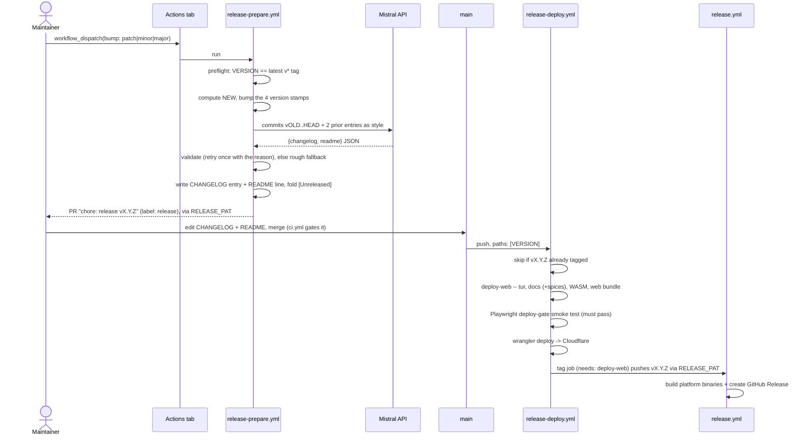

# CI Release Workflows Plan -- manual GitHub Actions + Cloudflare deploy

> **Status: IMPLEMENTED, not yet exercised (2026-10-05).** The two workflows
> and the drafter landed together; nothing has run end to end, because two of
> the four secrets do not exist yet (see "Secrets"). Moved out of `hold/` on
> execution. Release notes are now drafted by an LLM over the Mistral API
> (`tools/release_prepare.py`, model choice measured below).
>
> **Overlaps [release-in-actions-plan](release-in-actions-plan.md)**, a later
> and more detailed proposal for the same job that its author decided
> differently: one shot with no review PR, Cloudflare Workers AI for the notes,
> binaries built inside the cut (no PAT). This plan keeps the review PR. One
> of the two should be archived once the flow has a real release behind it.

Move the release cut from the local, interactive `/cut-*-release` skills to a
two-stage GitHub Actions flow: a **manual prepare** step that opens a review
PR with LLM-drafted notes, and a **merge-triggered deploy** step that ships
the web app to Cloudflare and cuts the tag. The existing
`.github/workflows/release.yml` (binary builds + GitHub Release) is reused
unchanged.

## Why two stages

Changelog authoring needs human judgment (the skill uses an `AskUserQuestion`
gate). A single non-interactive workflow can't provide that. Splitting into
prepare -> review PR -> deploy moves the judgment into PR review, where
`ci.yml` also runs as the quality gate, while keeping the mechanical steps
automated. The LLM draft makes that review an edit, not a blank page.

Every ordering invariant the skill enforced is preserved:

- The tag is only ever cut from a commit that already contains the version
  bump + CHANGELOG + README (that commit is the merged PR).
- The Cloudflare deploy must fully succeed before the tag job runs
  (`needs: deploy-web`), so a failed deploy never strands a tag.

## Flow



## Decisions (settled)

1. **Two-stage PR flow** -- prepare opens a review PR; a human edits the
   drafted changelog there rather than in an interactive prompt.
2. **No preview/staging environments.** A Playwright `deploy-gate` smoke test
   still runs and must pass before the Cloudflare deploy.
3. **Access control:** `workflow_dispatch` is already limited to users with
   write access -- no approval environment needed.
4. **Notes drafter: Mistral API**, model order
   `zai-glm-latest@low, mistral-medium-latest, mistral-small-latest` --
   measured, see "Model choice". An API failure never blocks: the PR opens
   with a rough subject-line draft and a warning banner.

## Files

### New: `tools/release_prepare.py`

Steps 0-5 of the `/cut-*-release` skills, non-interactively. Standard library
only (runs before any pip install).

- Computes `NEW` from `VERSION`; refuses if `CHANGELOG.md`'s `[Unreleased]`
  demands a bigger bump than requested (the patch skill's Step 0, mechanized);
  refuses an empty commit range.
- Writes **all four** version stamps the skills write -- `VERSION`,
  `stdlib/VERSION` (`ctest -R tur_stdlib_version_stamp` checks they agree),
  `src/web/wasm_glue.h`, and `web/public/sw.js`'s `CACHE_VERSION`. The
  original plan listed two. The `sw.js` rewrite is anchored on the
  `CACHE_VERSION =` line: the Justfile's `bump-*` recipes matched the version
  shape anywhere and would have rewritten a historical version quoted in a
  comment; fixed there in the same change.
- Drafts the notes over `<MISTRAL_BASE_URL>/chat/completions` with
  `response_format: json_object`. The prompt carries the skill's
  classification rules, the two most recent CHANGELOG entries as style
  exemplars, the README line, any `[Unreleased]` notes (folded in), and every
  commit since `vOLD` -- subject plus the first 12 body lines, release commits
  excluded.
- Validates the draft before writing it: only `Added / Changed / Deprecated /
  Removed / Fixed / Docs` subsections, in order; at most 16 bullets and 110
  words a bullet; no repeated bullet; ASCII only (typographic punctuation is
  converted first); every `TUR-[EW]nnnn` it cites appears in the commits or
  under `src/` (the anti-fabrication check). A rejected draft goes back to
  the same model once, with the reason. Then reflows bullets to the file's
  80-column, two-space-continuation layout, whatever the model did.
- Inserts `## [NEW] -- DATE` above the newest entry, deletes the
  `[Unreleased]` heading, rewrites README's `**Latest release:**` line.
- `--out DIR` writes `new_version`, `pr_body.md` (which model wrote it, a
  review checklist, the commit list) and `draft.json`.

Run it locally to preview a cut without touching anything:

```sh
MISTRAL_API_KEY=... python3 tools/release_prepare.py --bump minor
```

### New: `.github/workflows/release-prepare.yml`

- Trigger: `workflow_dispatch` with `bump` (`patch|minor|major`) and an
  optional `models` override (`MODEL` or `MODEL@EFFORT`, comma-separated).
- `concurrency: release-prepare`; `permissions: contents: read` -- every
  write goes through `RELEASE_PAT`.
- Preflight: `VERSION` must equal the latest `v*` tag (otherwise a previous
  release never finished).
- Runs the drafter with `--apply`, commits `chore: release vNEW` on
  `release/vNEW`, pushes, opens the PR with `gh pr create` and label
  `release` (created on first use). Refuses if that branch already exists.
  The draft is uploaded as an artifact either way.
- No third-party PR action: `gh` is on the runner, and the repo pins every
  action by SHA (C-5), so not adding one is the cheaper choice.

### New: `.github/workflows/release-deploy.yml`

- Trigger: `push` to `main` filtered `paths: [VERSION]` (fires when the
  release PR merges), plus `workflow_dispatch` as a manual re-run hatch.
- `concurrency: release-deploy`; `permissions: contents: read`.
- Job `check`: reads `VERSION`; if `vX.Y.Z` already exists, everything
  downstream is skipped (a stray `VERSION` touch, or a re-run after success).
- Job `deploy-web` (the `ci.yml` `web-smoke` job's steps + a deploy, same SHA
  pins):
  - Clones `turmeric-spices` as the sibling and runs
    `tools/check-pack-spices.py` after the docs build -- the deploy-only
    check `just deploy-web` runs. Without it the site silently loses every
    spice page; the original plan relied on genspices' leniency here, which is
    exactly what that check exists to refuse.
  - Release-build native `tur`, `./build/tur run docs`, WASM (`tur_wasm`),
    `npm ci`, Playwright Chromium.
  - Smoke gate: `npx playwright test deploy-gate.spec.js --project=desktop`
    (blocking).
  - `npm run build`, then
    `npx wrangler deploy --config dist/try_turmeric/wrangler.json` with
    `CLOUDFLARE_API_TOKEN` / `CLOUDFLARE_ACCOUNT_ID`.
- Job `tag` (`needs: [check, deploy-web]`): checks out with `RELEASE_PAT`,
  re-checks the tag does not exist, `git tag -a` (annotated, not signed -- C-4)
  and pushes it.

### Unchanged: `.github/workflows/release.yml`

Already triggers on `push: tags: v*`, builds the platform archives + docs
tarball and creates the GitHub Release with provenance. No edits.

## The RELEASE_PAT gotcha -- it bites twice

1. **The tag.** A tag pushed with the default `GITHUB_TOKEN` does not trigger
   other workflows, so `release.yml` would never fire and no binaries would
   build.
2. **The PR.** The repo's "Allow GitHub Actions to create and approve pull
   requests" setting is off (`can_approve_pull_request_reviews: false`), so
   `GITHUB_TOKEN` cannot open the PR at all -- and if it could, `ci.yml` would
   not run on a branch it pushed, removing the quality gate this design
   relies on.

So both stages use a fine-grained PAT (`RELEASE_PAT`, this repo only,
Contents: read/write and Pull requests: read/write). A GitHub App token would
age better (no expiry calendar); see release-in-actions-plan 5.4 for the
trade-off table.

## Secrets

`Settings -> Secrets and variables -> Actions`:

| Secret | Purpose | State |
|---|---|---|
| `MISTRAL_API_KEY` | release-notes draft | **set 2026-10-05** |
| `RELEASE_PAT` | release PR + tag push that re-triggers `release.yml` | missing -- fine-grained PAT, this repo only, Contents + Pull requests read/write |
| `CLOUDFLARE_API_TOKEN` | `wrangler deploy` | missing -- "Edit Cloudflare Workers" template, scoped to this account/zone |
| `CLOUDFLARE_ACCOUNT_ID` | target account (`web/wrangler.jsonc` carries none) | missing |

`release-prepare` fails fast with a pointer here if `RELEASE_PAT` is absent;
without `MISTRAL_API_KEY` it still opens a PR, with the rough fallback draft.

## Model choice (measured 2026-10-05)

Each candidate drafted two real releases from the inputs as they stood at the
old tag (the CHANGELOG and README from `vOLD`, so the hand-written answer is
not in the prompt), and was compared against the hand-cut entry:
`v0.61.0..v0.62.0` (10 commits) and `v0.62.0..v0.63.0` (74 commits, the hard
case). `reasoning_effort` values each model accepts differ: Medium and Small
take `none` (default) or `high`; GLM takes `low`, `high` or `max` and reasons
by default.

| Model @ effort | 0.62.0 | 0.63.0 | Verdict |
|---|---|---|---|
| `zai-glm-latest@low` | 5 s | 7 s | **Best.** Closest to the house voice, real API names, consolidated, accurate |
| `zai-glm-latest` (default effort) | 64-205 s | 127-220 s | Same quality as `@low`, 20-30x slower |
| `zai-glm-latest@max` | 235 s | >15 min, abandoned | Unusable in CI |
| `mistral-medium-latest` | 4 s | 14-19 s, needed the retry (19-30 bullets first) | Right themes, vaguer, leaks plan labels ("P0", "P1") |
| `mistral-medium-latest@high` | 57 s | 68 s | Thinner than at `none` -- effort does not help it here |
| `mistral-small-latest` (either effort) | 5-12 s | 10-11 s | Fluent but wrong: called a string-`replace` fix "BREAKING -- `tur run` ...", cited fixture names |

`mistral-large` was not tried (older; not viable). Medium and Small stay in
the order as fallbacks for a GLM outage; neither is good enough to merge
without a real edit. The validator retry is what makes Medium usable on large
releases at all.

What no validator catches is a real change described with the wrong
mechanism -- that is what the review PR is for, and why this plan keeps it.

## Implementation checklist

- [x] Write `tools/release_prepare.py` (drafter, validators, fallback, apply).
- [x] Measure Medium / Small / GLM, with effort settings, on two releases.
- [x] Write `.github/workflows/release-prepare.yml`.
- [x] Write `.github/workflows/release-deploy.yml`.
- [x] Verify the `dist/.../wrangler.json` config path -- a local `vite build`
      emits `web/dist/try_turmeric/wrangler.json` (`name: try-turmeric`, both
      custom-domain routes), matching `web/package.json`'s `deploy` script.
- [x] Set `MISTRAL_API_KEY`.
- [ ] Add `RELEASE_PAT`, `CLOUDFLARE_API_TOKEN`, `CLOUDFLARE_ACCOUNT_ID`.
- [ ] Dry-run: dispatch `release-prepare` with `bump: patch`, read the PR,
      close it unmerged and delete `release/vX.Y.Z`.
- [ ] Real cut: merge a release PR; confirm `release-deploy` fires, the gate
      runs, and the deploy -> tag -> `release.yml` chain completes.
- [ ] Slim the `/cut-*-release` skills to `gh workflow run release-prepare.yml
      -f bump=<level>` plus a PR link, keeping their "Things to refuse".
- [ ] Decide between this plan and release-in-actions-plan; archive the other.
