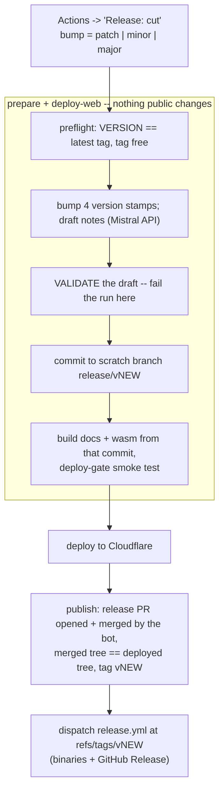

# CI Release Workflows Plan -- one-shot GitHub Actions cut + Cloudflare deploy

> **Status: IMPLEMENTED, not yet exercised (2026-10-05).** One workflow,
> `.github/workflows/release-cut.yml`, plus the drafter
> `tools/release_prepare.py`. Nothing has run end to end: the Cloudflare
> secrets and one repo setting are still missing (see "Prerequisites").
> Moved out of `hold/` on execution.
>
> **Design changed during implementation.** This plan began as a two-stage
> flow (prepare opens a review PR, merging it deploys and tags). It shipped as
> a one-shot cut instead -- the author's call, 2026-10-05: an interactive
> review PR was more mess than the review was worth, and the one-shot shape
> also needs no PAT. That brings it close to
> [release-in-actions-plan](release-in-actions-plan.md); the differences are
> that notes come from the Mistral API, and `release.yml` is dispatched
> unchanged rather than extracted into a reusable workflow. One of the two
> plans should be archived once a real release has gone through.

## Flow



`dry_run: true` stops after the draft: it is in the job summary and the
`release-draft` artifact, and nothing is pushed.

Ordering invariants kept from the `/cut-*-release` skills:

- The tag is only ever on a commit that contains the bump + CHANGELOG +
  README.
- The deploy succeeds before the tag exists, so a failed deploy never strands
  a tag. Everything before `publish` leaves `main`, the tags and the site as
  they were; the scratch branch is the only residue.

## Why one shot, and what replaces the review

Nobody reads the notes before they are public. What stands in for the reader:

- **Validators, as a hard gate** (`release_prepare.py --strict`): only
  `Added / Changed / Deprecated / Removed / Fixed / Docs` subsections, in
  order; at most 16 bullets and 110 words a bullet; no repeated bullet; ASCII
  only; every `TUR-[EW]nnnn` it cites appears in the commits or under `src/`.
  A rejected draft goes back to the same model once with the reason, then the
  next model is tried. If none passes, the run fails before anything is
  pushed.
- **`dry_run`** previews the exact entry for one dispatch -- the habit before
  an unusually large cut.
- **`[Unreleased]`** is still folded in; anything you want said a particular
  way, write there as you go.
- **Prose errors are cheap after the fact**: a follow-up commit to
  `CHANGELOG.md` and an edit of the release body. Neither needs a retag.

What no validator catches is a real change described with the wrong
mechanism. That is the price of one shot.

`allow_rough_notes: true` is the outage path: if no model passes, it ships raw
commit subjects and a TODO README line instead of failing. A deliberate choice
by whoever dispatches, never a silent fallback.

## Files

### `tools/release_prepare.py`

Steps 0-5 of the skills, non-interactively; standard library only.

- Computes `NEW`; refuses a bump smaller than `[Unreleased]` demands, and an
  empty commit range.
- Writes all four version stamps: `VERSION`, `stdlib/VERSION` (checked by
  `ctest -R tur_stdlib_version_stamp`), `src/web/wasm_glue.h`, and
  `web/public/sw.js`'s `CACHE_VERSION` -- anchored on that line, because the
  file's comments quote old versions. The Justfile's `bump-*` recipes had the
  same shape-match bug and are fixed in the same change.
- Drafts over `<MISTRAL_BASE_URL>/chat/completions`
  (`response_format: json_object`): the skills' classification rules, the two
  latest entries as style exemplars, the README line, `[Unreleased]`, and
  every commit since `vOLD` (subject + first 12 body lines, release commits
  excluded). Validates as above; reflows bullets to the file's layout.
- Inserts `## [NEW] -- DATE`, drops `[Unreleased]`, rewrites README's
  `**Latest release:**` line.

Preview a cut locally, touching nothing:

```sh
MISTRAL_API_KEY=... python3 tools/release_prepare.py --bump minor
```

### `.github/workflows/release-cut.yml`

Inputs: `bump`, `dry_run`, `allow_rough_notes`, `models` (`MODEL` or
`MODEL@EFFORT`, comma-separated). `concurrency: release-cut`. Three jobs:

- **`prepare`** -- preflight, draft (`--strict` unless `allow_rough_notes`),
  summary + artifact, then commit `chore: release vNEW` to `release/vNEW` and
  push it.
- **`deploy-web`** -- checks out that commit; clones `turmeric-spices` and
  runs `tools/check-pack-spices.py` (the deploy-only check `just deploy-web`
  runs -- without it the site silently loses every spice page); Release-build
  `tur`, `tur run docs`, `tur_wasm`, `npm ci`; the blocking
  `deploy-gate.spec.js` smoke test; `npm run build`; `wrangler deploy --config
  dist/try_turmeric/wrangler.json` (path verified against a local
  `vite build`).
- **`publish`** -- refuses if `main` moved since `prepare` (the merge would
  publish a tree nobody deployed); opens the release PR and merges it
  (`--rebase --match-head-commit`, retried for GitHub's mergeability race);
  checks `main`'s tree equals the deployed commit's; tags `vNEW` (annotated,
  not signed -- C-4) and runs `gh workflow run release.yml --ref vNEW`.

### Removed

The two-stage `release-prepare.yml` / `release-deploy.yml` from the first
version of this PR.

### Unchanged: `.github/workflows/release.yml`

Dispatched at the tag ref, `github.ref` is `refs/tags/vNEW`, so its
`startsWith(github.ref, 'refs/tags/')` gate publishes and `GITHUB_REF_NAME`
names the archives -- exactly as a tag push would.

## No PAT -- how the two GITHUB_TOKEN traps are avoided

1. **`main` takes changes only through a pull request** (classic branch
   protection, 0 approvals, admins exempt -- which is why the local skills can
   `push HEAD:main`). The bot cannot push there, so `publish` opens a PR and
   merges it. That needs the repo setting **"Allow GitHub Actions to create
   and approve pull requests"**, which is off today.
2. **A tag pushed with `GITHUB_TOKEN` starts no workflow.** But
   `workflow_dispatch` is the documented exception: a dispatch made with
   `GITHUB_TOKEN` does start a run. So `publish` dispatches `release.yml` at
   the tag instead of relying on the tag push.

Consequence worth knowing: `ci.yml` does not run on the release commit (a
`GITHUB_TOKEN` merge triggers nothing). The release diff is six version and
notes files; `release.yml` then builds and runs a program from every archive.

## Prerequisites

| What | State |
|---|---|
| `MISTRAL_API_KEY` secret | **set 2026-10-05** |
| `CLOUDFLARE_API_TOKEN` secret ("Edit Cloudflare Workers" template, this account/zone) | missing |
| `CLOUDFLARE_ACCOUNT_ID` secret (`web/wrangler.jsonc` carries none) | missing |
| Settings -> Actions -> General -> "Allow GitHub Actions to create and approve pull requests" | off -- `publish` cannot open the release PR until it is on |

`dry_run` needs only `MISTRAL_API_KEY`, so it works today.

## Model choice (measured 2026-10-05)

Each candidate drafted two real releases from the inputs as they stood at the
old tag (CHANGELOG and README from `vOLD`, so the hand-written answer is not
in the prompt), compared against the hand-cut entry: `v0.61.0..v0.62.0`
(10 commits) and `v0.62.0..v0.63.0` (74 commits, the hard case).
`reasoning_effort` values differ per model: Medium and Small take `none`
(default) or `high`; GLM takes `low`, `high` or `max` and reasons by default.

| Model @ effort | 0.62.0 | 0.63.0 | Verdict |
|---|---|---|---|
| `zai-glm-latest@low` | 5 s | 7 s | **Best.** Closest to the house voice, real API names, consolidated, accurate |
| `zai-glm-latest` (default effort) | 64-205 s | 127-220 s | Same quality as `@low`, 20-30x slower |
| `zai-glm-latest@max` | 235 s | >15 min, abandoned | Unusable in CI |
| `mistral-medium-latest` | 4 s | 14-19 s, needed the retry (19-30 bullets first) | Right themes, vaguer, leaks plan labels ("P0", "P1") |
| `mistral-medium-latest@high` | 57 s | 68 s | Thinner than at `none` -- effort does not help it here |
| `mistral-small-latest` (either effort) | 5-12 s | 10-11 s | Fluent but wrong: called a string-`replace` fix "BREAKING -- `tur run` ...", cited fixture names |

Default order: `zai-glm-latest@low, mistral-medium-latest,
mistral-small-latest`. `mistral-large` was not tried (older; not viable).
With no reviewer, Medium and Small are fallbacks for a GLM outage only --
worth a `dry_run` look before letting either publish.

## Checklist

- [x] `tools/release_prepare.py` (drafter, validators, `--strict`, apply).
- [x] Measure Medium / Small / GLM, with effort settings, on two releases.
- [x] `.github/workflows/release-cut.yml`.
- [x] Verify the `dist/.../wrangler.json` path.
- [x] Set `MISTRAL_API_KEY`.
- [ ] Add `CLOUDFLARE_API_TOKEN`, `CLOUDFLARE_ACCOUNT_ID`; enable "Allow
      GitHub Actions to create and approve pull requests".
- [ ] `dry_run` dispatch on `main` after merge; read the summary.
- [ ] First real cut; confirm deploy -> PR merge -> tag -> `release.yml`.
- [ ] Slim the `/cut-*-release` skills to `gh workflow run release-cut.yml -f
      bump=<level>` (a `dry_run` first when the range is large), keeping their
      "Things to refuse".
- [ ] Archive this plan or release-in-actions-plan.
