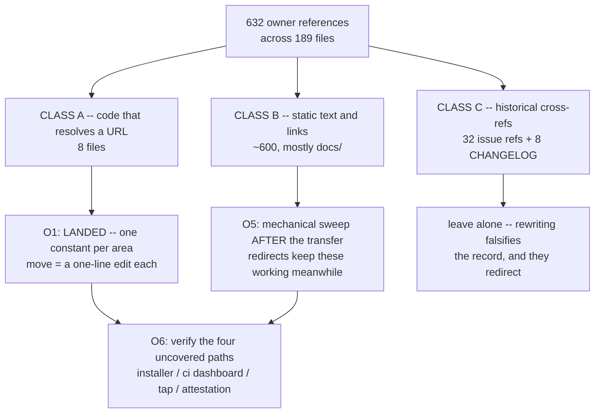

# Moving the Turmeric repos to a GitHub org

> **Status: ALL SEVEN REPOS TRANSFERRED 2026-10-02.** O1 landed 2026-10-01;
> O2 (redirect verification) RESOLVED; O3 (org pre-staging) done; Tiers 1-3
> transferred, spices before turmeric per 4.1; **O4 (the Class A owner
> literals) and O5 (the 502-occurrence Class B doc sweep) both landed in the
> same PR as this text.** What remains is **O6**, and of its four checks three
> are done -- only "verify a release cut under the org" is genuinely
> outstanding, since it needs a release. Written in
> answer to "what is a good option for moving turmeric repos out of my
> rjungemann account -- a free-tier GH org?" The short answer is **yes, GitHub
> Free for organizations is sufficient and costs nothing here**, and section 1
> is the measurement that settles it.
>
> **The secrets ledger -- every secret, its consumer, and where it has to be
> redefined -- is [section 2.1](#21-the-secrets-ledger----every-secret-and-where-it-goes).**
> The per-repo progress tracker is [section 0a](#0a-progress-tracker).
> **Type:** repository / release infrastructure
> **Touches:** no compiler source. `tvm/tvm.sh`, `web/{repo,site,ci-metrics,worker}.js`,
> `tools/gen{guides,spices}.py`, [`.github/workflows/ci.yml`](../../.github/workflows/ci.yml),
> `Formula/turmeric.rb`, `scripts/wait-for-release.sh`, `cmake/mir.cmake`,
> `.claude/commands/cut-*-release.md`, and ~600 link occurrences under `docs/`.
>
> **Decided before writing any of this down:**
> 1. **A free org is enough, because every repo is public.** Standard-runner
>    Actions minutes are unlimited on public repos. The 2,000-minute Free
>    allowance only bills private repos -- where the 10x macOS multiplier would
>    make this repo's CI unaffordable within a week (section 1).
> 2. **Target name `turmeric-lang`**, matching the domain. Plain `turmeric` is
>    a taken user account. `turmeric-lang` was unclaimed on 2026-10-01 and is
>    being reserved.
> 3. **`turmeric-spices` must move before `turmeric`, never after.** O1 made
>    turmeric's CI clone owner-relative, which is what creates the ordering
>    constraint (section 4.1). This is the one way the move can turn CI red on
>    its own. They do *not* have to move in the same window: measured
>    2026-10-02, spices' own CI hardcodes `rjungemann/turmeric` (ci.yml lines
>    36, 373, 404) rather than deriving it, so spices-in-org /
>    turmeric-still-at-`rjungemann` resolves through the redirect and is safe
>    to sit in for as long as you like.
> 4. **Migrate gradually, supplemental repos first and `turmeric` last**
>    (owner's call, 2026-10-02). Section 0a tracks it. In-flight turmeric PRs
>    are not a reason to delay: all four open PRs are same-repo `claude/*`
>    branches, so they transfer with the repo, numbers intact, with nothing to
>    re-push from the old remote.
> 5. **Do not rewrite `owner/repo#N` cross-references or CHANGELOG entries.**
>    They redirect, and rewriting them falsifies a historical record
>    (section 3, Class C).

## 0. Summary

Nothing about the move is hard. What makes it worth a plan is that the
breakage is **concentrated in a handful of places that no test covers**: the
installer served at `turmeric-lang.com/install`, the `/ci` dashboard's data
source, the Homebrew tap name, and release-asset attestation verification.
None of those are exercised by `bash tests/run.sh` or by CI, so a move that
"looks green" can still have broken the install path for every new user.

The compiler is not at risk at all: `git grep rjungemann -- src/ stdlib/`
returns **nothing**. The move can break distribution and documentation; it
cannot break the product.



## 0a. Progress tracker

Tiered by coupling: a repo is in Tier 1 only if it owns no secrets and nothing
resolves a URL into it at build or install time.

| Tier | Repo | Owner now | Transferred | Still owed |
| --- | --- | --- | --- | --- |
| 1 | `smt-lib-benchmarks` | `turmeric-lang` | **2026-10-02** | Class B doc sweep |
| 1 | `mir` | `turmeric-lang` | **2026-10-02** | `tools/update-mir.sh:34` default, `VENDORED.md` prose |
| 1 | `asdf-turmeric` | `turmeric-lang` | **2026-10-02** | `lib/utils.bash`, `README.md`, `bin/help.overview` |
| 1 | `turmeric-godot` | `turmeric-lang` | **2026-10-02** | `build.yml:36,107`, `README.md` |
| 2 | `trowel` | `turmeric-lang` | **2026-10-02** | cask name (4.3); `CMakeLists.txt:219`. **Its 7 secrets carried over** -- see 2.1 |
| 3 | `turmeric-spices` | `turmeric-lang` | **2026-10-02** | its own repo's 3 hardcoded refs (`ci.yml:36,373,404`) -- a spices-side PR |
| 3 | `turmeric` | `turmeric-lang` | **2026-10-02** | O6: verify a post-move release's attestation. O4 + O5 done; `SENTRY_DSN` org-wide |

Every transfer was verified afterwards, not assumed: for all five, an
old-path `git clone --depth 1` and `git ls-remote` still succeed, and the
workflows survived intact (`mir` 9, `turmeric-godot` 1, `trowel` 2). `mir`'s
only post-transfer oddity -- a `__probe` default branch -- was corrected to
`master` the same day.

Done at the org level, so not owed by any individual repo any more:
`SENTRY_DSN` is set as an org secret with *All repositories* visibility;
Dependabot **alerts** and secret scanning are on as org defaults for new repos
**and** enabled retroactively on all five moved repos (org defaults are
`*_for_new_repositories` and are **not** retroactive, so that second step was
necessary). Automatic Dependabot security *updates* are deliberately still off.

## 1. Why GitHub Free for organizations is sufficient

Every repo in the family is **public**:

| Repo | Visibility | Owner refs in this tree |
| --- | --- | --- |
| `turmeric` | public | 405 (+4 as `.git`) |
| `turmeric-spices` | public | 134 |
| `mir` (fork of `vnmakarov/mir`) | public | 39 (+2 as `.git`) |
| `trowel` | public | 24 |
| `smt-lib-benchmarks` | public | 11 |
| `turmeric-godot` | public | 7 |
| `asdf-turmeric` | public | 3 (+2 as `.git`) |

GitHub Actions on standard runners is **free and unmetered for public
repositories**. The Free plan's 2,000 minutes/month applies only to private
repos, and there it is billed against multipliers -- macOS 10x, Windows 2x.

That multiplier is why visibility, not plan tier, is the real decision. From
[ci-aux-suite-latency-plan](https://github.com/turmeric-lang/turmeric/blob/main/docs/archive/ci-aux-suite-latency-plan.md),
the `Auxiliary suites (macos-latest)` job alone runs **56-66 minutes**. Were
these repos private on a Free org:

- One aux job = 56 min x 10 = **560 billed minutes**.
- The 2,000-minute allowance = **three and a half PRs per month**, before
  counting the Linux legs, Windows, the JIT matrix, or `fuzz.yml`.

So: **keep the repos public.** If any of them ever needs to go private, the
plan tier stops being a formality and the macOS legs have to be rethought
first. Team ($4/user/month) raises the allowance to 3,000 minutes, which does
not change that conclusion -- it buys 5 PRs instead of 3.5.

What Free for orgs does *not* include is irrelevant to a public-repo project:
protected branches and rulesets, required reviewers, and CODEOWNERS are all
available on public repos at the Free tier. Private Pages and SAML SSO are
the real Team/Enterprise features, and neither is in use.

## 2. What the transfer carries, and what it silently drops

GitHub moves more than people expect, which is what makes the exceptions
dangerous -- the move looks complete.

**Carried automatically:** git history and tags, releases *and their assets*,
issues and pull requests with their numbers intact, stars, watchers, wiki,
Git LFS objects, and a permanent redirect from every old URL. `git clone`,
`git fetch`, the web UI, and `api.github.com` all follow that redirect, so
existing clones and already-installed `tvm` keep working.

> The redirect survives only while nothing occupies the old path. **Never
> create a repo named `turmeric` under `rjungemann` again** -- doing so
> silently breaks every old link, every existing clone's remote, and the
> installer for anyone who cached an old URL.

**Dropped or reset, in rough order of how expensive it is to notice:**

| Thing | Consequence | Where it bites |
| --- | --- | --- |
| ~~**Actions secrets**~~ | ~~become empty~~ | **WRONG, corrected 2026-10-02 by measurement.** Actions secrets **survive** a transfer. All 7 of trowel's were present under the org immediately afterwards, carrying their original July timestamps -- so they were carried over, not recreated. Ledger and caveat in **2.1** |
| **Rulesets / branch protection** | base-branch gate may lapse | **measured 2026-10-02: nothing to re-apply.** All 7 repos have 0 rulesets and no branch protection on `main`. Section 6.1 still applies as a thing to *confirm*, not restore |
| **Dependabot alerts + security updates** | silently off | Confirmed: `trowel` and the Tier 1 repos all needed alerts re-enabled by hand after moving. Now on for all five, plus org defaults for new repos (0a) |
| **CodeQL default setup** | `codeql.yml` may need re-enabling | security tab goes quiet |
| **Allowed-actions policy** | third-party actions blocked | **measured 2026-10-02: a no-op here.** The org is `allowed_actions: all`, `enabled_repositories: all`, and Actions is `enabled=true` on every moved repo. Nothing to permit |
| **Fine-grained PATs scoped to `rjungemann/*`** | 404s, not auth errors | any local tooling, `gh` config, release scripts |
| **Deploy keys / Git integrations** | ~~web deploy stops~~ | **measured 2026-10-02: does not apply here.** No deploy keys on any of the 7 repos, and the web deploy is a local `wrangler deploy`, not a Git integration -- see 2.1 |

`SENTRY_DSN` is now an **org-level** secret at *All repositories* visibility
(set 2026-10-02), rather than a repo-level copy per consumer. That is strictly
better than the previous arrangement and is the one place where the move
improves the status quo for free.

One interaction to be deliberate about, now that secrets are known to survive a
transfer (2.1): **a repo-level secret shadows an org-level one of the same
name.** So `turmeric` will arrive carrying its own `SENTRY_DSN`, and that copy
-- not the org value -- is what its workflows will read. The values are
identical, so nothing breaks either way; it only matters for which one you have
to remember to rotate. To make the org secret actually authoritative, delete the
repo-level copy after the move:

```sh
gh secret delete SENTRY_DSN -R turmeric-lang/turmeric
```

Do **not** hoist trowel's signing material the same way -- 2.1 says why.

### 2.1 The secrets ledger -- every secret and where it goes

Measured 2026-10-02 across all 7 repos, every store `gh secret list` does not
show included. **8 secrets live in 2 repos.** Actions *variables*, Dependabot
secrets, Codespaces secrets, environments and deploy keys are **empty in all 7
repos**, so they need no migration at all.

> **Secrets survive a transfer -- the opposite of what this plan assumed.**
> Measured on `trowel`: immediately after it moved, all 7 secrets were present
> under `turmeric-lang/trowel`, each still carrying its original 2026-07-10
> `updated_at`. An unchanged timestamp means the stored value was carried over,
> not wiped and re-created. Section 2's "Actions secrets become empty" row was
> wrong, and the "re-add the 7 before the next release" gate does not exist.
>
> **The one thing a names-and-timestamps listing cannot prove is that the
> ciphertext still decrypts under the new owner.** GitHub never discloses a
> value, so the decisive test is the next `trowel` release actually signing and
> notarizing. Until that has run once, treat the table below as a restore
> reference rather than a confirmed no-op -- it is also what you need if a
> value is ever lost for an unrelated reason.

GitHub never discloses a secret's value back to you, so anything not
independently recoverable has to come from your own records -- the "Recover
from" column is the honest answer to "can I rebuild this if I never wrote it
down?"

| Secret | On | Consumed by | Redefine on | Recover from |
| --- | --- | --- | --- | --- |
| `SENTRY_DSN` | `turmeric` | `fuzz.yml:144`, `fuzz.yml:273`, `tsan.yml:86` | **org** `turmeric-lang`, visibility *All repositories* | Sentry project settings -> Client Keys (DSN) |
| `MACOS_CERTIFICATE` | `trowel` | `release.yml:22` | **repo** `trowel` only | Re-export the Developer ID `.p12` from Keychain Access, then `base64` it |
| `MACOS_CERTIFICATE_PASSWORD` | `trowel` | `release.yml:23` | repo `trowel` | Whatever you set on the `.p12` export -- your own record |
| `MACOS_KEYCHAIN_PASSWORD` | `trowel` | `release.yml:24` | repo `trowel` | **Arbitrary.** It names a throwaway keychain the job creates; invent a fresh value, nothing validates it against anything |
| `MACOS_CODESIGN_IDENTITY` | `trowel` | `release.yml:21` | repo `trowel` | `security find-identity -v -p codesigning` (the `Developer ID Application: ...` string) |
| `APPLE_ID` | `trowel` | `release.yml:25` | repo `trowel` | Your Apple Developer account email |
| `APPLE_TEAM_ID` | `trowel` | `release.yml:26` | repo `trowel` | developer.apple.com -> Membership details |
| `APPLE_APP_PASSWORD` | `trowel` | `release.yml:98-106` (notarization) | repo `trowel` | **Re-issuable.** appleid.apple.com -> Sign-In and Security -> App-Specific Passwords. Revoke the old one |

#### Why `SENTRY_DSN` goes org-wide and the Apple secrets do not

An org secret with *All repositories* visibility is readable by any workflow in
any org repo. Secrets are withheld from **forked** PRs -- but every PR in this
project is a same-repo `claude/*` branch, and those **do** receive secrets. So
an org-wide `MACOS_CERTIFICATE` would be readable by a branch workflow in
`turmeric`, `spices` or `mir`, none of which has any business signing anything.
A Sentry DSN is an ingest endpoint, not a credential that can sign software;
the blast radius is not comparable. Keep the signing material scoped to the one
repo that signs.

#### Commands

Setting an **org** secret needs a scope a default `gh` login does not carry
(`gist, read:org, repo, workflow` as of 2026-10-02):

```sh
gh auth refresh -h github.com -s admin:org

gh secret set SENTRY_DSN --org turmeric-lang --visibility all

# trowel's seven, repo-scoped, once trowel is in the org:
base64 -i DeveloperID.p12 | gh secret set MACOS_CERTIFICATE -R turmeric-lang/trowel
gh secret set MACOS_CERTIFICATE_PASSWORD -R turmeric-lang/trowel
gh secret set MACOS_KEYCHAIN_PASSWORD    -R turmeric-lang/trowel
gh secret set MACOS_CODESIGN_IDENTITY    -R turmeric-lang/trowel
gh secret set APPLE_ID                   -R turmeric-lang/trowel
gh secret set APPLE_TEAM_ID              -R turmeric-lang/trowel
gh secret set APPLE_APP_PASSWORD         -R turmeric-lang/trowel
```

Verify with `gh secret list -R turmeric-lang/trowel` -- it lists names, which
is enough to catch a missing one, and is all GitHub will tell you.

#### Not a GitHub secret, but in the same class

- **The Cloudflare Workers deploy -- settled 2026-10-02, and it is a
  non-issue.** `try-turmeric` and `turmeric-spices` are both live Workers, and
  the worry was that a Cloudflare **Workers Builds** connection (authorized per
  GitHub *account*) would need re-authorizing against the org. It is not one:
  no `CLOUDFLARE_API_TOKEN` exists in any repo, no workflow mentions
  `wrangler`, and the Justfile's `deploy-web` recipe runs
  `cd web && npm run deploy` -> `vite build && wrangler deploy`, documented as
  "requires `wrangler` auth". The deploy is therefore local and authenticated
  against the **Cloudflare** account, which the GitHub transfer does not touch;
  the custom domains are bound in `web/wrangler.jsonc`, not on GitHub's side.
  Nothing to reconnect. (If a Workers Builds connection *also* exists in the
  Cloudflare dashboard, it would not show up from the repo side -- worth one
  glance there, but the documented deploy path does not use it.)
- **Fine-grained PATs** scoped to `rjungemann/*` 404 rather than failing auth
  (section 2). Re-scope to the org.
- **Trowel's transfer was safe regardless**, which is why it went ahead before
  this was known: its `ci.yml` uses none of the 7, and only `release.yml` does.
  So the worst case was a gate on *releasing*, never on transferring. As it
  turned out there was no gate at all.

## 3. The three classes of reference

632 occurrences, 189 files. They are not one problem:

### Class A -- code that resolves a URL (8 files) -- **DONE in O1**

These actually fetch something, so a stale owner is a runtime failure, not a
dead link. Each now has exactly one literal, so the move is a one-line edit:

| File | Single source of truth | Notes |
| --- | --- | --- |
| `web/repo.js` | `GH_REPO` (**new**) | mirrors the `csp.js` "one source, several appliers" pattern |
| `web/site.js` | imports `GITHUB_URL` | 3 literals -> 0 |
| `web/ci-metrics.js` | imports `GITHUB_URL` | commit permalinks |
| `web/worker.js` | imports `GH_REPO` | installer `REPO=` **and** the ci-metrics raw base |
| `tvm/tvm.sh` | `__tvm_gh_repo()` | the 3 `TVM_*` overrides still win |
| `tools/genguides.py` | `GITHUB_URL` | verified output-identical, 147 files |
| `tools/genspices.py` | `GITHUB_BASE` | already one constant; now says so |
| `.github/workflows/ci.yml` | `${{ github.repository_owner }}` | needs **no** edit at move time |
| `scripts/wait-for-release.sh` | `TURMERIC_REPO` default | already overridable before O1 |
| `Formula/turmeric.rb` | `head` URL | one literal; a formula cannot import a constant |
| ~~`cmake/mir.cmake`~~ | -- | **STALE, corrected 2026-10-02.** There is no `TUR_MIR_GIT_REPOSITORY` any more and no `FetchContent`/`GIT_REPOSITORY` at all: #1024 made the vendored `external/mir/` tree the only source, so `cmake/mir.cmake` resolves no URL and is not Class A. The fork's owner survives only in `tools/update-mir.sh:34` (`MIR_REPOSITORY` default, already overridable) and `external/mir/VENDORED.md` prose. `update-mir.sh` fetches an explicit commit SHA, never a branch |

### Class B -- static text and links (~600, overwhelmingly `docs/`)

| Area | Files | Occurrences |
| --- | --- | --- |
| `docs/archive/` | 96 | (585 total under `docs/`) |
| `docs/guides/` | 83 | |
| `docs/reported/` | 6 | |
| `docs/upcoming/` | 4 | |
| `web/*.html`, `README.md`, `SECURITY.md`, `tvm/README.md`, `emacs/`, `vscode-syntax-ext/`, `benchmarks/`, `tests/corpus/smtlib/` | ~14 | ~25 |

These redirect, so none of them is urgent. They are a single mechanical
commit **after** the transfer (O5). Guides carry absolute GitHub URLs by
convention -- only `docs/guides/` and `docs/api/` are published, so a relative
link to `reported/`, `archive/` or `upcoming/` would 404 on the site -- which
is why this count is large and will stay large.

The sweep rule, stated so it can be applied without judgement calls:

> Rewrite `https://github.com/rjungemann/<repo>` -> `https://github.com/turmeric-lang/<repo>`
> for the repos that actually moved. Leave everything else.

### Class C -- historical cross-references (40) -- **leave alone**

- **32** `owner/repo#N` shorthand issue/PR references (`rjungemann/turmeric#1002`
  in `CMakeLists.txt:1364`, `rjungemann/mir#4` and `#5` in `cmake/mir.cmake`,
  `rjungemann/turmeric#846` in `tests/run-refine-wasm.sh:52`, a fixture
  comment, and 20-odd in `docs/archive/`).
- **8** CHANGELOG entries.
- Prose describing past behavior, e.g. `web/worker.js:5` recording that the
  installer "used to be `brew install --HEAD rjungemann/turmeric/turmeric`".

All of these redirect. Rewriting them would assert that a thing which
happened under one owner happened under another, which is exactly the kind of
archeology-by-sed that a later reader cannot untangle. A blind
`s/rjungemann/turmeric-lang/g` over the tree would hit all 40.

## 4. Scope -- which repos move

### 4.1 `turmeric-spices` moves before `turmeric`, in either window

This is a hard ordering constraint and it is one that O1 introduced
deliberately. `ci.yml` now clones:

```sh
"$GIT" clone --depth 1 \
  "https://github.com/${{ github.repository_owner }}/turmeric-spices" \
  ../turmeric-spices
```

Owner-relative, which makes the step's trust-boundary comment true by
construction instead of by convention -- the clone can no longer reach outside
the owner that owns the workflow. The cost is an **ordering** constraint on the
two repos:

| Order | Result |
| --- | --- |
| spices first | turmeric's CI keeps cloning `rjungemann/turmeric-spices`, which redirects to the org. **Safe, and safe to stay in indefinitely** -- see below. |
| turmeric first | CI immediately clones `turmeric-lang/turmeric-spices`, which does not exist yet. **Every PR red** until spices follows. |
| both, same sitting | Safe, and the window where it matters is minutes. |

**The original plan said the two "must move in the same window"; measured
2026-10-02, that is stronger than necessary.** The constraint is one-directional,
because the dependency is asymmetric:

- *turmeric -> spices* is **owner-relative** (`${{ github.repository_owner }}`),
  so it tracks whichever owner holds turmeric. This is the direction that
  breaks, and only if turmeric moves first.
- *spices -> turmeric* is **hardcoded** `rjungemann/turmeric` in three places
  (`ci.yml:36` and `:404` `actions/checkout`, and `:373` a `git ls-remote` to
  pin turmeric's `main` for the run). Hardcoded resolves through the redirect
  whichever owner turmeric sits under, so spices keeps working while turmeric
  waits.

So spices can live in the org for days or weeks before turmeric follows, which
is what makes "supplemental first, turmeric last" workable rather than a
same-sitting scramble. The three hardcoded refs are a Class B sweep on the
spices side, not a blocker. Also note that `turmeric-spices` CI re-pins
turmeric's `main` on every run, so two spices runs hours apart already use
different compilers.

### 4.2 Decisions, settled 2026-10-02

Everything moves. The owner resolved both open questions in favour of moving;
what follows is what each one actually costs.

| Repo | Decision | What it cost / costs |
| --- | --- | --- |
| `smt-lib-benchmarks` | **moved** | Nothing. It contains **zero** `rjungemann` references of its own; the 11 refs the plan counted are in the *turmeric* tree pointing at it, and they are `tests/corpus/` docs |
| `turmeric-godot` | **moved** | `build.yml:36,107` hardcode `rjungemann/turmeric`, which still resolves -- turmeric has not moved, and will redirect when it does |
| `asdf-turmeric` | **moved** | `lib/utils.bash:13` `TURMERIC_REPO` default is already overridable. Users' existing `asdf plugin add turmeric https://github.com/rjungemann/asdf-turmeric` lines now rely on the redirect; verified still cloning 2026-10-02 |
| `mir` | **moved** | The original "probably leave" reasoning rested on a build pin that no longer exists (see the Class A correction). With the sources vendored, moving the fork costs one default in `update-mir.sh` and some prose, and the "implies permanence" objection is weaker than keeping a Turmeric-specific fork in a personal account |
| `trowel` | **move, Tier 2** | A distinct product with its own cask, and the only repo besides turmeric holding secrets -- hence its own tier rather than its own answer. See 4.3 and 2.1 |

### 4.3 The Homebrew tap renames itself

There is no `rjungemann/homebrew-turmeric` -- it 404s. The tap *is* this repo:
`Formula/turmeric.rb` lives at the root.

**The conclusion originally drawn from that was wrong, and it had been wrong
since before the move.** This section used to say `brew install --HEAD
rjungemann/turmeric/turmeric` "resolves against the repo directly". It does
not. Measured 2026-10-03 on Homebrew 4.x: `brew tap turmeric-lang/turmeric`
clones `https://github.com/turmeric-lang/homebrew-turmeric` and fails, because
the `homebrew-` prefix is the convention with no fallback -- `tap.rb:16` states
it outright ("a GitHub repository with the name of `user/homebrew-repository`").
A bare `brew install --HEAD turmeric-lang/turmeric/turmeric` refuses before it
starts: "This command requires the tap turmeric-lang/turmeric."

What works is spelling the URL out, which is what makes the tap point at the
repo rather than at the `homebrew-`-prefixed name:

```sh
brew tap turmeric-lang/turmeric https://github.com/turmeric-lang/turmeric
brew install --HEAD turmeric-lang/turmeric/turmeric
```

Verified by tapping: `brew info turmeric-lang/turmeric/turmeric` then reports
`HEAD` with `From: .../turmeric-lang/turmeric/blob/HEAD/Formula/turmeric.rb`.
`README.md` already had the two-line form; `web/index.html` carried the bare
one-liner and has been corrected. **The same defect applies to Trowel** -- there
is no `homebrew-trowel` repo either and `Casks/trowel.rb` lives in
`turmeric-lang/trowel`, so `web/trowel/index.html`'s three bare
`brew install --cask` lines were equally broken; the explicit-URL tap resolves
the cask at 0.2.1.

Creating real `homebrew-turmeric` / `homebrew-trowel` tap repos would make the
bare one-liners work as published, and is the only way to get a short install
command. That is an infrastructure decision, not a doc fix, and is deliberately
left open here.

Three places say the old form: `README.md:41`, `web/index.html:333`, and
`web/worker.js:111` (which O1 changed to derive from the installer's own
`REPO`, so it now follows `GH_REPO` for free). Users with the tap already
cloned should `brew untap rjungemann/turmeric` before tapping the new name;
brew keys its tap cache by name and will otherwise keep the stale one.

### 4.4 Loose end found while transferring: `mir`'s default branch

`turmeric-lang/mir`'s default branch was **`__probe`**, not `master`, with
`master` and 9 other branches alongside it. Nothing depended on the default --
`tools/update-mir.sh` fetches an explicit commit SHA -- so it was cosmetic, but
it made the repo's landing page show a stray probe branch. **Corrected to
`master` on 2026-10-02** (`gh api -X PATCH repos/turmeric-lang/mir -f
default_branch=master`).

Worth recording while here: `mir` is **not** a GitHub fork of `vnmakarov/mir`
at all -- the API reports no parent. It is a standalone repo carrying MIR's
history, so the "fork" relationship is social, not structural, and the
"moving a temporary fork implies permanence" objection in 4.2 was weighing a
relationship GitHub does not model.

## 5. Runbook

### O1 -- consolidate the references (**LANDED**)

One constant per area, defaulting to today's owner so the change is a no-op.
Verified: `tvm` URL derivation byte-identical with overrides still winning;
all four web modules parse as ESM with identical interpolated values;
`genguides.py` output byte-identical across 147 files; `ci.yml` valid YAML.

### O2 -- verify what redirects (**RESOLVED 2026-10-02: raw is fine**)

This was the plan's highest-risk unknown. **`raw.githubusercontent.com` is
widely reported not to follow repo-transfer redirects**, and two things depend
on it: `web/worker.js` `TIMINGS_BASE` (the `/ci` dashboard's whole data source)
and the installer's `RAW` (how `tvm.sh` is fetched during bootstrap). If raw
did not redirect, both would break the instant the transfer completed and O4
would have to deploy in the same window.

**It does not break.** Measured twice -- first against a third-party precedent
(`jest`, transferred `facebook` -> `jestjs`), then against our own
`smt-lib-benchmarks` immediately after its real transfer. Identical results, so
no throwaway probe repo was needed:

| Old-owner URL | Result |
| --- | --- |
| `raw.githubusercontent.com/<old>/<repo>/main/README.md` | **200**, served directly -- not even a 301. Raw resolves the old owner path server-side |
| `codeload.github.com/<old>/<repo>/tar.gz/refs/heads/main` | **200** |
| release asset `github.com/<old>/<repo>/releases/download/...` | **200** (301 -> codeload, then serves) |
| `github.com/<old>/<repo>` (web UI) | 301 -> new owner |
| `api.github.com/repos/<old>/<repo>` | 301 -> `/repositories/<id>` |
| `git clone --depth 1` / `git ls-remote` | OK |

Consequences for the rest of the plan:

- **O4 is no longer time-pressured.** The Class A one-line edits can land at
  leisure after the transfer instead of in the same window.
- **O6 item 2** (`/ci` dashboard) drops from "verify the redirect holds" to a
  routine smoke check.
- `trowel`'s `CMakeLists.txt:219`, which downloads a *turmeric release asset*
  by URL, is redirect-safe by the release-asset row above.
- The Cloudflare Workers deploy, briefly the last open item, turned out not
  to involve GitHub at all (see 2.1). Nothing about the transfer is unmeasured
  now.

### O2a -- what a transfer does to work in flight (measured 2026-10-02)

Three things nobody had written down, all measured on the real transfers:

- **An existing clone keeps working for `push`, not just `fetch`.** Pushing a
  new branch to `https://github.com/rjungemann/turmeric` landed it in
  `turmeric-lang/turmeric`, with an advisory
  `remote: This repository moved. Please use the new location:`. So agents and
  checkouts pointed at the old URL need no intervention; `git remote set-url`
  is tidiness, not repair.
- **In-progress Actions runs are cancelled by the transfer; queued runs are
  not.** turmeric's live PR run came back 25 x `cancel` / 1 `pass`, while
  spices' two *queued* runs survived the move still queued. One open PR's run
  also survived in `in_progress`, so the cancellation is not uniform -- do not
  infer anything about a PR from it.
- **A cancelled run re-runs cleanly under the new owner**:
  `gh run rerun <id> -R turmeric-lang/turmeric` took a
  `completed/cancelled` run straight to `queued`. No re-push needed. This is
  also the cheapest way to satisfy 6.1 -- it proves checks still attach.

### O3 -- create the org and pre-stage settings (**DONE 2026-10-02**)

1. ~~Create `turmeric-lang` (Free). Add the personal account as owner.~~
   **Done** -- created 2026-10-02, owner account is org `admin`.
2. ~~Set `SENTRY_DSN` as an org secret; set the allowed-actions policy; enable
   Dependabot org-wide.~~ **Done 2026-10-02.** `SENTRY_DSN` is an org secret at
   *All repositories* visibility. The allowed-actions step was a **no-op** --
   the org is already `allowed_actions: all`. Dependabot alerts and secret
   scanning are on as org defaults *and* enabled retroactively on all five
   moved repos; automatic security updates left off on purpose.
3. Re-scope any fine-grained PAT from `rjungemann/*` to the org. **Still
   owed** -- note the `gh` login itself needed
   `gh auth refresh -h github.com -s admin:org` before an org secret could be
   set (transfers worked without it).

### O3a -- Tier 1: the four zero-coupling repos (**LANDED 2026-10-02**)

```sh
for r in smt-lib-benchmarks mir asdf-turmeric turmeric-godot; do
  gh api -X POST "repos/rjungemann/$r/transfer" -f new_owner=turmeric-lang
done
```

The API returns **202 Accepted with the pre-transfer body** -- `full_name` still
reads `rjungemann/...` in the response. That is not a failure; poll
`gh api repos/turmeric-lang/<repo>` a few seconds later to confirm. All four
verified moved, old paths still cloning, workflows intact.

### O3b -- Tier 2: `trowel` (**LANDED 2026-10-02**)

1. ~~`gh api -X POST repos/rjungemann/trowel/transfer -f new_owner=turmeric-lang`~~ **Done.**
2. ~~Re-add the 7 signing secrets before the next release cut.~~ **Not needed** --
   they carried over (2.1). The next release run is still the confirmation that
   their values decrypt under the new owner.
3. `Casks/trowel.rb` -- the cask is the repo, as with turmeric's formula (4.3),
   so the install line becomes
   `brew install --cask turmeric-lang/trowel/trowel`. Existing users need
   `brew untap rjungemann/trowel` first; brew keys its tap cache by name.
4. `CMakeLists.txt:219` pulls a turmeric release asset by URL -- redirect-safe
   (O2), so this is a Class B edit, not a blocker.

### O4 -- Tier 3 and the Class A flip (**LANDED 2026-10-02**)

Per 4.1 -- **spices first, turmeric second, never the reverse.** Done in that
order, with the org path for spices confirmed resolvable before turmeric was
touched.

O1's consolidation held up exactly as promised: **every Class A file carried
exactly one owner literal**, so each was a one-line edit.

| File | Literal | Verified |
| --- | --- | --- |
| `web/repo.js` | `GH_REPO` (covers 4 web files) | evaluates as ESM; `GITHUB_URL` derives correctly |
| `tvm/tvm.sh` | `__tvm_gh_repo` default | `bash -n` |
| `tools/genguides.py` | `GITHUB_URL` | parses |
| `tools/genspices.py` | `GITHUB_BASE` | parses |
| `scripts/wait-for-release.sh` | `TURMERIC_REPO` default | `bash -n` |
| `Formula/turmeric.rb` | the `head` URL | `ruby -c` |
| `tools/update-mir.sh` | `MIR_REPOSITORY` default | `bash -n` -- **not in the original list**, but `mir` moved too |
| `.github/workflows/ci.yml` | -- | **nothing**, as predicted (owner-relative) |

Also swept in O4 rather than deferred to O5, because they are live
user-facing instructions rather than prose: `README.md` (CI badge, `brew tap`
line, `git clone`, security-advisory link) and `web/index.html` (tvm README
link, `git clone`, Dockerfile link). The `brew` block additionally gained the
`brew untap rjungemann/turmeric` step from 4.3 -- brew keys its tap cache by
name and otherwise keeps serving the stale one.

**The attestation command was NOT a swap** (6.2). `README.md` now shows both
owners with the rule that the owner follows the *release's vintage*, not where
the repo lives, because v0.59.0 and earlier are signed as
`rjungemann/turmeric`. Swapping it would have told every current user that
their download failed verification. The three `cut-*-release.md` files got the
same treatment as a sub-bullet.

Verified afterwards that the sweep did not overreach: **34 Class C
`owner/repo#N` references are still present** and `CHANGELOG.md` is untouched,
which is the property the URL-anchored pattern exists to preserve.

Nothing else was owed at transfer time: `SENTRY_DSN` was already org-wide
(2.1), there is no web deploy integration to reconnect (2.1), and there is no
branch protection or ruleset to re-apply (section 2).

### O5 -- sweep Class B (**LANDED 2026-10-02**)

**The only step left besides O6.** One commit, applying the 3.2 rule. Not a
blind `sed`: the 34 surviving Class C references would be caught by one. BSD
`sed -i` also has no `\b`, so use `perl -pi -e` with an explicit URL-shaped
pattern.

Scope measured after O4 landed: **~520 owner URLs across 161 files**,
overwhelmingly `docs/`. The heaviest are
`docs/guides/value-representations-guide.md` (30),
`docs/guides/opaques-guide.md` (19) and
`docs/guides/developing-spices-guide.md` (16). All seven repos have moved, so
the alternation can now cover every one of them rather than just the two the
original pattern named:

```sh
git grep -Il 'github\.com/rjungemann/' \
  | grep -v CHANGELOG.md \
  | xargs perl -pi -e 's{github\.com/rjungemann/(turmeric-spices|turmeric-godot|asdf-turmeric|smt-lib-benchmarks|turmeric|trowel|mir)\b}{github.com/turmeric-lang/$1}g'
```

Order the alternation longest-first as above: `turmeric` would otherwise match
the prefix of `turmeric-spices` and leave `github.com/turmeric-lang/turmeric-spices`
mangled into `.../turmeric-spices` only by luck of `\b`. Spices has its own
three hardcoded refs (`ci.yml:36,373,404`) to sweep in its own repo.

### O5a -- what a `github.com/`-anchored sweep cannot match (**LANDED 2026-10-02**)

The pattern above is anchored on `github.com/rjungemann/<repo>`, which is what
makes it safe -- it cannot touch the Class C `owner/repo#N` cross-references.
The cost is that **every reference spelling the owner WITHOUT that host prefix
survives it**, and those are disproportionately the ones that matter: not doc
links, but commands and links a reader will actually run.

Two shapes, six occurrences, all found only by grepping for `rjungemann/` and
subtracting the `github.com/` and `githubusercontent.com/` hits:

| Shape | Where |
| --- | --- |
| bare `owner/repo` in a CLI command | `brew install --cask rjungemann/trowel/trowel` x3 (`web/trowel/index.html`), `gh codespace create --repo rjungemann/turmeric` (`web/index.html`) |
| a host that is not `github.com` | `codespaces.new/rjungemann/turmeric` (`README.md`, `web/index.html`) |

`web/trowel/index.html:352` is the whole problem on one line: the sweep
rewrote the `github.com/turmeric-lang/trowel/releases/latest` link in that
paragraph and left the `rjungemann/trowel` tap name in the `step-code` block
directly above it, so the page advertised two different owners for the same
product.

So after the URL sweep, run the complement and read it by hand:

```sh
git grep -In 'rjungemann/' \
  | grep -v 'github\.com/rjungemann/' \
  | grep -v 'githubusercontent\.com/rjungemann/' \
  | grep -vE 'rjungemann/[a-zA-Z0-9._-]*#[0-9]'
```

What that turns up is mostly **deliberate** and must stay, which is why it
wants eyes rather than another `perl -pi`:

- the attestation vintage flags and `users/rjungemann/attestations/...`, a
  path a transfer genuinely does not move (section 6.2);
- the `brew untap rjungemann/<tap>` migration lines -- naming the OLD tap is
  the point, since Homebrew keys its tap cache by name and a user who only
  runs the new command keeps getting the stale one;
- CHANGELOG entries, `docs/archive/` records, `benchmarks/*/RESULTS.md`
  measurement provenance, and `cmake/mir.cmake`'s "copied from the
  rjungemann/mir fork" note.

Trowel's page gained the same untap note the README already carried for the
turmeric tap; a moved cask has the identical stale-cache problem and had no
note at all.

Then `git diff --stat`, and read the diff before committing -- the pattern is
URL-anchored precisely so that `rjungemann/turmeric#1002` cannot match.

**What actually ran.** Anchored on *both* the host and the repo name, which is
stronger than the one-liner above and is what made the result reviewable:

```
\b(github\.com|raw\.githubusercontent\.com)/rjungemann/(<7 repo names, longest first>)(?![A-Za-z0-9-])
```

Requiring a real repo name is not belt-and-braces -- it is what protects the
sweep rule three paragraphs up, which contains the literal
`github.com/rjungemann/<repo>` and would otherwise have been rewritten into a
sentence saying to rewrite `turmeric-lang` to `turmeric-lang`.

Result: **502 occurrences across 157 files**, plus 3 by hand. Totals reconcile
exactly -- 514 found, minus 8 in `CHANGELOG.md`, minus 4 in this file = 502.

**Two files were excluded from the automated pass:**

- `CHANGELOG.md` (8) -- Class C, a historical record.
- **this plan** -- it carries deliberate *examples* of the old owner: the sweep
  rule itself, the `asdf plugin add` URL users already have in their shells,
  and the push-redirect probe in O2a. Rewriting those would make each sentence
  assert the opposite of what it means. Its two genuine citation links were
  updated by hand; three old-owner strings remain on purpose.

One more hand edit, because the automated pattern only matches URLs:
`docs/guides/security-guide.md` had a live
`brew install --HEAD rjungemann/turmeric/turmeric`. The three *other*
occurrences of that string stay -- `web/worker.js:6` records what the installer
"used to be", and two in this file are before/after contrasts.

**Verified after the sweep**, which is the whole point of anchoring:

| Kept intact | Count |
| --- | --- |
| Class C issue shorthand (`rjungemann/turmeric#1002`) | 34 |
| Filesystem paths (`/Users/rjungemann/...`) | 22 |
| Deliberate 3-part tap references | 3 |
| Surviving old-owner URLs (CHANGELOG 8 + this plan 2) | 10 |

No non-ASCII was introduced: the diff shows 7 lines with non-ASCII added and 7
removed -- box-drawing characters in a tree diagram, carried along by lines
whose URL changed.

`genguides.py` output is **not** committed, so no doc regeneration is owed;
the guides are the source. The rendered site picks the change up on the next
web deploy.

### O6 -- verify the four paths no test covers

CI going green proves almost nothing here. Check by hand:

1. **Installer:** `curl -fsSL https://turmeric-lang.com/install | sh` in a
   container, end to end, including the checksum step.
2. **`/ci` dashboard:** load it and confirm the NDJSON actually arrives.
   Downgraded to a routine smoke check by O2 -- raw serves old-owner paths at
   200, so this is no longer the cliff the plan was written around.
3. **Homebrew:** DONE 2026-10-03, and it found a documentation bug that predates
   the move -- see 4.3. The bare `brew install --HEAD
   turmeric-lang/turmeric/turmeric` on the website could never have worked, for
   turmeric or for Trowel; the tap needs its URL spelled out. The `brew untap
   rjungemann/turmeric` half is a no-op on a machine that never tapped the old
   name (measured: no turmeric tap present), and remains correct advice for one
   that did. The remaining question is not verification but whether to create
   real `homebrew-*` tap repos so the short form works.
4. **Attestation:** DONE 2026-10-02, and it found a real documentation bug --
   see 6.2. Still outstanding: the same check on a release cut *after* the
   move, to confirm `--repo turmeric-lang/turmeric` is the right form going
   forward.

## 6. Two traps worth naming

### 6.1 CI's base-branch gate is a ruleset-adjacent assumption

`ci.yml` is gated `pull_request: branches: [main]`, which is load-bearing for
a reason unrelated to this move (it keeps the workflow off the `ci-metrics`
orphan branch that `tools/ci/publish-timings.sh` pushes to). After the
transfer, confirm the first PR actually produces checks. A PR with no checks
reports "no checks reported on the branch" rather than anything that looks
like a failure, so it is easy to read as green.

### 6.2 Old releases' attestations name the old OWNER -- and the flag changes

The premise was right and **both prescriptions were wrong.** Measured
2026-10-02 on v0.59.0's `macos-arm64` asset, downloaded after the transfer:

| Command | Result |
| --- | --- |
| `gh attestation verify <asset> --repo rjungemann/turmeric` | **HTTP 404** |
| `gh attestation verify <asset> --repo turmeric-lang/turmeric` | **HTTP 404** |
| `gh attestation verify <asset> --owner turmeric-lang` | **HTTP 404** |
| `gh attestation verify <asset> --owner rjungemann` | **exit 0** |

So this plan's original advice -- "verifying a pre-move release requires
`--repo rjungemann/turmeric`" -- would have sent a user to a 404 and left them
unable to verify a download at all.

**Why.** The certificate records
`sourceRepositoryOwnerURI: https://github.com/rjungemann` and
`buildSignerURI: .../rjungemann/turmeric/.github/workflows/release.yml@refs/tags/v0.59.0`.
The attestation itself is stored in the owning **account's** index --
`GET users/rjungemann/attestations/<digest>` returns it, while
`GET repos/<either owner>/turmeric/attestations/<digest>` and
`GET orgs/turmeric-lang/attestations/<digest>` both 404. A transfer does not
move that index, and the repo-scoped endpoint resolves through the *current*
owner, which is why it fails under both names. **The flag changes, not just
its value.**

Guidance now carried in `README.md`, `docs/guides/security-guide.md`,
`docs/guides/releases-and-installation-guide.md`, the comment in
`release.yml`, and all three `cut-*-release.md` files:

```sh
# built before the 2026-10-02 move (v0.59.0 and earlier)
gh attestation verify turmeric-<tag>-<target>.tar.gz --owner rjungemann
# built after it
gh attestation verify turmeric-<tag>-<target>.tar.gz --repo turmeric-lang/turmeric
```

`CHANGELOG.md:149` also names the old form but is **left alone** as Class C --
it records what was true at that release.

Two consequences worth keeping in view:

- A user reporting a 404 here has used the wrong flag. Say so explicitly;
  "verification failed" on a release binary is exactly the message that makes
  someone assume compromise.
- The post-move form is still **unverified** -- it cannot be tested until a
  release is cut under the org. Treat `--repo turmeric-lang/turmeric` as the
  expectation, not a measurement, until then (O6 item 4).

## 7. What this plan does not do

- It does not rename anything. Repo names are unchanged; only the owner moves.
- It does not touch the compiler. `src/` and `stdlib/` carry zero references.
- It does not propose a CI guard against new hardcoded owners. Worth
  considering once the move is done -- a check that the Class A files contain
  no literal owner would keep the one-line property true -- but adding a job
  to the auxiliary suites runs against
  [ci-aux-suite-latency-plan](https://github.com/turmeric-lang/turmeric/blob/main/docs/archive/ci-aux-suite-latency-plan.md),
  which is actively trying to make that job smaller.
