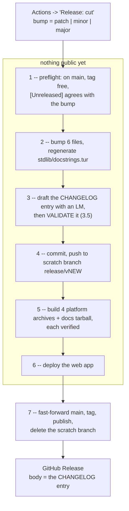

# Release in Actions -- one-shot patch/minor/major cuts, with LM-drafted notes

> **Status: PROPOSED 2026-09-27; nothing landed as of 2026-09-28.** R1-R5 are
> all open: no `release-cut.yml`, `release-build.yml` or `tools/release/`; the
> `Justfile` `bump-*` recipes and the `cut-*-release` skills are unchanged, and
> v0.56.1/v0.56.2 were cut by the local flow. One change since writing:
> `7698fff03` (2026-09-28) gated `release.yml`'s publish job on every build leg
> succeeding -- R3's extraction must keep that gate. Written in response to
> "come up with a plan for manual GH Actions release tasks (patch, minor,
> major)", the open question of which LM writes the release notes (Cloudflare
> Workers AI vs. a Mistral API key), and the requirement that docstrings be
> regenerated as part of the release.
> **2026-10-05:** [ci-release-workflows-plan](ci-release-workflows-plan.md)
> was executed instead (review PR, Mistral API), and it measured Mistral --
> GLM at `reasoning_effort: low` won there too. Section 3.3's "Mistral was not
> measured" is now answered in that plan's "Model choice".
> **Type:** Release engineering / CI
> **Touches:** `.github/workflows/release.yml`, new `release-cut.yml` and
> `release-build.yml`, new `tools/release/`, the `Justfile` `bump-*` recipes,
> the three `.claude/commands/cut-*-release.md` skills, and
> [`docs/guides/releases-and-installation-guide.md`](../guides/releases-and-installation-guide.md)
> section "Cutting a release (maintainers)".
>
> **Decided by the author, 2026-09-27:**
> 1. **Notes provider:** Cloudflare Workers AI, `@cf/zai-org/glm-5.3` with
>    `reasoning_effort: "low"` -- by measurement, section 3. Mistral stays a
>    one-input switch.
> 2. **The web deploy runs in the release workflow**, not on the maintainer's
>    laptop.
> 3. **One shot, no review PR.** One dispatch cuts the release. Section 2 is
>    built around making that safe; section 5.4 is the accounting of what that
>    decision costs and what pays for it.

## 0. Summary

Today a release is a local, interactive procedure: `/cut-patch-release` (or
`-minor`/`-major`) drives the version math, asks an LM -- Claude, in the
session -- to draft the CHANGELOG entry and the README line, runs
`just deploy-web` from the maintainer's laptop, and only then pushes the tag
that triggers `.github/workflows/release.yml`. Three things are bound to that
laptop: the wrangler credentials, an emscripten toolchain, and the model.

All three move into one manually dispatched workflow:



Steps 1-6 touch nothing a user or a clone can see. `main` moves, the tag
appears, and the web app changes only in step 7, once everything before it has
succeeded. That ordering is the whole design: it is what keeps a one-shot cut
recoverable, and it is the same invariant today's skill protects by deploying
before it pushes the tag.

## 1. What the current cut actually touches

Measured against the tree at v0.55.1, not from the skill's prose.

Exactly six tracked files carry the version (`git grep -l '0\.55\.1'`):

| File | What reads it |
| --- | --- |
| `VERSION` | CMake, `tur --version`, the docs tarball name |
| `stdlib/VERSION` | the stdlib stamp; `ctest -R tur_stdlib_version_stamp` fails if the two disagree |
| `src/web/wasm_glue.h` | `TURMERIC_VERSION` in the wasm build |
| `web/public/sw.js` | `CACHE_VERSION` dev/no-build fallback (vite rewrites it in `dist/`) |
| `CHANGELOG.md` | the release body |
| `README.md` line 5 | "Latest release:" |

One tracked *generated* file moves on a release: `stdlib/docstrings.tur`.
`docs/html/`, `web/public/docs-pack/` and `web/public/doc-names.json` are all
gitignored build outputs (`.gitignore:97,129,137`) -- nothing about them needs
committing, which is why the docstring regen is the only doc artifact in
section 4.

The homebrew formula needs no bump: `Formula/turmeric.rb` is `head`-only, with
no versioned `url`/`sha256`.

## 2. Architecture -- two workflows

### 2.1 `release-build.yml` (`on: workflow_call`)

A straight extraction of today's `build`, `build-windows` and `docs` jobs into
a reusable workflow taking one input, `ref`. No logic changes: the same prefix
layout, the same "unpack the archive and compile a two-line program" check that
caught the archives which passed `tur --version` while being unable to compile
anything, the same self-contained-binary check on Windows.

`release.yml` stays, reduced to a tag-triggered caller of this workflow plus
the existing publish job, so a hand-pushed `v0.0.0-test3` tag keeps working
exactly as the guide documents.

### 2.2 `release-cut.yml` (`on: workflow_dispatch`)

| Input | Type | Default | Notes |
| --- | --- | --- | --- |
| `bump` | choice | `patch` | `patch` / `minor` / `major` -- the one knob the request asked for |
| `notes_provider` | choice | `cloudflare` | `cloudflare` / `mistral` / `none` |
| `notes_model` | string | `@cf/zai-org/glm-5.3` | overridable without editing YAML |
| `refresh_doctests` | boolean | `false` | see section 4.2 |
| `dry_run` | boolean | `false` | preflight + draft the notes, upload as an artifact, change nothing |

Four jobs, in this order, because the order is the safety:

**Job 1 `prepare`** -- nothing public.

1. Preflight:
   - HARD: the dispatch ref is `main`.
   - HARD: the computed tag `v<NEW>` does not exist.
   - HARD: at least one commit since the last `v*` tag.
   - HARD: `CHANGELOG.md` has no `## [Unreleased]` section demanding a larger
     bump than the one requested (today's Step 0, mechanized).
   - REPORT: a leftover `release/v*` scratch branch, which means an earlier cut
     died mid-flight. Worth seeing, not worth failing on.
   - ADVISORY: experiment rows at or past `expires_at`, printed to the job
     summary. **This never fails the job.** Believing otherwise has stranded
     two releases; the rule lives in CLAUDE.md and in the
     [experimental flags guide](../guides/experimental-flags-guide.md#expiry-policy).
   - ADVISORY: the latest `ci.yml` run on `main` -- report its conclusion, do
     not gate on it. A red suite does not block a cut.
2. Bump via `tools/release/bump-version.sh <patch|minor|major>` (R1) -- one
   implementation, shared with the `Justfile` recipes.
3. Regenerate docstrings (section 4).
4. Draft the notes via `tools/release/gen-release-notes.py` (section 3.4).
   Any `## [Unreleased]` content is folded in as authoritative material the
   model must preserve rather than paraphrase, and the heading does not survive
   the release.
5. **Validate** (section 3.5). A failure fails the job here, before anything is
   pushed. Section 5.4 explains why this is the one place the plan got stricter
   when the review PR went away.
6. Self-verify the diff it just produced: configure, build `tur`, run
   `ctest -R tur_stdlib_version_stamp`, and compile one program against the
   regenerated stdlib.
7. Commit `chore: release v<NEW>` and push to the scratch branch
   `release/v<NEW>`. Output the commit SHA.

On `dry_run: true` the job stops after step 5, uploads the draft entry and the
README line as artifacts, and pushes nothing.

**Job 2 `build`** -- `uses: ./.github/workflows/release-build.yml` with
`ref: <the scratch SHA>`. Four platform archives plus the docs tarball, each
one unpacked and used to compile a program.

**Job 3 `deploy`** -- checks out the scratch SHA, sets up emscripten
(`mymindstorm/setup-emsdk@v14`, lifted from `ci.yml`'s `web-smoke` job), runs
`npm run deploy` in `web/`. The wasm and `doc-names.json` it builds are
gitignored outputs; nothing gets committed here, which is the property that
stopped every release tag from carrying the previous release's wasm.

**Job 4 `publish`** -- `needs: [build, deploy]`, so it runs only if every
archive built, every archive compiled a program, and the site deployed:

1. `git push origin <sha>:main` -- a fast-forward. If `main` moved during the
   run this fails, which is correct: re-dispatch.
2. Create the annotated tag `v<NEW>` on that SHA.
3. Create the GitHub Release with the extracted `CHANGELOG.md` entry as the
   body. This replaces `generate_release_notes: true`, which today puts a raw
   commit list on the release page while the good prose sits in `CHANGELOG.md`.
4. Delete the scratch branch.

### 2.3 Why a scratch branch instead of pushing to `main` first

A reusable build workflow checks out a ref from the repository, so the bumped
commit has to exist somewhere remote before it can be built on four platforms.
Pushing it straight to `main` would mean a failed build leaves `main` carrying a
version bump with no release and no tag -- and the *next* dispatch then
computes its bump from an already-bumped `VERSION`, which is the confusing
state to be in at exactly the wrong moment.

The scratch branch costs one ref and one delete, and buys: `main` untouched
until everything has passed, an abandoned cut that cleans up with
`git push origin --delete release/v<NEW>`, and a re-dispatch that sees the same
starting state as the first attempt.

## 3. The LM decision -- Workers AI vs. Mistral

### 3.1 What the job actually is

Not "summarize some commits". The hand-written v0.55.1 entry is 3,462 bytes and
11 bullets built out of **83 commits / 85 KB of subjects-plus-bodies**, and it
cites `src/passes/srfi_prune.c`, the 3.50s-vs-4.91s build measurement, and
`TUR-W0043` by name. The material for that is in the commit *bodies*, so the
prompt is ~26K tokens, which rules out any model with a 24K context
(`@cf/meta/llama-3.3-70b-instruct-fp8-fast`, `@cf/qwen/qwq-32b`) before quality
enters the picture.

### 3.2 Measured, this session

All Cloudflare Workers AI, through an `env.AI` binding on account
`1a7ad6bc...`, given the real `v0.55.0..v0.55.1` log with the release commit
**excluded** (its own body is a prose summary of the release -- leaving it in
leaks the answer and flatters every model), plus the previous entry truncated
to 4 KB as a style exemplar.

| Model | `reasoning_effort` | Latency | Neurons | Output | Verdict |
| --- | --- | --- | --- | --- | --- |
| `@cf/zai-org/glm-5.3` | default | 124 s | 8054 | **0 bytes** | 12K tokens spent entirely in `reasoning_content`, hit the cap, returned empty `content` |
| `@cf/zai-org/glm-5.3` | `low` | 69 s | 4527 | 8.8 KB, 17 bullets, ASCII-clean | **Best.** House voice, real file paths, the real build numbers |
| `@cf/moonshotai/kimi-k2.7-code` | default | 63 s | 3634 | **0 bytes** | same reasoning-cap failure |
| `@cf/nvidia/nemotron-3-120b-a12b` | n/a | 38 s | 1760 | **0 bytes** | truncated with neither content nor reasoning |
| `@cf/openai/gpt-oss-120b` | `low` | 24 s | 880 | 3.3 KB, 13 bullets | Good shape, but **11 lines of non-ASCII** (U+2011 hyphens, curly apostrophes) -- a hard repo-rule violation |
| `@cf/mistralai/mistral-small-3.1-24b-instruct` | n/a | 32 s | 915 | 4.4 KB, 18 bullets | Fluent but one-bullet-per-commit and **degenerate**: the last three bullets repeat verbatim twice |
| *(hand-written v0.55.1)* | -- | -- | -- | 3.5 KB, 11 bullets | the target |

Three findings that outrank the model ranking:

- **`reasoning_effort: "low"` is the difference between empty output and the
  best output.** The Workers AI flagships are thinking models; at default
  effort GLM-5.3 burned 44K characters of reasoning on this prompt and never
  reached `content`. The parameter is in the model schema
  (`enum: ["low","medium","high"]`), so this is a supported knob, not a hack.
- **Empty `content` with `finish_reason: "length"` is a normal failure mode**,
  not an outage. Three of six runs.
- **Non-ASCII output is a normal failure mode too.** The docs and
  `tests/fixtures/**` are ASCII-only by repo rule; one model silently emitted
  non-breaking hyphens.

Both of those last two are why section 3.5 exists, and why it is now a gate
rather than an annotation.

### 3.3 Decision

**Cloudflare Workers AI, `@cf/zai-org/glm-5.3`, `reasoning_effort: "low"`**, for
reasons that are mostly not about model quality:

- It is the only option measured here that produced a publishable draft.
- The account is already connected and wrangler is already in the release path,
  so the deploy token and the notes token can be the same credential -- one
  secret instead of two vendors.
- ~4500 neurons/cut. Workers AI's free allowance is 10,000 neurons/day and the
  paid rate is ~$0.011/1K neurons (verify at
  <https://developers.cloudflare.com/workers-ai/platform/pricing/>) -- so a cut
  is free or about five cents, and two failed prompt iterations in one day is
  where the free tier ends.

**Mistral was not measured** -- no key in this session -- so this is not a
quality verdict against it. Mistral Medium/Large are plausibly better at this
than GLM-5.3 and need no reasoning-effort dance. It stays a one-input switch:
`notes_provider: mistral` + `MISTRAL_API_KEY`. R2's script runs standalone
against a local log dump, so measuring it later costs one command, not a
workflow change.

### 3.4 One code path for both providers

Both APIs speak OpenAI-shaped chat completions, so the provider is
configuration, not a second implementation:

| | Base URL | Auth | Model |
| --- | --- | --- | --- |
| `cloudflare` | `https://api.cloudflare.com/client/v4/accounts/$CF_ACCOUNT_ID/ai/v1` | `Bearer $CLOUDFLARE_API_TOKEN` | `@cf/zai-org/glm-5.3` |
| `mistral` | `https://api.mistral.ai/v1` | `Bearer $MISTRAL_API_KEY` | `mistral-medium-latest` |

`tools/release/gen-release-notes.py` -- stdlib-only, no `openai` dependency,
one `urllib` POST to `<base>/chat/completions`.

> **Unverified:** the Cloudflare OpenAI-compatible path
> (`/ai/v1/chat/completions`) was not exercised in this session; the
> measurements above went through the `env.AI` binding, which returned
> OpenAI-shaped `choices` for every model. If the compat endpoint disagrees,
> fall back to the native `POST /accounts/$ID/ai/run/$MODEL`, which takes the
> same `{messages, max_tokens, reasoning_effort}` body and wraps the reply in
> `{"result": ...}`. R4's `dry_run` dispatch is where this gets settled, and it
> costs one dispatch.

### 3.5 Validators -- now the only gate on the prose

With no review PR, these are what stand between a model's bad day and a
published release. The generator refuses to write `CHANGELOG.md` unless the
draft passes all of:

1. Non-empty `content` after stripping any `reasoning_content`.
2. First line matches `^## \[<NEW>\] -- <today>$` -- catches a model inventing
   a version or a date.
3. Every heading is one of `### Added|Changed|Fixed|Removed`.
4. Between 4 and 20 `- **` bullets. GLM's 17 passes; mistral-small's
   duplicate-tail also passes on count, so:
5. No bullet's first 60 characters repeat -- the degenerate-loop check.
6. ASCII-only (`[^\x20-\x7e\t\n]` finds nothing), and no em dash.
7. Every `TUR-[EW]\d{4}` code, `src/**` path and `docs/**` path mentioned
   actually exists in the tree or in the commit range. This is the
   anti-fabrication check and the one most worth having.
8. Every `## [Unreleased]` bullet that was folded in survives verbatim. A
   hand-written note is authoritative; the model may reorder it, not rewrite
   it.
9. The README line is one sentence, ASCII, and names something the entry also
   mentions.

**A failure fails the run, before the scratch branch is pushed.** In the
review-PR design the right answer was the opposite -- open the PR with a
deterministic skeleton and let the human sort it out -- because a human was
guaranteed to look. Without that, publishing an unreviewed fallback is the
worse outcome, and failing costs one re-dispatch.

A provider outage therefore does not block a release: dispatch with
`notes_provider: none`, which calls no model, writes the deterministic skeleton
grouped by commit prefix, and marks it
`<!-- DRAFT: written without an LM; edit CHANGELOG.md and the release body -->`.
That is a deliberate choice, made by the person dispatching, rather than a
silent degradation.

## 4. Docstrings in the release

`stdlib/docstrings.tur` is tracked and is the runtime `(doc ...)` table, so it
belongs in the release commit, regenerated in job 1 alongside the bump.

### 4.1 The step

```sh
python3 -m pip install -r tools/requirements.txt
git clone --depth 1 https://github.com/turmeric-lang/turmeric-spices ../turmeric-spices
python3 tools/genguides.py docs/guides/ --out docs/html/guides/ --emit-pack web/public/docs-pack/
python3 tools/genspices.py --out docs/html/spices/ \
        --emit-json docs/html/spices/doc-names-spices.json --emit-pack web/public/docs-pack/
python3 tools/gendocs.py stdlib/ --out docs/html/api/ \
        --emit-tur stdlib/docstrings.tur \
        --emit-json web/public/doc-names.json \
        --extra-json docs/html/spices/doc-names-spices.json --emit-pack web/public/docs-pack/
python3 tools/genpack.py web/public/docs-pack/ --strict-links
git add stdlib/docstrings.tur    # the ONLY tracked output of the above
```

No compiler build is needed for the regen itself -- `tools/gendocs.py` shells
out to nothing.

The spices clone is not incidental: `tools/genspices.py:114` warns and skips
when `../turmeric-spices/` is absent, so **today's `release.yml` docs job ships
a docs tarball with no spice pages at all.** Fixing that is folded into R3.
`genpack --strict-links` is likewise in the `Justfile` recipe but missing from
the workflow -- R3 adds it, so a guide link into `docs/upcoming/` fails the job
instead of shipping a 404.

### 4.2 The carry-forward trap -- do not "fix" it

`gendocs --emit-tur` writes a `doc-verified?` table sourced from
`tests/doctest-generated/verified.txt`, which is gitignored and therefore
absent in every CI checkout. Since 2026-08-20 that is safe: absent is distinct
from empty, the existing 142-name table is read back out of the file and
re-emitted, and gendocs prints `142 verified carried forward`. A CI regen is
byte-identical -- see
[`docs/archive/docstrings-verified-table-zeroed-by-regen.md`](../archive/docstrings-verified-table-zeroed-by-regen.md).

So the default is regen-without-doctests, and that is correct. The
`refresh_doctests: true` input exists for the release where you want the table
actually refreshed; it costs a full Debug build plus `tools/run-doctests.sh`
(~10+ min) and it is the only path that can legitimately *shrink* the table.

Because nobody reviews a diff in this design, job 1 asserts the shape instead:
**a docstrings diff that only deletes verified names fails the run.** That is
the trap above coming back, and it is mechanically detectable.

### 4.3 Worth adding while here

The archive report's open item (4): a CI check that regenerating leaves
`stdlib/docstrings.tur` unchanged. Viable now that the regen is idempotent, and
it would have caught every historical flip-flop of that table. In this design it
belongs in `ci.yml` on `main` rather than in the cut: if a docstring was edited
without regenerating, the release wants to fix it silently, not refuse.

## 5. Traps that shape the design

### 5.1 `GITHUB_TOKEN` pushes do not trigger workflows

A tag pushed by a workflow using the default `GITHUB_TOKEN` does not start a
tag-triggered run -- so "the cut pushes a tag and `release.yml` picks it up" is
a silent no-op whose failure looks like a release that just never built.

This is why job 2 calls `release-build.yml` as a reusable workflow inside the
same run. No cross-workflow trigger exists to be suppressed, and the tag in job
4 is a record rather than a signal. `release.yml` keeps its tag trigger for
hand-pushed test tags, which you push with your own credentials, so it still
fires.

The same rule has one consequence that is now unavoidable: the `main` push in
job 4 is made with `GITHUB_TOKEN`, so **`ci.yml` does not run on the release
commit.** Section 5.4.

### 5.2 Secrets that must exist first

The repo has **zero** Actions secrets today (`gh api
repos/rjungemann/turmeric/actions/secrets` -> empty), so nothing here works
until these are added:

| Name | Needed by | Scope |
| --- | --- | --- |
| `CLOUDFLARE_API_TOKEN` | notes + web deploy | "Edit Cloudflare Workers" template (Workers Scripts:Edit, Workers Routes:Edit for the two custom domains, Account Settings:Read) **plus Workers AI:Read** |
| `CLOUDFLARE_ACCOUNT_ID` | both | `1a7ad6bc39bf5e58fe10ebd091b25014` -- `web/wrangler.jsonc` carries no `account_id`, so wrangler needs it from the environment |
| `MISTRAL_API_KEY` | only `notes_provider: mistral` | -- |

Two tokens (`CF_AI_TOKEN` read-only for notes, `CF_DEPLOY_TOKEN` for the
deploy) is the least-privilege version and costs one extra secret. Your call;
one is fine for a solo repo. Also add `permissions: contents: write` to the
`publish` job -- the repo default is `read`.

### 5.3 Everything else the local flow assumed

- **emscripten** in the deploy job: proven in `ci.yml`'s `web-smoke` job
  (`mymindstorm/setup-emsdk@v14`) -- lift that step verbatim.
- **Port 3000** is untouched. Nothing here starts a dev server; the deploy is
  `npm run deploy` (`vite build` + `wrangler deploy`).
- **`concurrency: group: release`, `cancel-in-progress: false`.** Two
  overlapping cuts is the one genuinely unrecoverable mess here.
- **Do not add a test-suite gate.** `bash tests/run.sh` is a signal, not a
  gate, per CLAUDE.md. Job 2 already compiles a program from each of four
  archives, which is the check that has actually caught shipped breakage.

### 5.4 What one-shot costs, and what pays for it

Dropping the review PR removes two things. Both have replacements, and it is
worth being explicit about which replacement is weaker.

**1. Nobody reads the prose before it is public.** Replacement: the section 3.5
validators, promoted from annotations to a hard gate that fires before anything
is pushed. This is genuinely weaker than a human read -- validator 7 catches a
fabricated file path or diagnostic code, but no validator catches *fabricated
causation*, a bullet that describes a real change with the wrong mechanism.
Three mitigations, in order of how much they help:

- `dry_run: true` is a one-dispatch preview of the exact entry, and costs
  ~4500 neurons. Using it before an unusually large cut is cheap habit.
- The release body is editable on GitHub afterwards, and `CHANGELOG.md` takes a
  follow-up commit. **Neither requires a retag** -- a prose error after the
  fact is a five-minute fix, not a botched release.
- `## [Unreleased]` is the pressure valve. Anything you want said a particular
  way, write there as you go; validator 8 makes the model preserve it verbatim.

**2. `ci.yml` never runs on the release commit** (5.1) -- the push is made by
`GITHUB_TOKEN`, so the commit that gets tagged shows no checks. Replacement, and
here the replacement is *stronger* than what CI would have given: job 1 builds
`tur`, runs `ctest -R tur_stdlib_version_stamp`, and compiles a program against
the regenerated stdlib; job 2 then does a Release build on four platforms and
compiles a program from each packaged archive. The release-specific diff is six
version files plus `stdlib/docstrings.tur`, and every part of it is covered by
that. A full `ci.yml` run would mostly re-test code that was already green on
`main` one commit earlier.

**A PAT would buy back exactly one thing: check marks on the release commit.**
Not the prose review -- no token can review prose. If that gap ever matters,
the options in increasing order of how well they age:

| Option | Cost | Ages how |
| --- | --- | --- |
| Classic PAT, `repo` scope | one secret | Badly. `repo` is every repo you can push to, and a max-1-year expiry becomes a release-day outage |
| Fine-grained PAT, this repo only, Contents: Read/Write | one secret | Better. Still expires; still a credential in the repo |
| GitHub App + `actions/create-github-app-token` | app + private key secret | Best. Per-run 1-hour tokens, no rotation calendar |
| SSH deploy key | one secret | Works for pushes specifically -- a deploy-key push does trigger workflows -- and needs no API permissions at all |

The recommendation is none of them. Revisit only if `main` grows branch
protection with required checks, which would make a `GITHUB_TOKEN` push
outright fail rather than merely arrive unchecked.

## 6. What a cut looks like

### 6.1 The dispatch

Actions -> **Release: cut** -> `bump: patch` -> Run workflow. Or keep the habit
and run `/cut-patch-release`, which after R5 does the same dispatch, asks for
confirmation first, and reports the run URL.

Elapsed: ~10-12 minutes to a published release (job 1 ~4 min, jobs 2 and 3 in
parallel ~6-8 min, job 4 seconds). With `refresh_doctests: true`, add ~10.

### 6.2 The job summary, which is the whole status report

```
Release: cut -- v0.55.1 -> v0.55.2 (patch)

Preflight
  ref is main                                    ok
  tag v0.55.2 does not exist                     ok
  commits since v0.55.1                          83
  [Unreleased] section                           none
  stale release/v* scratch branches              none
  experiments at/past expires_at                 cycle-gc (0.56.0)   ADVISORY ONLY
  latest ci.yml on main                          success (9c2ae30ad)  advisory

Notes
  provider/model     cloudflare / @cf/zai-org/glm-5.3 (reasoning_effort=low)
  latency/neurons    69 s / 4527
  validators         9/9 passed
  bullets            17 (Added 4, Changed 3, Fixed 10)

Docstrings
  stdlib/docstrings.tur   +12 -0 lines, 142 verified carried forward
  version stamp test      passed
  stdlib compiles         passed

Build      linux-x86_64 ok  linux-aarch64 ok  macos-arm64 ok  windows-x86_64 ok
           each archive unpacked and compiled a program        ok
Docs       turmeric-docs-v0.55.2.tar.gz (guides + api + spices)
Deploy     https://turmeric-lang.com  -> 0.55.2
Publish    main 9c2ae30ad..a1b2c3d4e, tag v0.55.2, release published
           https://github.com/turmeric-lang/turmeric/releases/tag/v0.55.2
```

### 6.3 Reading the result

Two things are worth a look after a green run, neither urgent:

1. **The release body.** It is the LM's prose, now public. Editing it on GitHub
   needs no retag; pair it with a follow-up commit to `CHANGELOG.md` so the two
   do not drift.
2. **<https://turmeric-lang.com>** reports the new version.

### 6.4 When it goes wrong

| Where | What is public | What you do |
| --- | --- | --- |
| Preflight fails | nothing | fix the stated condition, re-dispatch |
| Validators fail (3.5) | nothing | read the draft in the job summary; re-dispatch, or dispatch `notes_provider: none` and write the entry yourself |
| Docstrings diff deletes verified names (4.2) | nothing | read the archive report -- the carry-forward trap is back |
| A platform build fails | nothing | fix, re-dispatch, `git push origin --delete release/v<NEW>` |
| Web deploy fails | nothing | same -- and this is exactly the invariant the current skill protects |
| `main` moved mid-run | nothing | re-dispatch; the fast-forward push refused on purpose |
| Published, prose is wrong | tag + archives, both fine | edit the release body, follow-up commit for `CHANGELOG.md` |
| Published, the release is genuinely broken | everything | `gh release delete v<NEW> --cleanup-tag`, fix, cut again |

The first six rows leave `main`, the tag list, and the site exactly as they
were. The scratch branch is the only residue, and deleting it is the entire
cleanup.

### 6.5 Rehearsing

- `dry_run: true` -- preflight plus the real LM call, draft uploaded as an
  artifact, nothing pushed. The loop for iterating on the prompt.
- A throwaway `v0.0.0-test<N>` tag still exercises `release.yml` end to end as
  the guide documents, which is how to test R3 without burning a version.

## 7. Work items

Each lands on its own and leaves the tree releasable by the current local path.

**R1. `tools/release/bump-version.sh`.** One implementation of the version math
and the six-file edit, replacing the three near-identical `Justfile` recipes
(`bump-patch`/`bump-minor`/`bump-major`), which currently duplicate the `sed`
logic and omit `stdlib/VERSION`.
*Accept:* `bump-version.sh --dry-run minor` prints `0.55.1 -> 0.56.0` and the
six diffs, touching nothing; the `Justfile` recipes call it; `ctest -R
tur_stdlib_version_stamp` passes after a real run. The `sw.js` rewrite must stay
shape-matched (`tur-try-v1-[0-9]+\.[0-9]+\.[0-9]+`) so a drifted literal
re-syncs.

**R2. `tools/release/gen-release-notes.py`.** Prompt builder + OpenAI-shaped
client + the nine section 3.5 validators + the `--provider none` skeleton. Runs
standalone: `gen-release-notes.py --from v0.55.0 --to HEAD --bump patch
--provider cloudflare --model @cf/zai-org/glm-5.3`.
*Accept:* re-run against `v0.55.0..v0.55.1` (release commit excluded) and get a
draft that passes every validator; `--provider none` passes them too; a forced
empty response, a non-ASCII response, and a duplicated-bullet response each exit
non-zero naming the validator. The prompt must exclude `^chore: release` and
`^Regenerate docstrings` commits, pin U.S. spelling (GLM wrote "honouring"), and
cap the exemplar -- the v0.55.0 entry alone is 23 KB.

**R3. `release-build.yml` + the docs-job fixes.** Extract the three build jobs
as `workflow_call`; reduce `release.yml` to a caller; add the spices clone and
`--strict-links` from section 4.1.
*Accept:* a throwaway `v0.0.0-test<N>` tag produces the same five artifacts as
today, and the docs tarball now contains `docs/html/spices/`.

**R4. `release-cut.yml`.** Sections 2.2 and 4, four jobs. Land it `dry_run`-only
first -- that dispatch settles the section 3.4 endpoint question and lets you
iterate on the prompt for a few thousand neurons. Then enable jobs 2-4 and
rehearse the whole thing once at `v0.0.0-test<N>` with the deploy step live,
before pointing it at a real version.
*Accept:* `dry_run: true` uploads a draft and pushes nothing; a full run on a
test version produces the 6.2 summary, publishes, and leaves no scratch branch;
a deliberately broken validator input fails job 1 with `main` untouched.

**R5. Skills and guide.** Rewrite the three `cut-*-release.md` commands as
dispatchers (`gh workflow run release-cut.yml -f bump=patch`, then watch),
keeping their `AskUserQuestion` confirmation -- with one shot and no review PR,
that confirmation is now the last human checkpoint, so it should show the
computed version and the commit count -- and keeping *all* of their "Things to
refuse", especially that `expires_at` never blocks. Rewrite "Cutting a release
(maintainers)" in the releases guide around the new flow.
*Accept:* `/cut-patch-release` confirms, dispatches, and reports the run URL
without editing a single file locally; the guide's steps match what the workflow
does.

## 8. Open questions

1. **One Cloudflare token or two?** (5.2) One is fine for a solo repo; two is
   least-privilege. No design consequence either way.
2. **Does `notes_provider: none` want to exist at all**, or should a provider
   failure simply mean "re-dispatch later"? Keeping it costs one branch in R2
   and is the only path that works during a Cloudflare outage.

## 9. Not in scope

- Any change to what a release *contains* -- same four archives, same docs
  tarball, same prefix layout.
- Auto-detecting the bump level from commits. The input stays manual because
  `[Unreleased]` already encodes "this must be a minor", and preflight enforces
  it.
- Release-notes generation for the spices repo.
- Replacing `docs/reported/` triage or the experiment registry with anything.
  Expiry stays advisory. It always stays advisory.
