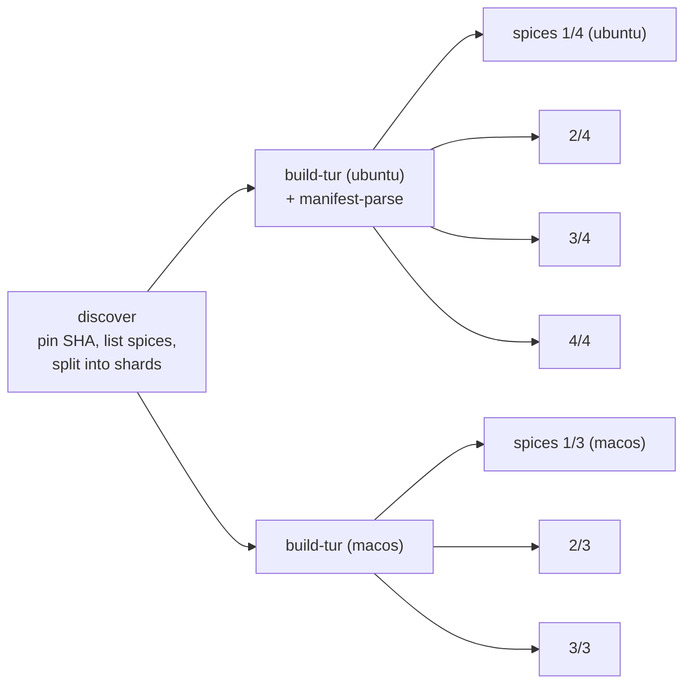

# turmeric-spices CI -- build the compiler once, shard the spices

> **Status: PLAN; S1 and S3 verified by a probe run, nothing merged.**
> Section 2.1 has the evidence. Written 2026-10-03 in response to
> "turmeric-spices CI runs seem to clog up CI runs for other repos, because it
> swamps GH Actions with dozens of small actions."
> **Type:** CI / test infrastructure (in the turmeric-spices repo, plus one
> companion change here)
> **Touches:**
> [`turmeric-spices/.github/workflows/ci.yml`](https://github.com/turmeric-lang/turmeric-spices/blob/main/.github/workflows/ci.yml)
> (the `test-spice`, `discover-spices` and `manifest-parse` jobs), a new
> `scripts/run-shard.sh` there, and -- section 7 -- a `concurrency:` block on this
> repo's [`.github/workflows/ci.yml`](../../.github/workflows/ci.yml).
>
> **Decided:**
> 1. **Build `tur` once per OS** and hand it to the test jobs as an artifact.
>    This removes 73% of the run's runner-minutes, and fanning out less does
>    not touch that 73% at all.
> 2. **Shard, do not serialize.** 4 Linux shards and 3 macOS shards, each
>    running its spices one after another and continuing past a failure.
> 3. **Cancel superseded PR runs** in both repos. Pushes to `main` keep
>    running to completion.

## 0. Summary

Every push to turmeric-spices starts **98 jobs**: one `test-spice` job per
spice per OS (48 spices x 2 OSes), plus `discover-spices` and
`manifest-parse`. Each of the 97 non-discover jobs rebuilds the same
Debug+ASan `tur` at the same pinned SHA before doing anything else.

The org's runners are shared between turmeric and turmeric-spices, and the
macOS pool is small. [ci-aux-suite-latency-plan](ci-aux-suite-latency-plan.md)
section 3 already measured this repo's macOS jobs waiting 40-80 minutes to
start. A spices run puts 48 macOS jobs into that same queue, and those jobs
are mostly recompiling the compiler.

The proposed shape is about 11 jobs instead of 98, and about 85
runner-minutes instead of about 280:



## 1. Measurement -- run 37124064186 (push, 2026-10-03)

The run was created at 12:48Z and finished at 14:53Z: 2h05m from start to
finish. Both crdt legs failed. That failure has nothing to do with the CI
shape.

**Where the runner time went**, summed across all jobs:

| Step | ubuntu (50 jobs) | macOS (48 jobs) |
| --- | ---: | ---: |
| Build the tur compiler | **71.0 min** | **135.0 min** |
| Fetch C dependencies | 10.2 | 16.8 |
| Install dependencies (apt/brew) | 14.0 | 3.2 |
| Checkout turmeric (compiler) | 3.0 | 4.7 |
| Run spice tests | 4.9 | 3.7 |
| Type-check spice sources | 0.8 | 1.2 |
| everything else | ~2.6 | ~6.2 |
| **total** | **~109** | **~172** |

The compiler build is 65% of the Linux time and 78% of the macOS time. The
actual spice work (fetch, type-check, test, errors, fixtures) adds up to
about **16 min on Linux and 22 min on macOS** across all 48 spices.

**When jobs started**, measured from the first job's start:

| | first start | last start | last finish |
| --- | ---: | ---: | ---: |
| ubuntu | t+0 | t+36 min | t+39 min |
| macOS | t+31 min | **t+122 min** | t+125 min |

The median job ran for 2.7 minutes, and the longest (sdf-raylib on macOS)
ran for 6.1. So the 2-hour run time is almost all macOS jobs waiting for a
free runner, one batch after another. While they wait, they hold up the
macOS legs of turmeric's own CI.

**The heaviest spices**, by per-job time excluding the compiler build:
notebook (91s ubuntu / 114s macOS), tourist-session, httpd, tls, ws-client,
tourist, http, sdf-raylib, tourist-session-valkey. Every one of them is under
two minutes, so no single spice needs a job of its own.

## 2. Build `tur` once per OS (S1)

A new `build-tur` job runs on `[ubuntu-latest, macos-latest]`, `needs:
discover-spices`, and checks out turmeric at
`needs.discover-spices.outputs.turmeric-sha`. It builds the same
Debug configuration as today, then uploads an artifact named
`tur-${{ runner.os }}`.

**What the artifact has to contain.** `tur test` links each test program
against a runtime archive, and `locate_runtime_lib` (`src/main.c`) looks for
it in `<exe_dir>/src`. It prefers `libturt_runtime.a` and falls back to
`libturi.a`. The stdlib comes from `TUR_STDLIB_DIR`, which the workflow
already sets to the turmeric checkout. So the artifact is:

- `build/tur`
- `build/src/libturt_runtime.a`, `build/src/libturt_preamble.a` and
  `build/src/libturi.a`
- `build/libtur_mir.a`
- `build/toolchain.txt`, the build job's `cc --version` (see 2.1)

Leave `build/src/libturi_wasm.a` out. It is as large as `libturi.a`
(114 MB on Linux) and nothing on the `tur test` path links it. The probe
shipped it anyway: its tarball of every `*.a` came to 69 MB on Linux and
61 MB on macOS.

Pack these with `tar` before uploading. `actions/upload-artifact` drops the
executable bit, and a `tur` without it fails as `Permission denied`.

The shard jobs still check out turmeric at the pinned SHA, because they need
the stdlib and the runtime headers that emitted C includes. Their job
becomes: download the artifact, untar it into `turmeric/build/`, then carry
on as today. That exact location is required, not just tidy: see 2.1.

### 2.1 Verified: run 37143548334 (branch `claude/ci-shard-probe`)

A throwaway workflow on a turmeric-spices branch (no PR, so the full matrix
did not run) built `tur` once per OS, uploaded it as an artifact, and
downloaded it into a separate job per OS. That job ran 9 spices through
`scripts/run-shard.sh`, chosen to stress the risky parts:

- json, notebook and crdt: pure Turmeric; notebook is the heaviest spice
- raylib and opengl: `:cmake-deps` native builds, Xvfb, GL
- tls: mbedtls built from source
- osc: a system library (liblo)
- ecs: the deep-stack corpus behind the `ulimit -s` workaround
- httpd: spices that depend on other spices

**All 9 passed on both OSes.** The two questions this section existed to
answer:

1. **Absolute paths ARE compiled into `tur`.** `strings` finds the build
   directory, `build/src/generated/...` and `external/mir/...` under
   `$GITHUB_WORKSPACE`. It works anyway because `$GITHUB_WORKSPACE` is the
   same path in every job of a repo on the same OS
   (`/home/runner/work/turmeric-spices/turmeric-spices`, and the same under
   `/Users/runner/...` on macOS). The consequence is a hard rule: **unpack
   at `$GITHUB_WORKSPACE/turmeric/build`, and keep turmeric checked out at
   `turmeric/`.** Changing either layout in only one of the two jobs breaks
   it.
2. **The toolchain matched.** The build and shard jobs reported the same
   compiler: gcc 13.3.0 on Linux, and Apple clang 21.0.0 under Xcode 26.6 on
   macOS. The guard works: the build job writes `cc --version` to
   `build/toolchain.txt`, and the shard `diff`s it against its own before
   running anything. Keep it. An image roll between the two jobs is rare,
   but when it happens it fails every spice at link time, with a message
   that does not mention the cause.

Measured times:

| job | ubuntu | macOS |
| --- | ---: | ---: |
| build-tur | 2m05s | 2m41s |
| shard of 9 spices, whole job | 4m33s | 6m42s |

Per spice, Linux / macOS, in seconds: json 24/23, notebook 58/103,
raylib 36/43, opengl 9/20, tls 36/60, osc 2/7, ecs 18/36, crdt 8/11,
httpd 43/72.

These agree with section 1's projection of about 5 minutes per Linux shard
and 7-8 per macOS shard.

Queueing showed up here too. The ubuntu build started 12 minutes after the
run was created, and the macOS build an hour later. That hour was the macOS
pool this plan is about: it was busy with two turmeric PRs' macOS legs at
the time.

**Fold `manifest-parse` into the Linux `build-tur` job** as a final step. It
builds its own `tur` today for no other reason than needing one.

## 3. Shard the spices (S2, S3)

### S2 -- shard assignment in `discover-spices`

`discover-spices` already lists the spices. It also emits two shard
matrices: `{"shard": [1,2,3,4]}` for Linux and `{"shard": [1,2,3]}` for
macOS, plus each shard's spice list. Assignment is **round-robin over the
sorted list**. That spreads out the alphabetically adjacent heavy cluster
(`tourist`, `tourist-session`, `tourist-session-valkey`, `tourist-ws`) with no
weights file to maintain.

At about 16 and 22 minutes of spice work per OS (section 1), the projection
is about 4-5 minutes per Linux shard and 7-8 minutes per macOS shard, plus
one dependency install and one artifact download each. If one shard turns
out much slower than the rest, the next step is a checked-in
`ci/shard-weights.json` with greedy longest-first assignment. Don't add it
until a measurement calls for it.

The shard counts are a single pair of numbers at the top of the job, so
tuning them later is a one-line change. macOS is deliberately kept at 3:
the scarce resource is macOS runners, not wall-clock time within a shard.

### S3 -- `scripts/run-shard.sh`

**Written and verified (2.1).** It is on the probe branch,
[`claude/ci-shard-probe`](https://github.com/turmeric-lang/turmeric-spices/blob/claude/ci-shard-probe/scripts/run-shard.sh),
ready to move into the real PR. The list below is what it does.

Move the body of today's per-spice steps (fetch, type-check, tests,
`errors/run.sh`, `fixtures/run.sh`) out of the YAML and into a script that
takes a list of spices and, for each one:

- wraps its output in `::group::<spice>` / `::endgroup::`;
- runs every stage and records pass or fail **without stopping**, so one red
  spice does not hide the next;
- keeps today's behavior that a `cmake build failed` in fetch is fatal for
  that spice (and only that spice);
- prefixes every `::error` annotation title with the spice name, so the
  annotations list on the run page still says which spice failed;
- appends one row per spice (spice, stage reached, result, seconds) to
  `$GITHUB_STEP_SUMMARY`.

It exits non-zero if any spice failed. Recording the seconds in the summary
is what makes a weights file cheap to write later, if one is ever needed.

Moving the logic into a script also lets a developer run a shard locally
(`scripts/run-shard.sh json crdt`), which today's inline YAML does not allow.

**Leave the per-spice `ulimit -s` and `xvfb-run` handling as it is**; only
where it lives changes.

### Re-running one spice

A failed shard can only be re-run as a whole, about 5-8 minutes. To cover
the "just re-run crdt" case, add a `workflow_dispatch` input `spices`
(space-separated). When it is set, `discover-spices` emits a single shard
per OS containing exactly those spices.

## 4. Cancel superseded runs (S4)

```yaml
concurrency:
  group: ci-${{ github.event.pull_request.number || github.ref }}
  cancel-in-progress: ${{ github.event_name == 'pull_request' }}
```

PR runs cancel their predecessors. Pushes to `main` do not: each merge to
`main` keeps its own result. In the five most recent spices runs, four were
cancelled, and some of them ran for 25-40 minutes before being cancelled.

## 5. What this costs

- **Failure granularity.** The check name becomes `spices 2/4 (ubuntu)`
  instead of `crdt (ubuntu-latest)`. The step summary and the
  spice-prefixed annotations (S3) restore most of that. Branch protection on
  turmeric-spices, if any is set on per-spice check names, has to be updated
  to the shard names in the same PR.
- **A shard is now a single point of runner loss.** If one runner dies, a
  shard's worth of spices goes unreported instead of one spice. The fix is a
  re-run, the same as today.
- **One more job hop on the critical path.** `build-tur` has to finish before
  any shard starts. That adds about 1.5 minutes on Linux and 3 on macOS
  (71/50 and 135/48 per build in section 1), far less than the queueing it
  removes.

## 6. Out of scope, worth doing next

**Shared native-dependency builds.** `tur fetch` builds the `:cmake-deps` of
raylib, raygui, sdf-raylib and ecs-raylib separately, even though all four
inherit the same raylib. Inside one shard these builds could share a
cache; across runs, an `actions/cache` keyed on the dependency's URL and
ref could skip them entirely. Fetch is the largest step left after S1
(about 10 min on Linux and 17 on macOS per run). Measure it after S1-S3
land.

## 7. Companion change in this repo (S5)

turmeric's own `ci.yml` has **no workflow-level `concurrency:` block**. The
only one in that file (the `ci-metrics` publisher, around line 1116) is
job-level and set to `cancel-in-progress: false` on purpose. So every push
to a turmeric PR branch starts the full matrix again, with its macOS legs,
while the previous run is still in the queue. Of this repo's workflows,
only `codeql.yml` cancels superseded runs.

A related change already has its own PR:
[#1058](https://github.com/turmeric-lang/turmeric/pull/1058) skips the
build-and-suite jobs entirely on docs-only PRs, such as the one that added
this plan.

Add the same block as S4, gated on `pull_request`. Pushes to `main`, and with
them the `ci-metrics` publisher, are unaffected, because their
`cancel-in-progress` evaluates to false.

## 8. Work items

| ID | Repo | Change |
| --- | --- | --- |
| S1 | spices | `build-tur` job per OS; tarred artifact; `manifest-parse` folded into the Linux build; toolchain-pairing guard |
| S2 | spices | shard matrices and per-shard spice lists from `discover-spices`; `workflow_dispatch` `spices` input |
| S3 | spices | `scripts/run-shard.sh`: per-spice groups, keep going past a failure, spice-prefixed annotations, step-summary table |
| S4 | spices | workflow `concurrency:`, cancel on PRs only |
| S5 | turmeric | the same `concurrency:` block on `ci.yml` |
| S6 | both | after the first run of the new shape, replace section 1's projections with measured numbers and retune the shard counts |

S1-S4 land as one turmeric-spices PR, because the shard jobs depend on the
build artifact. S5 is independent and can land first.
